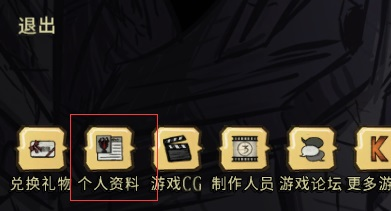

[info]: # ({"title":"搭个饥荒游戏服务器", "create":"2018-07-01 14:30:06", "modify":"2018-07-06 15:22:21", "category":"游戏", "tag_list":["饥荒联机", "DST", "don't starve together","游戏"], "info_list":[]})

连小伙伴的主机玩饥荒简直卡爆，~~瞬移、闪现、时光倒流~~。直接玩得怀疑人生，~~我是谁 我在哪 谁打我~~  


干脆搭个游戏服务器跑在阿里的ECS上面，可惜云服务器内存只有1G，开了~~几个mod~~内存就满了  
要是开swap系统慢的要死，要是不开swap又容易崩。~~真是令人头大~~  
是时候升级配置了。~~可是没有钱~~  


[preview]: # (end preview)

## 参考地址

[How to setup dedicated server with cave on Linux](https://steamcommunity.com/sharedfiles/filedetails/?id=590565473)

[How to install,configure and update mods on Dedicated Server](https://steamcommunity.com/sharedfiles/filedetails/?id=591543858)

[Don't Starve Together 创意工坊](https://steamcommunity.com/app/322330/workshop/)

## 系统版本

`$ uname -a`

```stdout
    ···Linux test-server 3.10.0-862.3.3.el7.x86_64 #1 SMP Fri Jun 15 04:15:27 UTC 2018 x86_64 x86_64 x86_64 GNU/Linux
```

`$ cat /etc/redhat-release`

```stdout
    ···CentOS Linux release 7.5.1804 (Core)
```

## 安装工具、依赖

`# yum install wget screen glibc.i686 libstdc++.i686 libcurl.i686`

## 安装steamCMD

**`# 开头表示root执行，$ 开头表示普通用户`**

// root添加运行用户，不推荐用root运行服务  
`# useradd dstuser`

// 切换用户  
`# su - dstuser`

// 下载steamCMD  
`$ wget https://steamcdn-a.akamaihd.net/client/installer/steamcmd_linux.tar.gz`

// 解压到 steamcmd文件夹下  
`$ mkdir steamcmd && tar -C steamcmd -zxvf steamcmd_linux.tar.gz`

## 安装游戏

// 执行命令以安装饥荒，注意执行权限 "$ chmod +x steamcmd.sh"  
`$ cd steamcmd && ./steamcmd.sh +login anonymous +force_install_dir ~/dst_server +app_update 343050 validate +quit`

```bash
# 注释：或者进入交互安装

$ cd steamcmd && ./steamcmd.sh
> login anonymous
> force_install_dir /home/dst/server_dst
> app_update 343050 validate
> quit

# 注释--------
# login 登陆用户名
# force_install_dir 安装路径
# app_update 343050 validate 安装/更新饥荒 343050为游戏id
# quit 退出
```

```stdout
# 安装完成输出
    ··· Success! App '343050' fully installed.
```

## 无尽的配置

// 进入游戏执行文件目录，查看缺失依赖 ldd: list dynamic dependencies  
`$ cd ~/dst_server/bin && ldd dontstarve_dedicated_server_nullrenderer`

```stdout
    ··· 省略 ...
    ··· libcurl-gnutls.so.4 => not found
    ··· 省略 ...
```

// 切换回root，处理libcurl-gnutls.so.4缺失，从/usr/lib/libcurl.so.4 软连接一个 libcurl-gnutls.so.4  
`# ln -s /usr/lib/libcurl.so.4 /usr/lib/libcurl-gnutls.so.4`

// 切回普通用户，再次执行之后会报无可用版本信息，但是不影响服务运行  
`$ ./dontstarve_dedicated_server_nullrenderer`

```stdout
    ··· ./dontstarve_dedicated_server_nullrenderer: /lib/libcurl-gnutls.so.4: no version information available (required by ./dontstarve_dedicated_server_nullrenderer)
```

// 写个启动脚本，不能直接用绝对路径，会报找不到文件  
`$ vim start.sh`

```bash
#! /bin/bash
# 启动主服务器
cd /home/dstuser/dst_server/bin
./dontstarve_dedicated_server_nullrenderer -cluster MyDediServer -shard Master
```

`$ vim start2.sh`

```bash
#! /bin/bash
# 启动地下洞穴服务器
cd /home/dstuser/dst_server/bin
./dontstarve_dedicated_server_nullrenderer -cluster MyDediServer -shard Caves
```

```dst
// 参数说明

-persistent_storage_root:
    修改存储的根目录，应该用绝对路径，默认.klei
-conf_dir:
    修改配置文件目录，不应该包含/，存储路径为<persistent_storage_root>/<conf_dir>
-cluster:
    设置使用的集群名字，配置文件会在 <persistent_storage_root>/<conf_dir>/<cluster>/cluster.ini，默认Cluster_1
-shard:
    设置使用的分片目录，配置文件会在<persistent_storage_root>/<conf_dir>/<cluster>/<shard>/server.ini，默认Master
-offline:
    离线，只有本地网络用户能加入服务器，与steam相关的功能都不起作用
-console:
    允许输入lua命令，不推荐，使用[MISC]下的console_enabled替代
--bind_ip <bind_ip>:
    修改监听位置
-port <port_number>:
    监听UDP连接的端口，会覆盖server.ini中[NETWORK]下的server_port设置，10998-110108
-players <max_players>:
    允许加入游戏的最大玩家数，会覆盖cluster.ini中[GAMEPLAY]下的max_players设置，1-64
-steam_master_server_port <port_number>:
    steam使用的内部端口，覆盖server.ini中[STEAM]下的master_server_port设置
-steam_authentication_port <port_number>:
    steam使用的内部端口，覆盖server.ini中[STEAM]下的authentication_port设置
-backup_logs:
    每次运行时创建以前的日志备份
-tick <tick_rate>:
    服务器向客户端发送更新的每秒的次数，覆盖cluster.ini中[NETWORK]下的tick_rate设置，15-60
```

// 服务器token文件，必须，内容为你账号生成的token  
`$ vim ~/.klei/DoNotStarveTogether/MyDediServer/cluster_token.txt`  
打开饥荒游戏 -> 开始游戏 -> 个人资料 -> `Generate Server Token` -> 将生成的token复制到`cluster_token.txt`文件内  



// 地上世界配置文件，文件名用 **`leveldataoverride.lua`**，不是`worldgenoverride.lua`  
`$ vim ~/.klei/DoNotStarveTogether/MyDediServer/Master/leveldataoverride.lua`

```lua
--获取配置可以自己用主机在饥荒开一个世界，设置好，然后在`C:\Users\<username>\Documents\Klei\DoNotStarveTogether\Cluster_<num>\Master\`下找到这个文件。<username>为自己用户名，<num>为创建世界选项里的第几个世界，从上往下1，2，3，4，5

return {
  desc="The standard Don't Starve experience.",
  hideminimap=false,
  id="SURVIVAL_TOGETHER",
  location="forest",
  max_playlist_position=999,
  min_playlist_position=0,
  name="Default",
  numrandom_set_pieces=4,
  ordered_story_setpieces={ "Sculptures_1", "Maxwell5" },
  override_level_string=false,
  overrides={
    alternatehunt="default",
    angrybees="default",
    antliontribute="default",
    autumn="default",
    bearger="default",
    beefalo="default",
    beefaloheat="default",
    bees="default",
    berrybush="default",
    birds="default",
    boons="default",
    branching="default",
    butterfly="default",
    buzzard="default",
    cactus="default",
    carrot="default",
    catcoon="default",
    chess="default",
    day="default",
    deciduousmonster="default",
    deerclops="default",
    disease_delay="default",
    dragonfly="default",
    flint="default",
    flowers="default",
    frograin="default",
    goosemoose="default",
    grass="default",
    houndmound="default",
    hounds="default",
    hunt="default",
    krampus="default",
    layout_mode="LinkNodesByKeys",
    liefs="default",
    lightning="default",
    lightninggoat="default",
    loop="default",
    lureplants="default",
    marshbush="default",
    merm="default",
    meteorshowers="default",
    meteorspawner="default",
    moles="default",
    mushroom="default",
    penguins="default",
    perd="default",
    petrification="default",
    pigs="default",
    ponds="default",
    prefabswaps_start="default",
    rabbits="default",
    reeds="default",
    regrowth="default",
    roads="default",
    rock="default",
    rock_ice="default",
    sapling="default",
    season_start="default",
    specialevent="default",
    spiders="default",
    spring="default",
    start_location="default",
    summer="default",
    tallbirds="default",
    task_set="default",
    tentacles="default",
    touchstone="default",
    trees="default",
    tumbleweed="default",
    walrus="default",
    weather="default",
    wildfires="default",
    winter="default",
    world_size="huge",
    wormhole_prefab="wormhole"
  },
  random_set_pieces={
    "Sculptures_2",
    "Sculptures_3",
    "Sculptures_4",
    "Sculptures_5",
    "Chessy_1",
    "Chessy_2",
    "Chessy_3",
    "Chessy_4",
    "Chessy_5",
    "Chessy_6",
    "Maxwell1",
    "Maxwell2",
    "Maxwell3",
    "Maxwell4",
    "Maxwell6",
    "Maxwell7",
    "Warzone_1",
    "Warzone_2",
    "Warzone_3"
  },
  required_prefabs={ "multiplayer_portal" },
  substitutes={  },
  version=3
}
```

// 地下世界的配置文件  
`$ vim ~/.klei/DoNotStarveTogether/MyDediServer/Caves/leveldataoverride.lua`

```lua
--获取配置可以自己用主机在饥荒开一个世界，设置好，然后在`C:\Users\<username>\Documents\Klei\DoNotStarveTogether\Cluster_<num>\Caves\`下找到这个文件。<username>为自己用户名，<num>为创建世界选项里的第几个世界，从上往下1，2，3，4，5

return {
  background_node_range={ 0, 1 },
  desc="Delve into the caves... together!",
  hideminimap=false,
  id="DST_CAVE",
  location="cave",
  max_playlist_position=999,
  min_playlist_position=0,
  name="The Caves",
  numrandom_set_pieces=0,
  override_level_string=false,
  overrides={
    banana="default",
    bats="default",
    berrybush="default",
    boons="default",
    branching="default",
    bunnymen="default",
    cave_ponds="default",
    cave_spiders="default",
    cavelight="default",
    chess="default",
    disease_delay="default",
    earthquakes="default",
    fern="default",
    fissure="default",
    flint="default",
    flower_cave="default",
    grass="default",
    layout_mode="RestrictNodesByKey",
    lichen="default",
    liefs="default",
    loop="default",
    marshbush="default",
    monkey="default",
    mushroom="default",
    mushtree="default",
    petrification="default",
    prefabswaps_start="default",
    reeds="default",
    regrowth="default",
    roads="never",
    rock="default",
    rocky="default",
    sapling="default",
    season_start="default",
    slurper="default",
    slurtles="default",
    start_location="caves",
    task_set="cave_default",
    tentacles="default",
    touchstone="default",
    trees="default",
    weather="default",
    world_size="huge",
    wormattacks="default",
    wormhole_prefab="tentacle_pillar",
    wormlights="default",
    worms="default"
  },
  required_prefabs={ "multiplayer_portal" },
  substitutes={  },
  version=3
}
```

```dst
# 注释 cluster.ini配置参数

[MISC]
max_snapshots:
    默认6，保存的存档数
[SHARD]
shard_enabled:
    默认false，是否启用分片，多级服务器必须true
bind_ip:
    默认127.0.0.1，在server.ini覆盖，如果shard_enabled=true和is_master=true则必须
master_ip:
    默认none，在server.ini覆盖，如果shard_enabled=true和is_master=false则必须
master_port:
    默认10888，server.ini覆盖，UDP
cluster_key:
    默认none，在server.ini覆盖，如果shard_enabled=true则必须，同一台计算机上的服务器只需设置一次，不同的则都需要设置
[STEAM]
steam_group_only:
    默认false，是否只允许steam组的成员连接
steam_group_id:
    默认0，上述为true时使用
steam_group_admins:
    默认false，为true时steam_group_id中的管理员也将是服务器的管理员
[NETWORK]
offline_server:
    默认false，离线服务器，steam功能不可用
tick_rate:
    默认15，每秒服务器向客户端更新次数
whitelist_slots:
    默认0，保留用户空位，将用户id放入与cluste.ini同级目录whitelist.txt中
cluster_password:
    默认none，玩家加入时要输入的密码
cluster_name:
    集群名，会显示在饥荒搜结果索里
cluster_description:
    默认empty，集群介绍
lan_only_cluster:
    默认false，是否仅本地模式
cluster_intention:
    默认依据游戏模式，游戏风格，[cooperative | competitive | social | madness] 合作|竞争|社交|疯狂
[GAMEPLAY]
max_players:
    默认16，最大玩家数量
pvp:
    默认false，是否可以pvp
game_mode:
    默认survival，游戏模式，[survival | endless | wilderness] 生存|无尽|荒野
pause_when_empty:
    默认false，没有玩家时暂停服务器
vote_kick_enabled:
    默认false，是否开启投票替人

# ================================================================
# 注释 server.ini配置参数

[SHARD]
is_master:
    默认none，如果shard_enabled=true则必须，是否为集群的主服务器，只能有一个true，其余false
name:
    默认none，如果shard_enabled=true和is_master=false则必须，会显示在日志中的分片名
id:
    默认随机数字，内部唯一标识
[STEAM]
authentication_port:
    默认8766，steam用的端口，同一台计算机上每个服务器需要不同
master_server_port:
    默认27016，steam用的端口，同一台计算机上每个服务器需要不同
[NETWORK]
server_port:
    默认10999，UDP，10998-11018，同一台计算机上每个服务器需要不同
```

// 通用配置文件，可以在`C:\Users\<username>\Documents\Klei\DoNotStarveTogether\Cluster_<num>\`下找到这个文件  
`$ vim ~/.klei/DoNotStarveTogether/MyDediServer/cluster.ini`

```dst
[GAMEPLAY]
game_mode = endless
max_players = 6
pvp = false
pause_when_empty = true

[NETWORK]
lan_only_cluster = false
cluster_intention = social
cluster_password = <your_password>
cluster_description = lazy, no description
cluster_name = <display_name>
offline_cluster = false
cluster_language = en
autosaver_enabled = true
enable_vote_kick = false

[MISC]
console_enabled = true

[SHARD]
shard_enabled = true
bind_ip = 127.0.0.1
master_ip = 127.0.0.1
master_port = 11001
cluster_key = dstuser
```

// 地上世界配置文件  
`$ vim ~/.klei/DoNotStarveTogether/MyDediServer/Master/server.ini`

```dst
[NETWORK]
server_port = 10999

[SHARD]
is_master = true

[ACCOUNT]
encode_user_path = false

[STEAM]
master_server_port = 12346
authentication_port = 12345
```

// 地下世界配置文件  
`$ vim ~/.klei/DoNotStarveTogether/MyDediServer/Caves/server.ini`

```dst
[NETWORK]
server_port = 11000

[SHARD]
is_master = false
name = Caves

[ACCOUNT]
encode_user_path = false

[STEAM]
master_server_port = 12348
authentication_port = 12347
```

// 配置mod，一行一个，"--"双横线开头为注释  
`$ vim ~/dst_server/mods/dedicated_server_mods_setup.lua`

```lua
--Global Position
ServerModSetup("378160973")
```

// mod的启用和配置，Master和Caves文件夹各一份，内容参考mod自身文件夹下的`modinfo.lua`文件的写法  
`$ vim ~/.klei/DoNotStarveTogether/MyDediServer/Master/modoverrides.lua`  
`$ vim ~/.klei/DoNotStarveTogether/MyDediServer/Caves/modoverrides.lua`

```lua
return {
    ["workshop-378160973"]={
        configuration_options={
        ENABLEPINGS=true,
        FIREOPTIONS=2,
        OVERRIDEMODE=false,
        SHAREMINIMAPPROGRESS=true,
        SHOWFIREICONS=true,
        SHOWPLAYERICONS=true,
        SHOWPLAYERSOPTIONS=2
        },
        enabled=true
  }
}
```

## 其他设置

### 管理员

与`cluster.ini`同级的目录下建立文件`adminlist.txt`，内容为用户id，即`KU_`开头的一串标识符，一行一个

```txt
KU_xxxxxxxxx
KU_xxxxxxxxx
```

### 占位白名单

与`cluster.ini`同级的目录下建立文件`whitelist.txt`，内容为用户id，即`KU_`开头的一串标识符，一行一个。并在`cluster.ini`中的`whitelist_slots`设置占位数量。之后服务器实际能进人数量为 最大数量 减去 whitelist_slots数值

```txt
KU_xxxxxxxxx
KU_xxxxxxxxx
```

### 黑名单

与`cluster.ini`同级的目录下建立文件`blocklist.txt`，内容为**用户Steamid**，**是一串数字，不是KU开头的id**，一行一个

```txt
xxxxxxxxxxxxxxxxxxxxxxxxxxxxxxxx
xxxxxxxxxxxxxxxxxxxxxxxxxxxxxxxx
```

## 启动

`$ ./start.sh`  
`$ ./start2.sh`  
如果一切顺利，就可以打开游戏，浏览游戏中搜索到了。

## 更新

// 等同于安装命令  
`$ cd steamcmd && ./steamcmd.sh +login anonymous +force_install_dir ~/dst_server +app_update 343050 validate +quit`

## 使用脚本维护

可以使用 `cron` 的定时任务配合 `bash` 脚本实现服务器的重启与自动更新

可以使用 `screen` 防止终端操作掉线时任务中断  
`screen start.sh` 启动任务  
分离任务，后台运行 `Ctrl + a`后按`d`  
或者直接 `screen -dmS <a_name> start.sh` 启动一个有名字的分离的后台任务  
使用 `screen -r <a_name>` 连接