[info]: # ({"title":"思科相关的笔记", "create":"2018-05-12 19:17:53", "modify":"2018-08-22 19:12:28", "category":"笔记", "tag_list":["cisco", "网络", "思科", "交换机", "路由器"], "info_list":[]})

思科相关的笔记，~~真是令人头大，学习使我快乐~~

[preview]: # (end preview)

## 网络基础

### 网络名词

- 网络：将地理位置不同的多台计算机使用通信线路连接，在网络操作系统、网络管理软件以及网络通信协议的管理和协调下，实现资源共享和信息传递的计算机系统
- 局域网：Local Area Network，某一区域内由多台计算机互联成的计算机组
- 城域网：Metropolitan Area Network，一个城市范围内所建立的计算机通信网
- 广域网：Wide Area Network，通常跨接很大物理范围的计算机网络
- 广播域：数据所能广播到的范围
- 冲突域：单播数据，除目标设备外其他也能收到信息的设备，其集合为一个冲突域。如HUB，所有的端口为一个冲突域

### OSI开放系统互联

- 全称：Open System Interconnection
- ISO/OSI参考模型是在其协议被开发出来之前设计出来的，它并不基于某个特定的协议集而设计，所以具有通用性，但在协议实现方面存在不足

OSI参考模型 & TCP/IP参考模型：  
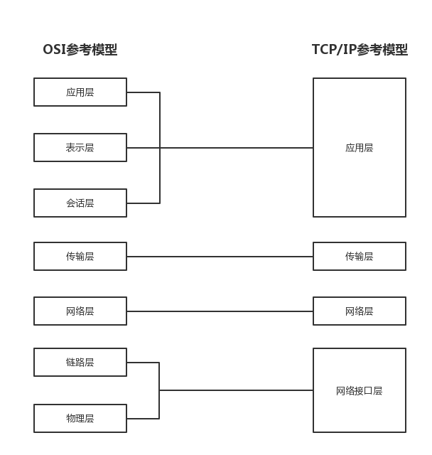

### OSI模型

物理层：

- 产生并检测电压，发送并接收带有数据的电气信号
- 不提供纠错，对数据传输做控制，监测出错率
- 传输电气信号的载体称为位流、比特流
- 设备
    - 网线
        - 屏蔽/非屏蔽双绞线
        - 光纤
        - 无线WiFi
    - 集线器：有放大信号作用，半双工模式，同一时刻只有一个方向的数据传输，收时不能发，发时不能收
    - 转换器：调制解调器（电信号< = >模拟信号，电信号< = >光信号）
    - 中继器

链路层：

- 决定通讯机制，差错控制
- 向网络层提供服务
- 合成传输数据帧
- 在不可靠的物理层上进行数据的可靠传输，将数据封装成帧（Frame），进行CRC校验（循环冗余校验），防止高速发送方的数据将低速方淹没
- 设备
    - 交换机：管理mac地址（48位二进制，表示为12个16进制数；前24位IEEE制定，后24位厂商制定；格式00-1c-25-91-65-48/001c.2591.6548），可简单看作多端口网桥
    - 网桥：将两个LAN连接并按照mac转发数据帧，现大多应用于软件，不具备三层设备特性。即不同网段使用网桥不能通信，需要另配三层设备
    - 网卡：网络适配器，生产时将唯一网络节点地址/mac地址烧录于ROM中。mac地址可以更改，仅更改显示，ROM中的mac更改需要重新烧录

网络层：

- 为设备连接提供逻辑地址
- 负责数据从源端到目的端
- 数据传输的寻径和转发
- 设备
    - 路由器：每一个端口属于一个广播域，也是一个单独的冲突域
    - 三层交换机

传输层：

- 建立端到端连接，负责数据端到端传输
- 通过端口号区分上层服务

传输协议：

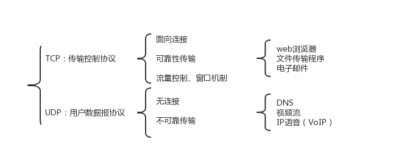

会话层：

- 提供会话控制、同步、重传等服务

表示层：

- 提供数据的编码、压缩、加解密等服务

应用层：

- 为应用软件提供服务，使其能够使用网络服务
- 常用端口号
    - HTTP:80
    - FTP:21
    - TELNET:23
    - SMTP:25/465/587
    - POP3:110
    - IMAP:143
    - DNS:53
    - TFTP:69
    - SNMP:161
    - RIP:520

**TCP/IP参考模型：** TCP/IP模型是先有协议，模型只是对现有协议的描述，因此和现有协议非常吻合，但它在描述非TCP/IP网络时的用处不大

网络接口层：

- ip地址和mac地址的映射
- 将数据封装成帧，提供物理介质的连接
- 接收从网络层传来的ip数据包，将数据包通过底层物理接口发送出去

网络层：

- 处理来自传输层的分组发送请求，将分组装入数据包，填充包头，选择目的节点路径，将封装好的ip数据包发往对应接口
- 处理外部输入数据，检查合法性，进行路由选择。目的为本机则去掉包头将数据提交上层处理，不为本机则依据路由表转发
- 处理ICMP（Internet Control Message Protocol 网际控制信息协议）报文，处理网络路由选择，流量控制等

传输层：

应用层：

### 数据的封装与解封装

数据封装与解封装：

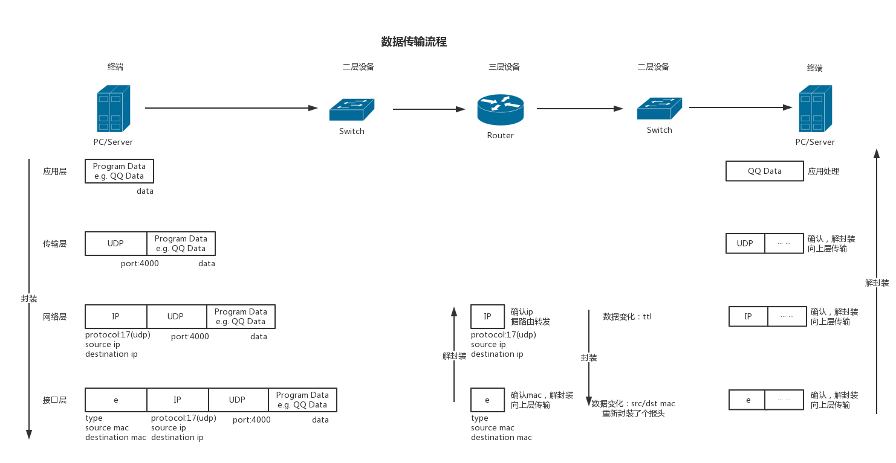

数据结构：

- 数据链路层给数据添加帧头（包含源/目的mac地址等），给数据尾添加CRC校验
- 串行线路不使用mac地址，添加PPP或HDLC等串行链路协议头

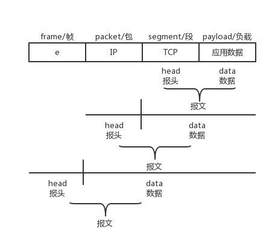

IP地址：

- 32为二进制数组成，三点分四小节
- 分网络位、主机位，由掩码区分
- ip地址分类
    - 5类地址：
        - A类地址：1.0.0.0-126.255.255.255
        - B类地址：128.0.0.0-191.255.255.255
        - C类地址：192.0.0.0-223.255.255.255
        - D类地址：224.0.0.0-239.255.255.255
        - E类地址：240.0.0.0-255.255.255.254
    - 私有地址：
        - A类地址：10.0.0.0-10.255.255.255
        - B类地址：172.16.0.0-172.31.255.255
        - C类地址：192.168.0.0-192.168.255.255
- 信息
    - IP：192.168.1.1 掩码：255.255.255.0
    - 192.168.1.0 网络地址/网络号，代表其内所有主机
    - 可简写为：192.168.1.1/24
    - 0.0.0.0 代表所有网络
    - 255.255.255.255 全广播地址
    - VLSM（Variable Length Subnet Masks）可变长子网掩码，需路由协议支持
    - CIDR（Classless Inter-Domain Routing，无类域间路由），在CIDR中，路由器使用前缀来描述有多少位是网络位，剩下的则是主机位。表示前缀的数字跟在地址的结尾，用斜杠("/")来表示，比如：192.168.1.0/20,这里的"/20"就是前缀，CIDR的设计提高了IPv4的可扩展性
    - 网络规划先从主机数多的开始

### 网线

- 线序：
    - T568A线序：绿白 绿 橙白 蓝 蓝白 橙 棕白 棕
    - T568B线序：橙白 橙 绿白 蓝 蓝白 绿 棕白 棕 （常用）
- 常用的10/100Mbps网线使用2对线：1236（1发[+]2发[-]3收[+]6收[-]），其余起屏蔽作用
- 类型：
    - 直通线：两头同为T568A/T568B线序，T568A-T568A，T568B-T568B
        - 常用于不同设备互连：交换机-路由器，交换机-计算机，集线器-计算机
        - **不用于计算机-路由器，交换机-集线器**，但现在大多数设备能端口自适应，故而实际上可以直通线互连
    - 交叉线：两头线序不同，T568A-T568B
        - 常用于相同设备互连，预防信号对冲：计算机-计算机，路由器-路由器，交换机-交换机，集线器-集线器
        - **计算机-路由器，交换机-集线器**
    - 全反线：两端线序相反，常用于配置线

### 数据帧包报段

- 信息交换发生于对等OSI层之间，在源端每一层附加控制信息，在目的端每一层进行控制信息的分析与移除
- 数据帧（Frame）：信息单位，起始点与目的点为数据链路层
- 数据包（Packet）：信息单位，起始点与目的点为网络层
- 数据报（Datagram）：通常指起始点与目的点都使用无连接网络服务的网络层信息单元
- 段（Segment）：通常指起始点与目的点都是传输层的信息单元
- 消息（message）：是指起始点和目的地都在网络层以上（经常在应用层）的信息单元
- 元素（cell）：一种固定长度的信息，它的起始点和目的地都是数据链路层。常用于异步传输模式（ATM）和交换多兆位数据服务（SMDS）网络等交换环境
- 数据单元（data unit）：指许多信息单元。常用的数据单元有服务数据单元（SDU）、协议数据单元（PDU）。SDU是在同一机器上的两层之间传送信息。PDU是发送机器上每层的信息发送到接收机器上的相应层（同等层间交流用的）
- 数据包（Packet）：封装的基本单元，它穿越网络层和数据链路层的分解面。通常一个Packet映射成一个Frame，但也有例外，即当数据链路层执行拆分或将几个Packet合成一个Frame的时候
- 名称：
    - 数据链路层的PDU叫做帧（Frame）
    - 网络层的PDU叫做数据包（Packet）
    - TCP的叫做数据段（Segment）
    - UDP的叫做数据报（Datagram）

### 无线网

- 无线网络分类：
    - PAN（Personal Area Network，个人网）
    - LAN（Local Area Network，局域网）
    - MAN（Metropolitan Area Network，城域网）
    - WAN（Wide Area Network，广域网）
    - WLAN（Wireless Local Area Network，无线局域网）
- 无线网络与有线网络区别：
    - WLAN和LAN都采用IEEE的802标准，LAN使用802.3标准，WLAN使用802.11标准
    - 无线网络没有边界，数据帧可以向任何能接收无线电信号的地方发送
    - 处在无线电频率范围内的无线网卡都可以接收到信号
    - 在同一个区域中使用相同的无线电频率可以互相干扰
    - 在不同国家对无线电频率有不同规定
    - WLAN的客户端使用无线接入点（AP，Access Point）连接到网络，而不是以太网交换机
    - 无线网络是一个共享网络，一个AP就像以太网中的Hub，数据使用无线电波传送，无线AP与无线路由区别：**AP少了路由功能**
    - 目前大多数的无线AP都支持多用户接入、数据加密、多速率发送等功能，一些产品更提供了完善的无线网络管理功能
    - 无线网络实际上采用的是半双工模式，收发是不能同时进行的，除非接收和发送使用不同的无线电频率
    - 无线网络不同于有线网络，线缆上可以检测到有冲突信号，无线网络中只要数据发送出去就没有办法检测是否发生冲突，所以802.11采用的是CSMA中的CA（冲突避免技术）
- 无线局域网标准：
    - 802.11无线局域网是IEEE定义的标准，在这个标准的基础上又相继推出了802.11a、802.11b、802.11g、802.11n等标准
    - 不同的标准受一些调制技术的影响，比如DSSS（Direct Sequence Sparead Spectrum，直接序列展频技术）和OFDM（Orthogonal Frequency Division Multiplexing，正交频分复用）
    - 使用OFDM时将会有更快的传输速度；DSSS比OFDM简单，相对花费较少
- 无线网络组件：
    - 无线网卡：无线网卡使客户工作站能够发送和接收射频信号，它使用调制技术将数据流编码后放到无线电频率信号上
    - 无线AP：就是一个无线接入点，可以连接无线客户端到有线客户端。在本质上来说，一个AP转换空气中的802.11封装的帧格式到有线以太网上的802.3以太网帧格式。AP类似802.3以太网中的Hub，是一个共享的媒体
    - 无线路由器：无线路由器可以执行无线接入点AP、以太网交换机和路由器的角色
- 名词：
    - AP参数：
        - 模式：无线网络的模式指的是WLAN的协议，802.11a/b/g/n等，无线路由器上的无线网络模式会显示一个"混合"的选项，这意味着这个选项同时支持802.11b和802.11g的标准
        - SSID：服务设置标识符(Service Set Identifier)，是一个独立的标示符，也就是连接wifi时那个无线网络显示的名称，客户端使用SSID区分不同的无线网络
        - 信道：在ISM无线频段中，2.4GHz又被划分出不同的通道，北美的标准是11个通道，欧洲的标准是13个通道，CCNA以北美为准，每个通道占22MHz，相邻通道间隔为5MHz。在实际情况中，可以让无线路由器自动选择通道，当和其他设备的通道重叠的时候，自动调整通道
    - 无线局域网拓扑结构：
        - AD hoc：也称IBSS（Independent Basic Service Set，独立基本服务集），最常用的就是我们使用带有无线网卡的笔记本建立无线临时网络（计算机到计算机的）
        - BSS：基本服务集，最常见到的就是一台家用无线路由器，上面用有线链接到我们的台式机，还有几台笔记本或手机通过无线连接到这台无线路由上
        - ESS：Extended Service Set，扩展服务集，也称作Infrastructure拓扑，也就是多个BSS组成的网络，网络中有多台无线AP，不同的AP有不同的SSID，用户可以根据SSID自己选择连接到哪个AP上
        - Common Distribution System：共同分布式系统，就是多个AP组成的覆盖范围很广的一个区域，在这个覆盖区域中AP使用同一个SSID来允许用户漫游在多个AP之间，不同AP之间有10%-15%的范围重叠，并且不同的AP之间不使用重叠的通道
    - 无线网安全协议：
        - 开放式：不加密的无线AP
        - WEP加密：WEP（Wired Equivalent Privacy），有线等效保密，这种加密方式本身存在缺陷，可以在几分钟以内破解出使用的密钥
        - WPA加密：WPA（Wi-Fi Protected Access，Wi-Fi安全接入），安全性相对WEP大幅提升，只能暴力猜解，或通过路由缺陷pin码破解
        - WPA2加密：WPA的安全加强版、
    - 无线网安全认证过程：
        - 在家庭无线局域网中，并没有严格的验证要求，验证是在无线接入点（AP或无线路由器）上进行的，而在一些安全要求严格的场合，需要有额外的登录和认证机制，通常是使用一台专门用来认证的服务器。用户的登录过程被EAP（Extensible Authentication Protocol，扩展验证协议）管理，IEEE使用802.1x协议对无线局域网进行认证和授权
        - EAP的认证步骤：
            - AP上的802.11连接进程为每个无线局域网的用户创建一个虚拟接口
            - AP阻止所有其他的数据帧，只允许802.1x协议的流量通过
            - 通过AP，802.1x的数据帧携带EAP身份验证数据包到达认证服务器，这台服务器上运行RADIUS协议，可以提供认证、授权、记账，即AAA服务。AP起到了一个中转的作用，将服务器的要求转发给无线客户端，将无线客户端的EAP应答转发给AAA服务器
            - 如果EAP验证成功，AAA服务器发送一个EAP验证成功的信息给无线接入点AP，AP就让通过验证的无线客户端的数据流通过虚拟接口，如果验证失败则关闭虚拟接口
            - 开放虚拟接口前，WLAN客户端和AP之间的数据链路被加密，以确保只有通过验证的客户端才能接入

网络信息：

| 网络类型  | PAN               | LAN                 | MAN                | WAN                |
| :-------: | :---------------: | :-----------------: | :----------------: | :----------------: |
| 网络标准  | 蓝牙Bluetooth     | 802.11a/b/g/n       | 802.16/MMDS/LMDS   | GSM/GPRS/CDMA/3G   |
| 网络速度  | <1Mb/s            | 1-248Mb/s           | 22Mb/s             | 10-384Kb/s         |
| 网络范围  | 短（几米）        | 几百至几千米        | 几千米至几十千米   | 大于几十千米       |
| 典型应用  | 蓝牙传输、耳机等  | 无线企业/家庭局域网 | “最后一公里”接入 | 移动电话等         |

网络特点：

| 特点          | 802.11无线局域网       | 802.3以太网  |
| :-----------: | :--------------------: | :----------: |
| 物理层        | 无线电频率（RF）       | 线缆         |
| 媒体访问方式  | 冲突避免               | 冲突检查     |
| 可用性        | 在AP范围内任意无线网卡 | 线缆链接     |
| 信号干扰      | 易受干扰               | 不易受干扰   |
| 规定          | 其他额外规定           | IEEE标准     |

## 数据结构

### 各协议数据结构

IP数据包：


TCP数据段：


UDP数据报：


伪首部：

- 伪首部， 又称为伪包头（Pseudo Header）：是指在 TCP 的分段或 UDP 的数据报格式中，在数据报首部前面增加源 IP 地址、目的 IP 地址、IP 分组的协议字段、TCP 或 UDP 数据报的总长度等共12字节，所构成的扩展首部结构。此伪首部是一个临时的结构，它既不向上也不向下传递，仅仅只是为了保证可以校验套接字的正确性
- 伪首部并非TCP&UDP数据报中实际的有效成分。伪首部是一个虚拟的数据结构，其中的信息是从数据报所在IP分组头的分组头中提取的，既不向下传送也不向上递交，而仅仅是为计算校验和
- **TCP的伪首部与UDP类似，只是协议号为6**


TCP握手挥手流量控制：

- CLOSED：初始状态
- LISTEN：服务器端的某个SOCKET处于监听状态，可以接受连接
- SYN_RCVD：表示接受到了SYN报文，很短暂，当收到客户端的ACK报文后，进入ESTABLISHED状态
- SYN_SENT：表示客户端已发送SYN报文
- ESTABLISHED：表示连接已经建立
- FIN_WAIT_1：SOCKET主动关闭连接，向对方发送了FIN报文，此时该SOCKET进入FIN_WAIT_1状态。当对方回应ACK报文后，则进入到FIN_WAIT_2状态，实际情况应该马上回ACK报文，所以FIN_WAIT_1状态较难见到，FIN_WAIT_2状态可用netstat看到
- FIN_WAIT_2：FIN_WAIT_2状态下的SOCKET，表示半连接，即有一方要求close连接，但另一方还有数据需要传送
- TIME_WAIT：收到了对方的FIN报文，并发送出了ACK报文，2个报文生存周期后即可回到CLOSED可用状态。**FIN_WAIT_1状态下，收到对方同时带FIN标志和ACK标志的报文，可以直接进入TIME_WAIT状态，而无须经过FIN_WAIT_2状态**
- CLOSING：发送FIN报文后，没有收到对方的ACK报文，却收到了对方的FIN报文。如果双方几乎同时close一个SOCKET，出现双方同时发送FIN报文的情况，即会出现CLOSING状态，表示双方都正在关闭SOCKET连接
- CLOSE_WAIT：表示在等待关闭。当对方发送FIN报文，己方回应ACK报文，进入CLOSE_WAIT状态。若己方无数据传送，发送FIN报文给对方，即关闭连接，若有，则先传送数据
- LAST_ACK：被动关闭一方发送FIN报文后，最后等待对方的ACK报文。当收到ACK报文后，即可以进入到CLOSED可用状态

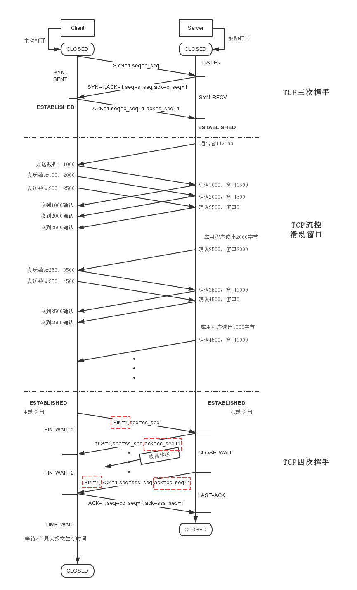

## 路由器基础

### 路由基本硬件

- CPU：中央处理器
- 闪存（Flash Memory）：大多用于保存路由IOS，断电数据不丢失
- 只读存储器（Read Only Memory，ROM）：用于存储不经常变动内容，包括引导程序（Bootstrap Instructions），基本诊断程序(Basic diagnostic software)、缩小版的IOS（Scaled-down version of IOS），断电数据不丢失
- 随机存取存储器（Random Access Memory，RAM）：用于保存临时指令和数据，包括运行的操作系统、运行的配置文件、路由表、arp表、包缓冲区等，断电数据丢失
- 非易失性随机存取存储器（NonVolatile RAM，NVRAM）：用于保存启动配置文件，断电数据不丢失
- 输入输出端口（Input/Output，I/O)：数据进出路由端口，`R#: show interface`查看端口,`R# show interface brief`查看启用未启用端口

### 路由引导过程

- 执行POST（Power-On Self Test）加电自检:路由通电后执行一系列诊断，测试硬件，完成自检后加载引导程序
- 加载引导程序：POST完成后，引导程序从ROM拷贝至RAM，执行引导程序，主要作用为定位IOS位置，并加载IOS进RAM
- 定位加载IOS：通过读取配置寄存器的值确定IOS位置，配置寄存器是存储于NVRAM中的一个16位值（老设备可能为16针的跳线）
    - 这个值的最后4位指明了引导字段，如0x2102这个十六进制数从右往左第一个数2就为引导字段，引导字段的范围是从0~15,0表示RXBOOT模式，1表示自动从ROM启动，2-F表示boot system命令，检查NVRAM中的配置，这将使路由在NVRAM中寻找boot system命令，如果找到就用引导命令中指定的方式引导（如“boot system flash:unzip-c3640-ik9o3s-mz.124-10.bin”，就是让路由读取闪存中的unzip-c3640-ik9o3s-mz.124-10.bin这个IOS文件）
    - 如果boot system引导失败，路由则会自动加载闪存中第一个IOS文件；如果闪存中也无有效的IOS，或者找不到闪存，路由则会通过TFTP广播请求IOS；如果TFTP广播请求失败，路由会从ROM中将一个缩小版的诊断IOS加载到RAM中，以帮助路由判断是什么原因导致了引导失败
    - 配置寄存器的值为0x2102表示启动加载配置文件，0x2142表示不加载配置文件，可用于忘记密码时修改原始密码
- 加载配置文件：IOS加载成功后，在NVRAM中查找有无startup-config，有则使用配置文件中的配置初始化路由，无则系统进入初始化配置模式

### 路由原理

- 路由器的工作就是接收信息分组，根据路由表将分组发送出去，即路由器的两个基本功能：寻址和转发
- 路由器也被称作转存设备，因为它在内存中储存接收到的信息分组，直到它被传送出去
- **路由的转发是基于目标的网络地址的，而不是目标的IP地址**

### 路由常用操作

#### 备份操作系统镜像文件

```router
R# show flash:
    ··· System flash directory:
    ··· File  Length   Name/status
    ··· 3   50938004 c2800nm-advipservicesk9-mz.124-15.T1.bin // .bin后缀的文件就是要备份的IOS
    ··· 2   28282    sigdef-category.xml
    ··· 1   227537   sigdef-default.xml
R# copy flash tftp // 使用copy命令将flash中的文件备份到tftp服务器
    ··· Source filename []? c2800nm-advipservicesk9-mz.124-15.T1.bin // 输入Flash中你要备份的文件名，粘贴刚才的ios文件名
    ··· Address or name of remote host []? 192.168.1.100 // 输入TFTP服务器的IP地址，即TFTP服务器地址，确保服务器与本路由是可以正常通信的
    ··· Destination filename [c2800nm-advipservicesk9-mz.124-15.T1.bin]? // 可以自己输入一个备份名，回车就直接用IOS原名
    ··· Writing c2800nm-advipservicesk9-mz.124-15.T1.bin...
    ··· [OK - 50938004 bytes] // 备份完成
```

#### 升级操作系统镜像文件

```router
R# copy tftp flash // 从TFTP服务器上拷贝文件到Flash
    ··· Address or name of remote host []? 192.168.1.100 // 输入TFTP服务器的IP
    ··· Source filename []? c2800nm-advipservicesk9-mz.124-15.T1.bin // 输入TFTP上的新IOS文件名
    ··· Destination filename [c2800nm-advipservicesk9-mz.124-15.T1.bin]? // 输入存放到路由器Flash中使用的名称，默认回车即可
    ··· Erase flash: before copying? [confirm] // 是否在拷贝新的IOS前删除旧的IOS，如果按回车则会删除旧的IOS
    ··· Erasing the flash filesystem will remove all files! Continue? [confirm]
    ··· Erasing device... eee ...erased
    ··· Erase of flash: complete
    ··· Accessing tftp://192.168.1.100/c2800nm-advipservicesk9-mz.124-15.T1.bin...
    ··· Loading c2800nm-advipservicesk9-mz.124-15.T1.bin from 192.168.1.100: !!!!!!!!!!!!!!!!!!!!!
    ··· [OK - 50938004 bytes]
R(config)# boot system flash flash:c2800nm-advipservicesk9-mz.124-15.T1.bin // 如果Flash中有多个IOS，可以使用此命令让这个新的IOS开机引导
```

#### 从备份恢复镜像文件

```router
// 路由进入rommon模式，ROM monitor模式（路由器出错进入/Ctrl + Break 进入）
// 必须连接路由器接口号最小的那个以太网接口
rommon 1 > IP_ADDRESS=192.168.1.1 // 设置路由器临时IP，和TFTP服务器同一网段
rommon 2 > IP_SUBNET_MASK=255.255.255.0 // 设置子网掩码
rommon 3 > DEFAULT_GATEWAY=192.168.1.1 // 设置网关，IOS文件的恢复支持跨网段进行
rommon 4 > TFTP_SERVER=192.168.1.100 // 设置TFTP服务器的IP地址
rommon 5 > TFTP_FILE=c2800nm-advipservicesk9-mz.124-15.T1.bin // 设置TFTP服务器上的IOS的文件名
rommon 6 > tftpdnld // 下载指定的IOS
    ··· Do you wish to continue? y/n [n]: y
    ··· !!!!!!!!! // 文件传输
rommon 7 > reset // 传输完成后使用reset重启路由
```

#### 备份配置文件

```router
R# copy startup-config tftp: // 将启动配置文件复制到tftp服务器
    ··· Address or name of remote host []? 192.168.1.100 // TFTP服务器的IP地址
    ··· Destination filename [R1-confg]? // startup-config保存的文件名
    ··· Writing startup-config....!!
    ··· [OK - 459 bytes]
    ··· 459 bytes copied in 3.073 secs (0 bytes/sec)
R# copy running-config tftp: //直接将running-config备份到TFTP服务器
```

#### 恢复配置文件

```router
R# copy tftp startup-config // 从TFTP恢复启动配置文件
    ··· Address or name of remote host []? 192.168.1.100 // TFTP服务器IP
    ··· Source filename []? R1-confg // 以前备份的启动配置文件的名称，注意大小写
    ··· Destination filename [startup-config]?
    ··· Accessing tftp://192.168.1.100/R1-confg...
    ··· Loading R1-confg from 192.168.1.100: !
    ··· [OK - 459 bytes]
    ··· 459 bytes copied in 0.031 secs (14806 bytes/sec)
```

#### 恢复路由器特权密码

```router
// 路由启动时，即"###..."时，按计算机键盘上的"Ctrl+Break"键，进入ROM monitor模式
rommon 1 > confreg 0x2142 // 更改完成后重启
rommon 1 > reset
    ··· Continue with configuration dialog? [yes/no]: no
R> en // 路由没有加载startup-config文件,直接可以进入特权模式
R# copy startup-config running-config // 将startup-config复制到running-config；一定不要错误的将运行配置文件覆盖启动配置文件，否则路由器所有启动配置数据都会丢失
R(config)# enable secret <your password> // 修改密码
R(config)# config-register 0x2102 // 将配置寄存器的值重新改成开机加载startup-config
R# copy running-config startup-config // 保存修改到startup-config
```

## 路由器安全

### 路由密码安全

- 设置一个复杂的密码：包含数字、包含大写字母、包含小写字母、包含特殊符号
- 对配置文件中的密码进行加密：`R(config)# service password-encryption`
- 特权密码的设置：创建特权密码应该使用`enable secret`而不是`enable password`
- 设置密码最小长度：`R(config)# security passwords min-length 12`可以将密码的最小长度设置成12位

### 限制远程访问

```router
R> enable
R# configure terminal
R(config)# service password-encryption // 启用路由密码加密，会将所有配置中的明文密码都加密存放
R(config)# security passwords min-length 12 // 设置密码最小长度
R(config)# enable secret 123 // 如果密码长度不够将不会配置成功
    ··· % Password too short - must be at least 12 characters. Password configuration failed
R(config)# access-list 1 permit 192.168.1.200 // 使用ACL允许192.168.1.200访问，这里使用了简单ACL，如果使用其他网管软件管理路由，可以使用复杂ACL允许管理IP和软件相应的端口
R(config)# line vty 0 4
R(config-line)# password ccna // 因为前面设置了密码最小长度是12个字符，所以这里报错了
    ··· % Password too short - must be at least 12 characters. Password configuration failed
R(config-line)# password lengthgreatthan12
R(config-line)# access-class 1 in // 将ACL 1应用于VTY，VTY 0-4号线路就只有IP是192.168.1.200可以连
R(config-line)# login // 开启登入
```

### ssh远程连接

使用ssh替代telnet：

```router
R> en
R# conf t
R(config)# host R1 // 一定要改变路由默认的名称并且配置一个域名，用来生成密钥
R1(config)# ip domain name www.r1.com
R1(config)# crypto key generate rsa // 生成rsa非对称密钥，输出中key的名字就是配置的路由名称和域名的组合
    ··· The name for the keys will be: R1.www.r1.com
    ··· Choose the size of the key modulus in the range of 360 to 2048 for your
    ··· General Purpose Keys. Choosing a key modulus greater than 512 may take a few minutes.
    ··· How many bits in the modulus [512]: // 输入密钥长度，直接回车则使用默认长度，长度可以是360到2048
    ··· % Generating 512 bit RSA keys, keys will be non-exportable...[OK]
R1(config)# username usertest password www.r1.com // 配置本地的用户名和密码用于ssh验证登陆
R1(config)# line vty 0 4 // 配置vty线路0~4
R1(config-line)# transport input ssh // 仅允许ssh登陆
R1(config-line)# login local // 使用本地创建的用户密码验证
R1(config-line)# exit
R1(config)# ip ssh time-out 30 // ssh选项，连接ssh后30秒未操作则超时
R1(config)# ip ssh authentication-retries 3 // 允许三次密码错误尝试
R1(config)# enable secret yourpassword // 配置特权密码
```

### 记录日志

```router
// VTY远程登录看不到提示，也看不到Debug命令的输出，因为虚拟终端默认情况下是关闭监控
R# terminal monitor // 在ssh登陆窗口，使用命令打开远程登录窗口的监控提示
R# terminal no monitor // 关闭远程终端监控功能

R(config)# no logging on // 关闭日志记录
R(config)# logging on // 开启日志记录
R(config)# logging buffered 7 // 设置日志记录缓存，后面的7是最高级别，记录所有信息
R(config)# service timestamps debug datetime msec // 给记录的debug消息添加时间戳，单位精确到毫秒
R(config)# service timestamps log datetime msec // 给记录的log消息添加时间戳，单位精确到毫秒

R# show logging // 显示本地缓存中的日志信息
// 路由缓存的空间是有限的，一般的做法是配置一台日志服务器，将路由和交换机的日志信息发送到服务器上，这样可以避免路由重启或者其他原因导致日志信息的丢失
```

### 禁用不必要的服务和端口

```router
R# auto secure // 不带参数，进入交互配置模式，根据提示设置
R# auto secure no-interact // 非交互式，使用的是思科推荐的安全配置（除非你知道在做什么，否则不要配置）
```

## 交换机基础

### 网络分层设计

- 接入层（Access）：接入层负责接入终端设备，打印机、计算机、IP电话等。一般在接入层实现冲突域的隔离，vlan的划分和交换机端口安全等
- 汇聚层（Distribution）：位于接入层和核心层之间，主要实现vlan间通信、广播域划分及网络策略定义等
- 核心层（Core）：主要作用为快速转发

### 交换机分类

- 按型号分类：
    - 固定配置交换机：不可扩展型，比如交换机上只有24个端口，那么就是24个端口，不可后期添加模块
    - 模块化交换机：可扩展型，通常有不同大小的机箱，以便安装不同模块化线路卡，可以通过添加不同的模块给交换机增加不同的功能
    - 可堆叠交换机：可堆叠交换机可以通过一根背板电缆将两台可堆叠交换机连接起来，就好像是一台交换机一样。用堆叠线连接的多台交换机只有一个MAC地址表，只需要一次MAC查询
- 按转发方式分类：
    - 储存转发（Store-and-Forward）：交换机接收数据时，将数据储存在本地缓存中，直到接收了完整的帧后，再转发
    - 快速转发（Cut-through）：交换机接收数据的前14个字节即开始转发，因为前14个字节已经包含了目的的MAC地址
    - 无碎片式转发（Fragment-free）：接收数据的前64个字节后立刻转发，因为大多数的错误和碰撞都发生在前64字节，也就是说大多数的错误帧都小于64字节
- 按对称性分类：
    - 对称式交换机：交换机所有端口的速率都一样；这种交换机多用在Peer-To-Peer(终端到终端)网络中
    - 非对称式交换机：交换机的端口速率不一样，比如少数几个速率是1000Mb/s，而多数端口速率是100Mb/s；多用在C/S（客户端/服务器）网络中
- 按缓存方式分类：
    - 基于端口内存缓冲：内存是基于每个端口分配的，每个端口有固定的缓存空间用来储存数据
    - 基于共享内存缓冲：内存是被每个端口共享使用的，可以根据每个端口的使用情况动态调整
- 按功能层级分类：
    - 二层交换机
    - 三层交换机
    - 四层交换机

### 交换机信息

- 基于数据的**源mac地址**进行学习
- 基于数据的目的mac地址，依据mac地址表进行转发
- 对数据的目的mac地址没学习过的，即无mac地址表项，执行泛洪
- 交换机接口可以学习多个mac地址
- 一个mac地址只能被交换机的一个接口学习，后到优先
- 对广播和组播数据，均采取泛洪（即对未知单播、组播、广播均泛洪）
- 与集线器的差别：
    - 交换机：
        - 有mac地址，能学习mac地址
        - 能学习mac地址，故而能转发mac、二层数据帧
        - 隔离广播域，隔离冲突域
        - 数据多时，先收数据，而后转发
        - 有协议防环
    - 集线器：
        - 无mac地址，属于一层设备
        - 无转发，使用泛洪
        - 使用泛洪，效率较低
        - CSMA/CD载波侦听多路访问
        - 先发完数据再收
        - 无防环机制
- mac地址表：
    - mac地址表：mac-address table，**默认保存300s**
    - 也叫cam表，故而cam表即mac表，因为cam模块维护mac地址

### 交换机常用操作

#### web管理

```switch
SW(config)# ip http server // 开启Web管理
SW(config)# username aa privilege 15 secret bb // 用于连接Web管理的用户名和密码，用户名是"aa"，密码是"bb"；Web管理账户必须设置成特权等级15才能登陆Web页面
SW(config)# ip http authentication local //使用本地验证

SW(config)# no ip http server // 关闭Web管理
SW(config)# no username aa
SW(config)# no ip http authentication local
```

#### 交换机端口安全

```switch
SW(config-if)# switchport port-security // 端口安全设置
```

#### 恢复交换机密码

```switch
// 重启交换机，启动过程中按住交换机面板上的MODE按键大约10秒左右,出现命令行模式
switch: flash_init // 首先输入此命令
switch: load_helper // 首先输入此命令
switch: dir flash: // 交换机的启动配置文件保存在Flash中的config.text，可以使用命令查看
    ··· Directory of flash:/
    ··· 7 -rwx  1900  <date>    config.text

switch: rename flash:config.text flash:config.bk // 重命名,交换机启动时，没有在闪存中找到config.text则无法加载特权密码等配置信息
switch: boot
    ··· Continue with configuration dialog? [yes/no]: no // 无配置，提示是否进入交互配置模式
sw> en // 直接可以进入特权模式
sw# rename flash:config.bk flash:config.text // 将闪存中的配置文件名称更改回来
sw# copy startup-config running-config // 加载config.text中的配置信息
sw# conf t
sw(config)# enable secret yourpassword // 修改密码
sw# copy running-config startup-config // 保存修改到startup-config
```

#### 查看端口网络信息

```switch
SW# show arp | include 192.168.1.2 // 找出目标IP对应的MAC地址
SW# show mac address-table | include 0050.7966.6801// 使用MAC地址获得对应端口
```

## 交换机安全

### MAC地址泛洪预防

- MAC地址泛洪(Flooding)攻击的原理：
    - 根据交换机工作原理，即根据数据帧中的源MAC地址进行学习
    - 当某台主机伪造大量的虚假MAC地址发往交换机，交换机的地址表容量有限，当交换机的MAC地址表被填满之后，交换机将不再学习其他MAC地址
    - 此时不论是单播组播，交换机都进行泛洪转发
    - 攻击主机只需要在本地开启一个抓包软件即可捕获局域网中的所有数据包
    - MAC地址表的老化时间默认是5分钟，为了保证这种攻击有效性，攻击主机必须持续发动攻击。
- MAC地址泛洪攻击预防：
    - 在接入端口上配置每个端口允许学习的MAC地址数量

```switch
// 三层交换机端口或二层的主干端口都不支持端口安全，端口安全只能配置在二层的接入端口上
// 可以使用range命令一次配置多个端口 SW(config)# int range f1/0-2,f2/1-3
SW# conf t
SW(config)# int e0/0
SW(config-if)# switchport mode access // 将端口设置成接入端口
SW(config-if)# switchport port-security // 开启端口安全
SW(config-if)# switchport port-security maximum 3 // 允许最大学习3个MAC地址
SW(config-if)# switchport port-security violation ? // 查看一下违规可以进行的操作
    ··· protect   Security violation protect mode // 违规时，只丢弃违规的流量，不违规的正常转发，而且不会通知有流量违规，也就是不会发送SNMP trap
    ··· restrict  Security violation restrict mode // 违规时，只丢弃违规的流量，不违规的正常转发，但它会产生流量违规通知，发送SNMP trap，并且会记录日志
    ··· shutdown  Security violation shutdown mode // 默认模式，当违规时，将接口变成error-disabled并shutdown，且接口LED灯会关闭，也会发SNMP trap，并记录syslog
SW(config-if)# switchport port-security violation protect // 保护，超过3后不学习新的MAC

SW# show port-security int f0/0 // 查看某个接入端口的安全规则
    ··· Port Security              : Enabled // 开启了端口安全
    ··· Port Status                : Secure-up
    ··· Violation Mode             : Protect
    ··· Aging Time                 : 0 mins
    ··· Aging Type                 : Absolute
    ··· SecureStatic Address Aging : Disabled
    ··· Maximum MAC Addresses      : 3 // 最大可学习MAC数
    ··· Total MAC Addresses        : 3 // 已经学习到的MAC数
    ··· Configured MAC Addresses   : 0
    ··· Sticky MAC Addresses       : 0
    ··· Last Source Address:Vlan   : 0050.7966.6800:1
    ··· Security Violation Count   : 0 // 违规次数
```

### DHCP欺骗预防

DHCP欺骗：

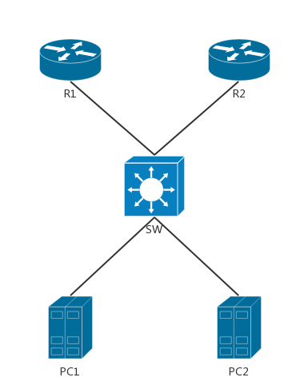

R1运行了DHCP服务，R2也运行了DHCP服务，R1-2和PC1-2连接在交换机，现在如果让两台pc自动获取IP，则可能随机从R1或R2上获取到IP地址（看谁先应答），如果此时R1所在线路出现故障，那么全部的PC将获得R2上DHCP地址池中的地址，如果连接R2的线路存在安全隐患，就有可能让其他人使用这种方法在这条线路上搭建一个DHCP服务器来欺骗正常的PC获取到他指定的IP

```switch
// 配置交换机，让PC1-2只能在R1上获取，并限制其他端口DHCP请求发送速率
SW# conf t
SW(config)# ip dhcp snooping // 启用DHCP防欺骗功能
// 在Vlan1上启用DHCP防欺骗功能，默认情况下交换机所有端口都属于Vlan1，如果创建了其他VLAN，使用相同方法启动Vlan上的DHCP防欺骗功能：“ip dhcp snooping vlan 2”
SW(config)# ip dhcp snooping vlan 1
// 设置可信任端口，不可信任端口将不会接受DHCP应答包,如果可信端口中不包含与PC相连的端口，那么PC也不能接收到DHCP应答包
SW(config)# int range f3/2,f0/0,f0/1
SW(config-if)# ip dhcp snooping trust
SW(config-if)# exit
// 限制其他端口的DHCP请求包的发送速率，避免非法发送大量DHCP请求耗尽DHCP服务器资源
SW(config)# int range f0/2-3,f1/0-3,f2/0-3,f3/0-1,f3/3
SW(config-if-range)# ip dhcp snooping limit rate 2
```

### ARP攻击预防

- 小型局域网中，可以使用双向绑定的方法，在计算机上使用arp命令，或第三方ARP防火墙绑定网关MAC，然后在交换设备或路由上使用命令静态绑定计算机IP对应的MAC地址
- 大型的局域网中，可以在交换或路由设备上使用ARP动态绑定技术

```router
R(config)# arp 192.168.1.2 0050.7966.6800 arpa // 静态绑定192.168.1.2这个地址的MAC
```

### 其他

- 交换机远程登录密码过于简单导致的暴力破解
- Telnet明文传输（在命令行登录路由器的时候使用SSH代替Telnet）
- CDP攻击（建议不使用时关闭，攻击者可从CDP信息获得设备的IP及IOS版本，针对IOS版本Bug进行攻击）
- DOS攻击等

## 静态路由

### 静态路由信息

- 适合小型网络，无CPU开销、路由占用，安全
- 繁琐、工作量大，需要了解网络的具体结构

```router
S 200.2.2.0/24 [1/0] via 192.168.2.1
// 静态 网段/掩码 [管理距离/开销] via（通过） 下一跳（出口）
```

### 静态路由配置

```router
R(config)# ip route 200.2.2.0 255.255.255.0 192.168.2.1 // 网段 掩码 下一跳
或：
R(config)# ip route 200.2.2.0 255.255.255.0 f0/0 192.168.2.1 // 网段 掩码 出接口 下一跳
或：
R(config)# ip route 200.2.2.0 255.255.255.0 f0/0 // 网段 掩码 出接口；不建议，需要开启代理arp，会使得arp表过大
// 直接写下一跳或是出接口&下一跳。单用出接口会依赖其他路由的arp转发，arp表过大，不建议使用；单用下一跳会引发递归查询至出接口。
```

```router
R(config)# ip arp proxy disable // 关闭arp转发
R# show arp // 查看arp表
R# clear arp-cache // 清除arp表
```

使用"下一跳路由器与本路由直连接口的IP"和使用"本路由外出接口"的区别：

- 使用下一跳路由器和本路由器相连的IP地址，默认的管理距离是1；使用本路由外出接口，管理距离默认是0
- 下一跳使用本路由外出接口，这种用法仅能使用在点对点线路上（PPP或HDLC）；如果是以太网或帧中继网络，建议指定下一跳路由器与本路由直连接口的IP地址

### 默认路由

- 默认路由的设置最容易形成路由环路
- 如果数据目的地址在这个网络中不存在，R1将未知数据发往R2、而R2又发往R3、R3再发给R1，环路形成

### 路由优先级

- 管理距离/AD（Administrative Distance）：用来提供路由可信度的一个参考值，管理距离越小，路由条目越可靠，有较小管理距离的路由条目将优先于较大的条目，管理距离的取值范围从0-255；0是最可信，255是最不可信；如果一台路由收到同一个网络的两条路由更新，路由器将选择管理距离较小的那条，放入路由表
- 路由选路原则：
    - 子网掩码最长匹配：一个目标地址被多个网络目标覆盖，它将优先选择最长的子网掩码的路由
    - 管理距离最小优先：在子网掩码长度相同的情况下，路由器优先选择管理距离最小的路由条目
    - 度量值最小优先：如果路由的子网掩码长度相等，管理距离也相等，接下来比较度量值，度量值最小的将进入路由表

路由优先级：

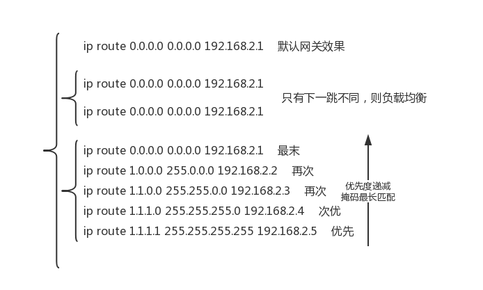

### 借用网络地址

- 接口上必须配置IP地址，才能实现通信，可两个地址除用来通信外再没有其他用途，为了节约IP地址，使用借用IP地址技术
- **需要配置了到对端借用的IP地址所在网段的路由，借用地址才能够正常工作**
- `R(config-if)# ip unnumbered lo 0 // 借用回环接口的IP`

### 路由表结构

- 级别1路由（Level 1 Route），在路由表中只显示成一行
    - **指一条路由使用的子网掩码小于或等于有类网络的默认子网掩码**
        - 网络路由：一条路由使用的子网掩码等于有类网络默认的子网掩码，比如192.168.2.1/24
        - 超网路由：一条路由使用的子网掩码小于有类网络默认的子网掩码，比如172.16.0.0/15
        - 默认路由：比如0.0.0.0/0
- 父路由（Parent Route）
    - 父路由实际上只是一个头部，暗示后面还有级别2的路由，级别2的路由也称为子路由
    - 只要路由表中出现一条子网掩码长度大于默认有类网络子网掩码的路由，父路由就会被创建
        - "12.0.0.0/24 is subnetted, 1 subnets"表示的是父路由，子网掩码的位数是24，该主类网络在路由表中有一个子网
        - "172.17.0.0/16 is variably subnetted, 2 subnets, 2 masks"也是一条父路由，因为子路由拥有不同的子网掩码，所以父路由的子网掩码使用主类网络默认的子网掩码16。"variably subnetted"表示是变长子网，有两个子网，有两种掩码，不同的子网掩码在子路由中分别表示
        - "172.16.0.0/24 is subnetted, 2 subnets"也是一条父路由，因为两个子路由的掩码长度都相同，所以在父路由中用/24表示出来，父路由中已经表示了子网掩码长度，子路由就不必再表示
- 子路由（Child Route）
    - 子路由中明确的标出了下一跳的IP地址或本路由的外出接口
    - 如果所有子路由的子网掩码相同，相同的子网掩码将在父路由中表示出来，子路由中就不再显示子网掩码长度
    - 如果子路由拥有不同的子网掩码长度，子网掩码将在每个子路由中单独表示出来，而父路由则使用默认主类网络掩码
- 最终路由（Ultimate Route）
    - 指路由条目中包含下一跳路由器的IP地址或本路由的外出接口
    - 除父路由外，所有级别1的路由和子路由都是最终路由

### 路由查找过程

- 路由器根据目的IP查找级别1路由，依次查找网络路由（包括父路由）、超网路由、默认路由，如果最佳匹配（子网掩码最长匹配）是级别1路由的最终路由（路由条目中包含下一跳IP或本地外出接口），那么这条路由用来转发数据包
- 如果最佳匹配的是级别1中的父路由，继续下一步查找即查找该父路由的子路由，如果找到匹配的子路由，则这条子路由用来转发数据包
- 如果子路由没有匹配，继续下一步查找，此时判断路由执行的是有类查找还是无类查找（**有类或无类查找是通过`R(config)# ip classless`（无类）和`R(config)# no ip classless`（有类）这两条命令来控制的**）
    - 有类路由行为：终止查找，丢弃数据包
    - 无类路由行为：继续查找级别1的超网路由和默认路由，如果没有超网路由匹配，也没有默认路由匹配，则终止查找，丢弃数据包。如果找到匹配，则使用找到的路由条目进行转发
    - **无类查找需要让Router执行进程交换而不是快速交换，默认的快速交换会影响无类路由查找过程**
        - 进程交换（过程交换）：对于每次转发数据包时，均查找路由表，比较消耗CPU资源
        - 快速交换（缓存）：对于最近收到的数据包，假设下一次还会收到同一地址数据包；因此第一次收到数据包，将构造高速缓存，在下次到达同一目的地的数据包到达时直接查找缓存后转发，而不再去查找路由表；对于路由变动较大的环境没有太多优势
        - CEF特快交换（思科专有）：思科为克服网络拓扑经常变化的环境，设计了CEF
            - CEF有两个表：转发信息表（FIB）和邻接表
                - 转发信息表：FIB表始终与IP路由表保持一一对应的关系，相当于是路由表的一个镜像，路由表发生变化，FIB表也随之迅速更新
                - 邻接表：维护二层的邻接关系，包括输出接口，MAC地址信息等信息
            - CEF通过FIB表和邻接表对数据包进行交换，但它不像快速交换第一次交换，要查找路由表，从而将条目加入缓存中；而是在FIB和路由转发表已经同步后，直接通过FIB匹配三层信息，并利用邻接表来查找二层信息来选择转发的接口；这样即使是路由震荡严重，也不会受到影响，因为要转发的目的地址已经全部在FIB表和邻接数据表中可以直接查找到了；它能够弥补在网络频繁变化的缺点，从而获得更高的稳定性

## ARP协议

### arp信息

- Address Resolution Protol/ARP，地址解析协议
- 将已知的IP地址解析为mac地址
- arp映射表，一般保存4h
- arp广播请求，单播回复
- LAN映射正常有下一跳解析下一跳，有网关解析网关；若都没有且代理开启则触发arp代理
- arp广播请求，后到优先的特性，使得有arp攻击（机制漏洞）；绑定arp以预防arp攻击`R(config)# arp 192.168.1.1 0003.0bcc.000. arpa // arp ip mac地址 封装格式`

Ping包：

- 由于第一次ping封包至以太网时无目的mac，封包失败，故而第一次ping失败
- 后发送arp广播的方式请求目的的mac地址，单播响应，即源广播请求，目的单播回复
- 获取目的mac地址后ping封包成功，ping包发送成功


ARP包：

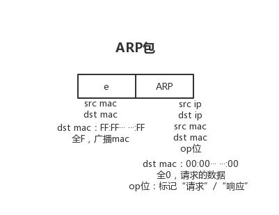

代理ARP：

- 当路由表中路由没有下一跳时有可能发生（即静态路由只有出接口没有下一跳的情况）
- 后台设备发现解析的arp非本网段，会认为前设备没有网关，若后设备有能力访问所解析的地址，则后设备在监听的接口发送其自身的mac地址以回应
- 故而使得前设备arp映射表上一个新IP则有一个新映射且mac地址可能相同
- 若后设备关闭arp转发则使得前设备解析失败
- arp后到优先，故而代理arp可能造成次优选路

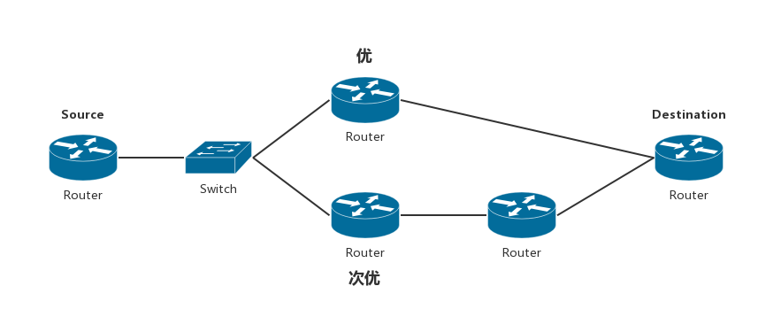

## RIP协议

### rip信息

- RIP：Routing Information Protocol/路由信息协议
- 距离矢量协议，有距离、有方向、传递路由条目，文档号Rfc：1058
- 度量值：跳数，超过15视为不可达
- 每30秒收敛一次
- 管理距离120
- V1广播更新，V2组播更新：224.0.0.9
- 版本V1、V2、NG（针对IPv6）
- 距离矢量协议：传递路由表
- 路由表中管理距离越小越优先
    - `S 192.168.1.0/24 [1/0] // 进入路由表`
    - `R 192.168.1.0/24 [120/1] // 舍弃`

RIP传递：


RIP v1：

- 广播更新
- 有类路由协议，传递时不传子网掩码
- 不支持变长子网掩码（VLSM）
- 不支持认证
- 每个更新包一次传输最大25条目
- 路由查询方式主类网段
- 不支持不连续子网
- 缺点：
    - ```router
        12.0.0.0/24
        C 12.1.1.0/24
        C 12.1.2.0/24
        C 12.1.3.0/24
        C 12.1.4.0/24
      ```
    - 不传递掩码则传递为12.1.1.0，无法判断网段还是主机，则使用A类掩码成12.0.0.0网段
    - 范围变大，精确匹配困难
    - 下述拓扑产生的路由传递将不能达到预期效果
    - 

RIP v2：

- 组播更新
- 无类路由，传递子网掩码
- 支持变长子网掩码（VLSM）
- 支持认证：明文/密文
- 查询机制小类-->大类：按位查询，最长匹配，精确匹配
- 支持不连续子网

RIP v1 & RIP v2：

- UDP传输，UDP为传输层协议，故而RIP为应用层协议
- 源端口号：520
- rip协议号：17（应用层协议无协议号，17实为UDP的编号）
- 请求消息-回应消息（消息形式）
- 默认支持等价负载均衡4，最大6（新的IOS可以支持16/32条）
- 计时器
    - 更新计时器（update）：30s更新路由
    - 超时计时器（timeout）：180s超时进入possible down（此状态仍可被查询、转发数据包），跳数设为16，并启动抑制计时器
    - 抑制计时器（hold-down）：180s，此状态不接受任何关于本条路由的更新（更优的路由除外）也不会向外发送关于本条路由的更新，180s之后同一台邻居路由器仍在通告这个路由较大跳数的路由信息，则路由器就会接受这个新的度量值并通告
    - 刷新计时器（flush）：240s路由能在路由表里停留的最大时间，与超时计时器同时计时，故而抑制时间实际上只有60s

### 路由环路

产生：

R1收到R2的关于1.1.1.1的路由，一周期后又将1.1.1.1发给R2，后R2又发给R1，造成环路  

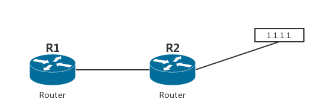

防环：

- 水平分割：从接口收到的路由条目不会再从此接口发出
- 路由毒化和毒性逆转的水平分割：收接口收到的路由条目会从此接口发出，但标记为16跳不可达
- 触发更新：路由发生变化时，立刻发送更新信息（距离矢量路由采用的是周期性更新，可以在串口上使用触发更新，**以太网接口不支持触发更新**）

### rip常用操作

#### rip配置协议

```router
R(config)# int f0/0
R(config-if)# ip address 10.1.1.1 255.255.255.0 // 配置IP
R(config-if)# no shutdown // 开启接口

R(config-router)# router rip  // 进入rip配置
R(config-router)# version 2 // 配置版本，不配置则版本不为1也不为2，发V1广播，收V1、V2组播
R(config-router)# no auto-summary  // 关闭自动汇总;自动汇总：将无类汇总为有类，即12.1.1.0/->12.0.0.0/8，无法精确匹配，故关闭自动汇总
R(config-router)# network 10.1.1.0  // 宣告直连接口的网段，即路由中的 C 标识；先接口入组播，后网段通告

R(config)# router rip
R(config-router)# maximum-paths ? // 可以通过?查看最大支持多少条线路的负载均衡
R(config-router)# maximum-paths 6 // 更改最大支持6条线路负载均衡

R# show ip protocols // 查看运行的路由协议

R(config)# ip route 192.168.0.0 255.255.0.0 null 0 // 黑洞路由，用于防环
R(config)# router rip
R(config-router)# redistribute static // 将静态路由重发布出去
```

#### rip负载均衡

- 基于每个分组的负载均衡，称作进程交换
- 基于每个目的的负载均衡，称作快速交换
- **IOS默认使用快速交换，如果使用进程交换，IOS将会将交替使用每条线路**

```router
R(config)# no ip cef // 关闭快速交换
```

#### rip环回接口

```router
// RIP向回环接口发送的更新，这些更新都是没有意义的；可以将回环接口设置成被动接口，这样这个接口将不再向外发送路由更新
R(config)# router rip
R(config-router)# passive-interface loopback 0
R(config-router)# passive-interface default // 将所有接口都设置成被动接口
R(config-router)# neighbor 123.1.1.2   // 设置单播邻居IP（配置单播更新）

R(config)# int s 0/0
R(config-if)# ip rip triggered // 在接口上开启触发更新功能，只有在点对点双方均开启之后触发更新才会生效
```

#### rip缺省路由

```router
// 使用RIP缺省路由自动向内部路由宣告一条默认路由，用于内部网络路由将数据发送至联网的路由（内外网边界路由）
R(config)# router rip
R(config-router)# default-information originate // 声明是默认路由源，这样就会向其他RIP路由宣告自己是默认路由
```

#### rip实现浮动静态路由

- R1和R2使用快速以太网和串行线路相连
- 假如R1是公司总部路由，R2是分部路由
- 它们之间的快速以太网线路模拟快速专线连接，而串行线路模拟普通慢速线路
- 在没有出现故障前，总部和分部使用快速专线通信
- 当专线发生故障时，要求自动切换到慢速串行线路，并且保持总部和分部的数据通信正常

```router
// RIP仅宣告内部网络和专线，没有宣告串行慢速线路

R1(config)# ip route 192.168.2.0 255.255.255.0 1.1.1.2 130 // 手动配置一条静态路由，使用串行线路到达R2，并且管理距离配置成130
R2(config)# ip route 192.168.1.0 255.255.255.0 1.1.1.1 130 // R2上也配置一条去往R1内部网络的静态路由指向R1的串口IP，管理距离是130

// 根据路由选路原则，子网掩码长度相同的前提下，RIP的管理距离是120，而静态路由的管理距离是130
// 所以将RIP条目放入路由表，当去往192.168.2.0/24的RIP条目消失后，这条静态路由才进入路由表，这就是浮动静态路由原理的基础
```

#### rip更改定时器

```router
R(config)# router rip
R(config-router)# timers basic 20 120 120 180
// timers basic updates invalid holddown flush
```

#### rip手动汇总ip

```router
// 汇总是在路由的外出接口上面做的，如果有多条外出接口，就要在每个接口上执行手动汇总
R(config)# int f0/0
R(config-if) #ip summary-address rip 192.168.1.0 255.255.255.192 // "192.168.1.0/26"
```

#### 路由翻动

- 当路由的接口在"UP"和"DOWN"之间快速变换时，就会产生路由翻动
- 路由汇总除了可以减小路由表大小，还能有效的将上游路由从路由翻动问题中隔离出来

#### rip路由验证

```router
R1(config)# key chain test1 // 创建密钥链test1
R1(config-keychain)# key 1 // 配置密钥链中的key 1
R1(config-keychain-key)# key-string ccna1 // 配置密码串

R1(config)# int s 0/0 // 在与R2相连的串口中配置使用密钥链test1进行验证
R1(config-if)# ip rip authentication key-chain test1
R1(config-if)# ip rip authentication mode md5 // 使用MD5验证
// 验证模式分为两种，一种是text明文验证，一种是md5验证；两端使用的密钥链中的密码串必须相同，并且验证模式也要相同

R2(config)# key chain test2 // test2是密钥名，只起到标识作用
R2(config-keychain)# key 1
R2(config-keychain-key)# key-string ccna1 // 密钥字符串"ccna1"必须和R1相同

R2(config)# int s 0/1
R2(config-if)# ip rip authentication key-chain test2
R2(config-if)# ip rip authentication mode md5 // 验证模式也必须相同
```

#### rip版本间通信

```router
// 在运行RIPv1的一端，让它同时发送版本1和版本2的更新
R1(config-if)# ip rip send version 1 2

// 或者在运行RIPv2的一端，让它同时接收版本1和版本2的更新
R2(config-if)# ip rip receive version 1 2
```

## OSPF协议

### ospf信息

- Open Shortest Path First/OSPF：开放式最短路径优先
- 使用Dijkstra算法
- 链路状态协议，传递数据库
- 度量值：cost=10^8/带宽（bit）
- 使用hello包建立邻居，10s组播一次224.0.0.5/224.0.0.6
- 224.0.0.6：Others更新update、只有DR BDR监听，后再往224.0.0.5组播更新
- DR（Design Router）指定路由器,BDR(Backup Design Router)备份指定路由器
- 管理距离：110
- 文档号rfc：2328
- 版本V2，V3（IPv6）
- 知道完整拓扑
- 度量值：初始接口带宽+路径上的传递方向入接口带宽
- 100 Mbits=100 000 kbits=100 000 000 bits
- 对比：1.优先级-->2.Router-id
- 没有自动汇总功能，无类路由
- OSPF协议号：89，网络层协议
- 五种数据报文：
    - Hello（Hello）
        - Router-id:标识符（环回/物理接口IP最大值）
        - 作用：
            - 发现邻居
            - 数据协商
            - 选举DR、BDR
            - 保持keepalive状态
        - Hello-interval：10s
        - Dead-interval：40s（为Hello固定4倍，反之不是）
            - 在广播（如以太网）和点对点链路（如串行线路）中，Hello间隔默认是10秒；dead时间默认是Hello间隔的4倍（40秒）
            - 非广播多路访问（NBMA），比如帧中继网络中默认Hello间隔是30秒
        - 形成邻居条件：
            - 区域号
            - 认证类型
            - Hello时间
            - 死亡时间
    - DBD（Database Description）可靠
    - LSR（Link -State Request）可靠
    - LSU（Link-State Update）可靠
    - LSACK（Link-State Acknowledgement）
- 默认支持等价负载均衡4，最大16；只支持等价负载均衡
- Hello包寻找邻居，建立关系-->（只给邻居发数据包）描述数据库-->请求-->回应更新-->确认
- 全部224.0.0.5组播监听邻居，DR、BDR监听224.0.0.6的更新数据
- DR、BDR在224.0.0.5组播更新
- DRothers在224.0.0.6组播更新
- 先选举BDR，等DR出来声明自身为DR，若周期内没有声明DR，则BDR-->DR，再选举BDR
- DR、BDR一经选举，不再变更（除非失效）
    - 在多路访问网络中需要选举DR和BDR，比如广播型多路访问的网络：以太网、令牌环网、FDDI；非广播型多路访问的网络：帧中继、X.25、SMDS
    - 点对点或点对多点网络不需要选举，如PPP或HDLC封装的点对点线路

OSPF传递路由：


OSPF包格式：

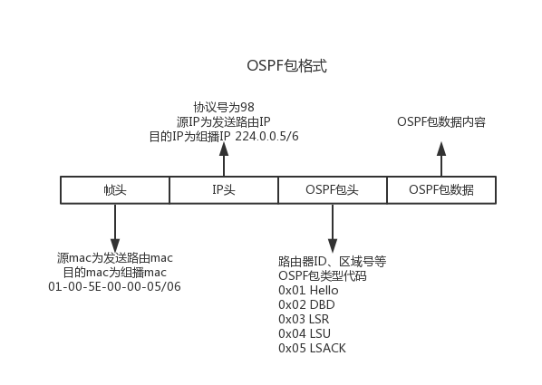

### ospf特点

- 优势：
    - 独立计算到每个网络的最短路径，具有更强的全局观
    - 有较高的收敛速度
    - 检测到拓扑发生变化时立即发送更新
    - 多区域设计，可以将一些问题限制在较小的区域中
- 劣势：
    - 内存需求较高
    - CPU负载高
    - 网络初始化时大量状态包泛洪，影响网络可用带宽

### ospf名词

- 链路/Link：接口加入OSPF进程，即作为OSPF的一条链路
- 链路状态/Link-State：包括接口的IP、子网、网络类型、链路开销、邻居等
- 路由ID/Router ID：用于表示路由器的IP地址，可以手动指定，默认回环接口最高IP，无回环接口则激活的物理接口最高IP
- 邻居/Neighbor：多台路由链接在一个公共的网络上，两台路由通过串行相连或是多台路由通过以太网相连
- 邻接/Adjacency：两台路由之间关系，OSPF只与建立了邻接关系的邻居共享路由信息
- 区域/Area：OSPF通过划分区域实现分层设计，跨越区域的路由称作ABR（Area Border Router，区域边界路由），所有区域与Area 0相连，Area 0称作骨干区域，骨干区域路由器有整个自治系统的所有路由条目
- 指定路由器/Designated Router：每台路由器都把拓扑变化发给DR和BDR，然后由DR通知该多路访问网络中的其他路由器
- 备用的指定路由器/Backup Designated Router：当DR发生故障的时候，BDR转变成DR，接替DR工作
- 花费/Cost：OSPF中度量值，使用链路带宽进行计算

### ospf协议的八种状态

- Down：OSPF初始状态，还没有开始交换信息
- Init：已经收到了邻居的Hello报文，但是报文中没有列出本路由的RID，即对方还没有收到本路由发出的Hello报文
- Two-Way：双向阶段，双方都收到了对方发送的Hello报文，建立了邻居关系，多路访问的网络中，DROther的路由器之间将停留在此状态。此状态下的路由器是不能共享路由信息的，想共享路由信息，必须建立邻接关系。（注意邻居关系和邻接关系的区别）
- Exstart：准备开始交换阶段，双方通过Hello报文决定主从关系，最高RID的路由将成为主路由，最先发起交换
- Exchange：开始交换阶段，路由器将本地的"路由状态数据库(LSDB)"用"数据库描述(DBD)"报文来描述，然后发给邻路由。这个阶段中的路由收到不在其数据库中的有关链路的信息，那么在下一个阶段中将请求对方发送该路由条目的完整信息
- Loading：加载阶段，路由器通过发送"链路状态请求(LSR)"，来向邻居请求一些路由条目的详细信息。邻居则会使用"链路状态更新包(LSU)"来回复LSR请求，收到邻居发回的LSU后，再发送LSAck向发送LSU的路由进行确认
- FULL：完全邻接状态，Loading结束后，路由器之间就变成了"Full adjacency"
- 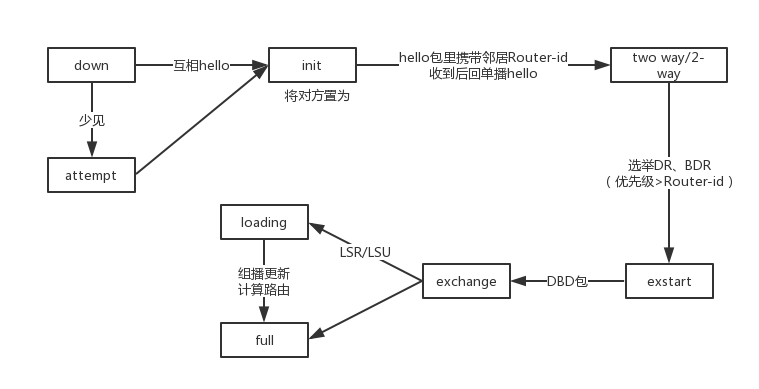

### ospf常用操作

#### ospf配置协议

```router
R(config)# int f0/0
R(config-if)# ip address 12.1.1.1 255.255.255.0 // 配置IP
R(config-if)# no shutdown // 开启接口

R(config)# router ospf <进程号> // ospf进程号只区分本地ospf进程，路由器间无影响
R(config-router)# network 12.1.1.0 0.0.0.255 area <区域号> // 匹配使用反掩码，区域号起路由间区域划分作用，0为骨干区域，所有区域都要与骨干区域相连；"net 0.0.0.0 255.255.255.255 area 0" 将所有接口发布进OSPF进程

// 对于OSPF的宣告还有几种可以使用的不规范格式：
// "net 123.1.1.1 0.0.0.0 area 0" 指定仅有一个IP（123.1.1.1）宣告进OSPF进程。
// "net 123.1.1.0 255.255.255.0 area 0"和"net 123.1.1.0 0.0.0.255 area 0"效果相同。
// "net 0.0.0.0 0.0.0.0 area 0"和"net 0.0.0.0 255.255.255.255 area 0"效果相同。
// 上面几种格式都能被正确识别，但是最好使用规范格式。

R# show ip ospf neighbor // 查询邻居关系
R# show ip ospf database // 查询拓扑表
R# show ip ospf interface s 0/0 // 查看某接口的OSPF信息

R(config)# router ospf <进程号>
R(config-router)# router-id 1.1.1.1 // 手动指定router-id
R# clear ip ospf process // 重启OSPF进程使更改生效

Router# show interface f0/0 // 查看接口带宽

R(config)# interface f0/0
R(config-if)# ip ospf priority 0 // 修改优先级 0不参与选举 默认1 越高越优先

R(config)# int s 0/0
R(config-if)# ip ospf hello-interval 5 // 修改Hello时间间隔
R(config-if)# ip ospf dead-interval 20 // 修改死亡时间间隔

// OSPF中所有的回环接口都被自动宣告成32位的主机路由"/32"；想显示回环接口的实际子网掩码，可以使用下面的命令
R(config)# int lo 0
R(config-if)# ip ospf network point-to-point // 在宣告进OSPF的回环接口上执行
```

#### ospf添加验证

```router
// 在所有参与OSPF进程的接口上配置使用明文密码；在OSPF进程中声明使用明文验证
R1(config)# int fa 1/0
R1(config-if)# ip ospf authentication-key ccna1234 // fa1/0接口验证密码"ccna1234"
R1(config-if)# int s 0/0
R1(config-if)# ip ospf authentication-key ccna // s0/0接口验证密码"ccna"
R1(config)# router ospf 100
R1(config-router)# area 0 authentication // 在OSPF进程中开启区域0的明文验证

// 在R2上也开启明文验证，链路两端配置的密码必须相同
R2(config)# int fa 1/0
R2(config-if)# ip ospf authentication-key ccna1234
R2(config-if)# int s 0/1
R2(config-if)# ip ospf authentication-key ccna
R2(config-if)# router ospf 2
R2(config-router)# area 0 authentication
// R1和R2的串行线路配置的密码都是"ccna"，和多路访问的以太网接口的密码不一样,这是允许的，只要两端的密码相同即可

// 配置MD5验证
R1(config-if)# ip ospf message-digest-key 1 md5 ccna123
R1(config-router)# area 0 authentication message-digest
```

#### ospf默认路由

```router
R(config)# ip route 0.0.0.0 0.0.0.0 lo1
R(config)# router ospf 100
R(config-router)# default-information originate // 发布默认路由
// "O*E2"中O表示从OSPF学习到的路由，E2表示该路由是OSPF外部类型2的路由,OSPF使用E1和E2标记外部路由
// E1表示除计算外部来的花费外，还要计算OSPF内部花费，而E2则只计算外部花费，不计算OSPF域内花费
R(config-router)# default-information originate always // 始终对外发布默认路由，即使接口down了
```

## EIGRP协议

### eigrp信息

- Enhanced Interior Gateway Routing Protocol/增强型内部网关路由协议
- 思科私有协议（已经公有）
- 高级距离矢量协议/需关自动汇总
- 快速收敛
- 支持VLSM、支持不连续子网
- 局部更新
- 支持多种网络协议
- 组播单播代替广播更新
- 可实现手动汇总
- 无环路的无类路由
- 支持WANS和LANS
- 支持等价和非等价均衡
- 组播：224.0.0.10，协议号：88
- Hello包发现邻居（hello 5s、dead 15s 没有关联，只是默认值）
- RTP（Reliable Transport Protocol/可靠传输协议）保证数据包到达邻居
- DUAL弥散算法
- 协议独立模块，每种网络协议都有独立模块支持
- 路由标记功能：从IGRP和任何外部源收到的更新都标记成EX（外部）
- 管理距离
    - 内部：90
    - 外部：170
    - 汇总：5

包结构：

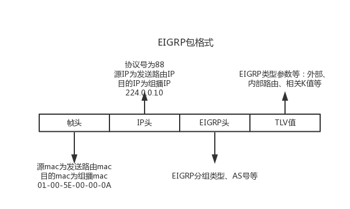

邻居建立：

- as号相同（autonomous system，配置时的as号，路由间相关，用于区分自治系统边界）
- K值匹配（双方度量值计算所参考的基准，K1,K2,K3,K4,K5分别对应带宽[Bandwidth]，负载[Loading]，延迟[Delay]，可靠性[Reliability]，最大传输单元[MTU,Maximum Transmission Unit]，简记**BL**ack **DR**ea**M**，计算度量值时K值只是作为乘数[0或1]，而不是具体的数值）
- 认证相同

路由形成：

- 生成邻居表
- 生成拓扑表
- 生成路由表

DUAL（Diffusing Update Algorithm）弥散算法：

- 无环路径
- 无环备用路径，可立即使用
- 快速收敛
- 限定更新 以使用最少带宽

度量值：

- 带宽[Bandwidth]
- 负载[Loading]
- 延迟[Delay]
- 可靠性[Reliability]
- 最大传输单元[MTU,Maximum Transmission Unit]
- 默认开销计算：Cost = 256 x [ ( 10^7 / 链路最小带宽Kbits ) + ( 链路延迟总和 / 10 ) ]
    - 链路延迟：初始接口+入接口累加
    - 默认K值：K1=1，K2=0，K3=1，K4=0，K5=0
- 其他开销计算：
    - Metric=[ K1 x Bandwidth + ( ( K2 x Bandwidth ) / ( 256 - Load ) ) + K3 x Delay ] x [ K5 / ( Reliability + K4 ) ]
- K2，K4，K5最好不要设置，因为这些参数设置为非零之后，会导致计算度量值时会考虑接口的负载和可靠性，而负载和可靠性会随时间变化，这将导致EIGRP重新泛洪拓扑数据，还可能导致路由器不断地选择不同的路由，由此导致网络不稳定

### eigrp路由环路

- 从A到E，A认为C链路好，A-->C-->E
- 从C到E，C认为A-B-E链路好，C-->A-->B-->E
- 数据从A发往C后又回到A，形成环路
- 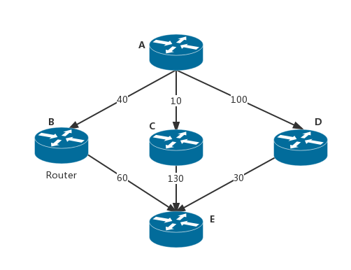

### eigrp路由条目

- 基本信息：
    - 后继路由器：Successor
    - 可行距离FD：Feasible Distance
    - 可行后继路由器：Feasible Successor
    - 报告距离RD/通告距离AD：Report Distance
    - 可行条件FC：Feasible Condition
- 通告距离为下一跳到目的网络的开销，即总开销减去其到下一跳的开销
- 最优的路由条目进入路由表，其他在拓扑表中存在、不是最优路由条目的路由成为可行后继路由器
- 可行条件：能成为可行后继路由器的条件（非最优条目的通告距离**必须**小于最优条目的可行距离[防环]）
- 

### eigrp报文

- hello：发现、验证和重新发现邻居路由器，组播
    - 默认的Hello分组发送间隔，除小于等于1.544Mb/s的多点帧中继链路是60秒外，其他链路都是5秒
    - 默认的保持时间是Hello时间的3倍，即15秒
    - 仅在宣告进EIGRP进程的接口的主IP地址上发送分组
- update：发送路由更新信息，组播、重传单播，需要被确认
- query：向邻居发送请求查询信息，组播，需要被确认
- reply：响应query信息，单播，需要被确认
- ack：确认一个可靠的报文（不是具体报文，是报文里的ack标记），单播
- request：目前不再使用

### eigrp联系建立

邻居建立：

- 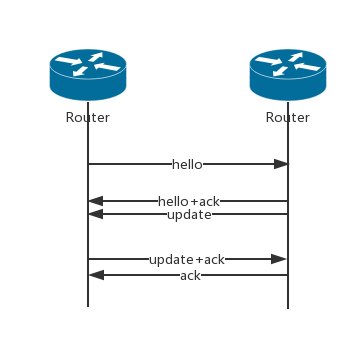
- 路由没了发送query，有则reply，无则发16个，超时后删除

邻居表：

- 建立起邻接关系需要满足两个条件
    - 具有相同的AS号
    - 具有相匹配的K值：show ip protocols查看K值

拓扑表：

路由表：

### eigrp常用操作

#### eigrp配置协议

```router
R(config)# interface f0/0
R(config-if)# ip address 12.1.1.0 255.255.255.0 // 配置IP
R(config-if)# no shutdown // 开启接口

R(config)# router eigrp <自治系统号> // 双方as号相同才能建立邻居，不同表示不是同一个协议
R(config-router)# no auto-summary // 关闭自动汇总
R(config-router)# network 12.1.1.0 0.0.0.255 // 宣告网段，反掩码匹配，正掩码会自动转换；不写则默认主掩码
// 12.1.1.0/12.1.2.0/12.1.3.0可以合为12.1.0.0，大范围包小范围
// 如果所有接口都宣告进EIGRP，则可以使用"net 0.0.0.0"一次性宣告所有接口

R# show ip eigrp neighbors // 显示邻居
R# show ip eigrp topology // 显示拓扑表
R# show ip eigrp topology all-link // 显示所有拓扑表，包括无资格进入拓扑表的

R(config)# interface f0/0
R(config-if)# bandwidth 100 000 // 单位：Kbits，修改带宽
R(config-if)# delay 10 // 单位：10ms，修改延时
R(config-if)# ip hello-interval eigrp 100 30 // 接口内修改hello时间 ip hello-interval eigrp <as号> <时间>
R(config-if)# ip hold-time eigrp 100 90 // 接口内修改保持时间 ip hold-timel eigrp <as号> <时间>
R(config)# router eigrp 100
R(config-router)# metric weights 0 1 0 0 0 0 // 修改K值，其中tos被用作服务质量区分服务等级

R# show ip eigrp interfaces detail s0/0 // 显示Router的s0/0接口上EIGRP配置信息
```

#### eigrp非等价负载均衡

```router
R(config-router)# router eigrp <as-num>
R(config-router)# variance <var_value> // 实现非等价负载均衡（需要有可行后继路由器）；var_value：可行后继路由器开销/后继路由器开销 （向上取整）
R# show ip route // 查看路由表
```

#### eigrp手动汇总ip

```router
R(config)# router eigrp 100
R(config-router)# passive-interface lo 0
R(config-router)# passive-interface lo 1
// 上述将回环接口设置成被动接口，即不发送分组，来减小路由表大小

R(config)# int s 0/1 // 手动汇总在主类网络的边界接口上配置
R(config-if)# ip summary-address eigrp 100 2.2.0.0 255.255.254.0
// 手动汇总后自动生成了一条汇总路由，指向空接口
```

#### eigrp的外部路由

配置的时候，并没有使用net 0.0.0.0宣告全部的接口，现在使用路由重发布技术，将新接口发布进EIGRP

```router
R(config)# router eigrp 100
R(config-router)# redistribute connected // 重发布直连路由

// 查看路由表,发现一条D EX开头的条目；"D EX"表示这条路由条目是EIGRP外部路由，不是起源EIGRP内部
// 可能是用重发布发布进EIGRP进程的，EIGRP外部路由默认管理距离是170
```

#### eigrp重发布默认路由

可以使用相同的方法重发布一条外部默认路由，配置一条默认路由，然后再将这条默认路由使用静态路由的形式重发布到EIGRP进程里

```router
R(config)# ip route 0.0.0.0 0.0.0.0 lo1 // 默认路由
R(config)# router eigrp 100
R(config-router)# redistribute static // 重发布静态路由
```

#### eigrp添加验证

全局配置模式下创建密钥链，在接口中调用密钥链并且制定验证模式

```router
// R1配置验证
R1(config)# key chain ccnakey1 // 链标识ccnakey1，只具有本地意义
R1(config-keychain)# key 1
R1(config-keychain-key)# key-string 123456 // 密钥密码，双方需要相同
// 在和R2相连的接口上调用密钥链，并指MD5加密
R1(config-keychain-key)# int s 0/0
R1(config-if)# ip authentication key-chain eigrp 100 ccnakey1
R1(config-if)# ip authentication mode eigrp 100 md5

// R2配置验证
R2(config)# key chain ccnakey2
R2(config-keychain)# key 1
R2(config-keychain-key)# key-string 123456
R2(config-keychain-key)# int s 0/1
R2(config-if)# ip authentication mode eigrp 100 md5
R2(config-if)# ip authentication key-chain eigrp 100 ccnakey2
```

#### eigrp性能调整

默认情况下EIGRP使用接口50%的带宽来传递EIGRP信息，可以使用下面的命令来更改EIGRP默认的接口带宽占用率

```router
// 将s0/0接口的EIGRP带宽占用率调整成5%
R(config)# int s 0/0
R(config-if)# ip bandwidth-percent eigrp 100 5
```

## ACL列表

### acl信息

- ACL（Access Control List，访问控制列表）
- 是一系列运用到路由器接口的指令列表，路由根据ACL中指定的条件对经过路由器接口的数据包进行检查
- 作用：
    - 流量控制，限制网络流量，提高网络性能
    - 匹配满足条件的流量，提供数据流控制
    - 为网络访问提供基本的安全层
    - 决定转发或阻止哪些类型的数据流
- 路由和交换机接口下指令列表，控制端口进出数据包
- 表中包含匹配关系、条件和查询语句；表只是框架结构，目的在于对某种访问进行控制
- 编号：
    - 1-99；1300-1999：标准ACL，基于源IP地址进行过滤
    - 100-199；2000-2699：扩展ACL，基于源、目的IP，源、目的TCP/UDP端口，协议类型进行过滤
    - AppleTalk：600-699
    - IPX：800-899
- 原则：
    - 基于每种协议配置ACL列表
    - 基于每个方向配置ACL列表
    - 基于每个接口配置ACL列表
    - 标准ACL要尽可能的应用在靠近目标端，因为标准ACL只针对源地址进行过滤
    - 扩展ACL应该尽可能的放在靠近源端，这样可以使得一些非法的数据流尽早的被丢弃
- 原理：
    - 入站ACL
    - 出站ACL（要么应用于入站数据流，要么应用于出站数据流）
    - 当路由器的进入方向的接口收到一个分组的时候，首先检查它是否是可路由的，如果不可路由（比如并非是发往本路由的分组），则直接丢弃
    - 如果可路由，接下来判断进入方向的接口是否配置了ACL，如果没有配置进入方向的ACL，则直接查询路由表，然后根据路由表中找到的端口准备往外转发，如果配置了进入方向的ACL则检查指令组是否允许该分组通过，不允许则丢弃，允许则查询路由表，选择外出接口准备往外转发，**入站的ACL检查是在查询路由表之前执行的**
    - 外出接口选择好之后，再检查外出接口上有没有配置ACL，如果配置了ACL则检查ACL指令组是否允许，没有配置ACL则直接转发
    - **从上到下，每次一条语句；一匹配就执行，匹配后不管后边语句，故配置时应注意语句顺序**
    - 如果所有指令都不匹配，默认的动作是拒绝
- 匹配过程：
    - 如果一个数据包中包含了源IP地址"192.168.0.2"到达路由器，假设路由器上的访问控制列表语句中包含"192.168.0.0 0.0.0.255"，路由器按照下面的步骤匹配这个IP地址
    - 使用访问控制列表中的地址对"192.168.0.0 0.0.0.255"执行逻辑或操作（192.168.0.0和0.0.0.255执行逻辑或运算），得到结果192.168.0.255
    - 用地址对中的通配符掩码（0.0.0.255）和数据包头中的IP（192.168.0.2）执行逻辑或操作，结果为192.168.0.255
    - 将得到的两个结果相减，如果结果是0则匹配，如果结果非0,则说明不匹配。对接下来的ACL条目都重复以上三步相同的操作
- 通配符：
    - "192.168.0.0 0.0.0.255"：普通IP/掩码
    - "any"：它可以用来代替地址掩码对"0.0.0.0 255.255.255.255"，该地址掩码对匹配任何IP地址
    - "host"：它可以用来代替通配符掩码"0.0.0.0"，该通配符掩码只能匹配一个IP地址
    - 在标准的访问控制列表中，如果仅匹配一个IP地址，可以省略关键字host，也就是说在标准访问控制列表条目中，没有通配符掩码，说明掩码是"0.0.0.0"
    - 在扩展的访问控制列表中不能省略host关键字
- 配置
    - 访问列表编号指明了使用何种协议的访问列表
    - 每个端口/协议/方向只能对应一条访问列表
    - 列表内容决定数据控制顺序
    - 具有最严格限制的条件语句应放在最上面
    - **列表的最后有一条隐含声明deny any any**
    - 每条正确的ACL表至少有一条允许语句
    - 先创建ACL，后应用到端口
    - ACL不能过滤路由自己产生的数据，ACL仅对穿越流量起作用，对本路由器起源的流量不起作用（本路由Ping其他路由等）

ACL工作流程：


### acl常用操作

#### acl操作命令

```router/switch
R(config)# access-list <ACL_num> {deny|permint} {source [source-wildcard]|any} [log]
// "[log]" 可选参数，表示要不要将匹配的条目显示在控制台输出中，或者输出到特定的服务器

R(config)# access-list <ACL_num> {deny|permit|remark} protocol source source-wildcard [operator operand] [port port-name or name] destination destination-wildcard [operator operand] [port port-name or name] [established]
// "remark" 是添加注释，相当于程序设计中的注释语句
// "[port port-name or name]" 表示端口号或名称，输入telnet和23的效果是一样的
// "[established]" 可以用作TCP的单向访问控制
    // 设计基于TCP的三次握手，在TCP会话中初始的数据包只有Sequence（序列号）而没有ACK（确认号）
    // 如受保护的网络主动发起对外部网络的TCP访问，外部返回的数据将携带TCP ACK参数，这样的数据将被允许
    // 外部主动发起的对内部受保护网络的访问则不会被允许，因为只有序列号没有确认号
```

```router/switch
R(config)# access-list 100 permit icmp 192.168.1.10 0.0.0.0 host 1.1.1.1 echo
// access-list <编号> permit/deny <协议> 网段 反掩码 目的网络 具体类型
R(config)# access-list 100 permit icmp host 192.168.1.10 host 1.1.1.1 echo // 等价
R(config)# access-list 100 deny icmp any host 1.1.1.1 echo // 拒绝所有ping访问1.1.1.1；host只匹配一台主机，echo为ping包类型

R(config)# access-list 100 permit ip any any// 置于列表结尾，ip表示所有协议
// 因为ACL最后隐含deny any语句，故而需要在表中添加允许，否则最后匹配deny any语句，使得其余数据全部不可达
// ACL从上到下，逐条匹配，若都不匹配，则匹配最后默认隐含语句deny any

R(config)# interface f0/0
R(config-if)# ip access-group 100 in // ip 分组调用 编号 调用方向

// 其他配置方式
R(config)# access-list 1 permit host 192.168.1.10 // 标准ACL参数较少

R# show access-list // 显示ACL表
R# show ip access-list 100 // 显示编号100的ACL表

R(config)# no access-list 1 // 删除编号是1的标准ACL
R(config-if)# no ip access-group 1 in // 删除在接口上的调用

R(config)# ip access-list standard 1
R(config)# ip access-list extended 100 // extended表示扩展ACL表，100为表编号，表的条目序号默认10/20/30累加
R(config-ext-nacl)# no 20 // 删除序号为20的ACL条目
R(config-ext-nacl)# 20 deny icmp any host 1.1.1.1 echo // 添加序号为20的ACL条目

R(config-ext-nacl)# 5 permit tcp host 192.168.1.10 host 1.1.1.1 eq 23
R(config-ext-nacl)# 10 deny tcp any host 1.1.1.1 eq 23
// eq为端口号，应用层数据端口号，表示1.1.1.1的端口为23；也可以加在192.168.1.10后，表示192.168.1.10的23端口
// 但是源端口不固定，限制的意义不大；目的的端口固定，因此限制目的端口；此eq所在不同位置表示不同的意义，与先前的echo表示意义不同

R(config)# interface f0/0
R(config-if)# ip access-group 100 in // 接口上的调用

// 调整起始编号和编号的递增方式,100是ACL的编号，也可以是一个命名扩展ACL的字符串名称
R(config)# ip access-list resequence 100 1 5 // 1代表起始的数字，5代表增量（每个条目编号增加5）
```

#### 配置标准命名acl

- 可以使用字符来代替数字标识ACL，称为命名ACL
- 命名ACL与Cisco IOS 11.2以前的版本不兼容，现在一般都是12.0以后的版本
- 不能为多个ACL使用相同的名字，不能使用相同的名字来命名不同类型的ACL，不能使用相同的名字来命名一个标准ACL和一个扩展ACL

```router
R(config)# ip access-list standard deny-r1 // "deny-r1"就是这条标准ACL的自定义名称
R(config-std-nacl)# deny 12.1.1.1 // 第一条规则，阻止12.1.1.1
R(config-std-nacl)# permit any // 第二条规则允许所有IP
R(config-std-nacl)# exit
R(config)# int s 0/1 // 在R3的s0/1接口上调用它
R(config-if)# ip access-group deny-r1 in

// 标准命名的ACL也可以使用标准ACL里面的编辑语句来编辑
R(config)# ip access-list standard deny-r1
R(config-std-nacl)# no 20 // 删除编号是20的条目

// 删除这个标准命名ACL，并在接口上删除对它的调用
R(config)# no ip access-list standard deny-r1
R(config)# int s 0/1
R(config-if)# no ip access-group deny-r1 in
```

#### 扩展acl的已建立参数

```router
// 可选参数"established"，可以用作TCP的单向访问控制
    // 设计基于TCP的三次握手，在TCP会话中初始的数据包只有Sequence（序列号）而没有ACK（确认号）
    // 如受保护的网络主动发起对外部网络的TCP访问，外部返回的数据将携带TCP ACK参数，这样的数据将被允许
    // 而外部主动发起的对内部受保护网络的访问则不会被允许，因为只有序列号没有确认号
// 末尾添加established参数，注意，因为是允许R3访问R1的telnet，源和目的地址以及端口别搞错了
// 这个访问列表是当R3的telnet发到R1，R1回复的TCP中携带ACK号才匹配的，所以源应该是R1，源端口应该是R1的telnet端口23
// 目的端口是R3上的一个随机端口，没有写出来就是匹配所有端口
R1-s0/0======s0/0-R2-s0/1======s0/1-R3

R2(config)# access-list 100 permit tcp host 12.1.1.1 eq telnet host 23.1.1.3 established
R2(config)# int s0/1 // 在接口上调用，注意方向是Out
R2(config-if)# ip access-group 100 out
//这个acl配置在R2的s0/0接口，方向是in，如果那样配置，R1不仅仅不能访问R3，就连R2也不能访问
```

#### 扩展acl允许路由协议

```router
R(config)# access-list 100 permit udp any host 255.255.255.255 eq rip // 允许RIPv1数据流
R(config)# access-list 100 permit udp any host 224.0.0.9 eq rip // 允许RIPv2的流量
R(config)#access-list 100 permit eigrp any any // 允许EIGRP的流量
R(config)#access-list 100 permit ospf any any // 允许OSPF的流量
```

#### 配置反射acl

- Cisco IOS只支持使用扩展的命名访问控制列表来定义反射列表
- ACL参数中携带established能够起到单向访问控制的目的，但是这种使用方法只能针对TCP的流量
- 反射ACL能够提供真正意义上的单向访问控制
- 当内部发起一个会话（基于IP、ICMP、TCP、UDP都可以），并将数据发给外部网络时，反射ACL被触发并且生成一个新的临时条目，如果从外部返回的数据符合临时条目，则允许进入内部网络
- 如果是一个始发于外部的会话，在边界路由上不会有临时条目的记录，边界路由上的反射ACL将阻止这样的流量进入内部网络
- 临时条目的生成依据的原则：
    - 协议(protocol)保持不变
    - Source-IP和Destination-IP严格对调
    - Source-Port和Destination-Port严格对调
    - 对于ICMP协议，会根据协议类型号进行匹配
- 临时的反射条目是有生存时间的：
    - TCP会话，如果路由器检测到两组FIN标记，则会在5秒内删除这个临时条目（比如R3登录R1后使用exit退出登录，R2就会在5秒钟以内删除这个临时条目）
    - 如果路由器检测到RST位的分组，则会立即删除临时条目
    - 对于UDP和其他协议（比如ICMP等），默认的删除时间是倒计时300秒
    - `R(config)# ip reflexive-list timeout 30 // 将默认生存时间改成30秒`

```router
// 创建扩展命名ACL，这个ACL将在R2的s0/0接口的出方向上调用；"permit ip any any reflect out-ip"：允许所有IP流量，并对外出的IP流量进行反射，反射生成的临时ACL被保存到out-ip列表中
R2(config)# ip access-list extended out-acl
R2(config-ext-nacl)# permit ip any any reflect out-ip
R2(config-ext-nacl)# exit
// 创建另外一个扩展命名ACL，这个ACL的作用是对进入的流量做评估；"evaluate out-ip"当有流量进入的时候，使用这个临时的ACL评估
R2(config)# ip access-list extended in-acl
R2(config-ext-nacl)# evaluate out-ip
R2(config-ext-nacl)# exit
R2(config)# int s 0/0 // 在R2的s0/0接口的外出方向调用out-acl，这个ACL会根据每个从R3途径R2外出到R1的流量做反射，生成一个临时的ACL out-ip
R2(config-if)# ip access-group out-acl out
R2(config-if)# ip access-group in-acl in //在R2的s0/0接口进入方向做评估

// 进入方向、外出方向是相对的。从R1访问R3，那么R2的s0/0就是进入方向；从R3访问R1，R2的s0/0接口对于R3来说就是外出方向
```

反射ACL：


#### 配置动态acl

- 临时条目的生存周期：
    - 动态ACL的生存周期有两个参数：空闲时间和绝对时间，当验证通过后，动态ACL临时条目生成后，空闲时间和绝对时间倒计时同时启动
    - 空闲计时器在每当有一个报文匹配动态访问列表时进行复位（即重新开始倒计时），当空闲计时器到期时，该临时条目被删除
    - 绝对计时器永不复位，当绝对定时器到期时，该动态条目被删除
- Telnet的设置：
    - 配置了动态ACL后，R2上所有的Telnet请求都会被路由器认为是要开启一个动态ACL条目，当用户验证后，telnet就会被关闭，这样会带来一个问题，网络管理员将不能通过Telnet对路由进行管理
    - 使用`rotary`命令开启其他Telnet端口，如`rotary 1`命令开启的端口是3001，`rotary 2`开启3002，以此类推

```router
R2(config)# access-list 100 permit tcp any host 12.1.1.2 eq 23 // 允许外网Telnet本路由进行验证
// 允许使用3001端口对本路由进行管理，用"rotary 1"命令打开这一端口，
// 在实际应用中很少使用Telnet去对路由进行远程管理，如果使用其他网络协议，在这里需要打开对应端口
R2(config)# access-list 100 permit tcp any host 12.1.1.2 eq 3001
// 创建动态ACL，名称为"ccna_dyanmic_acl"；"timeout 60"是绝对时间，60分钟；"permit tcp any host 23.1.1.3 eq 23"后半部分中的"any"会被通过验证的主机的IP地址所代替
R2(config)# access-list 100 dynamic ccna_dyanmic_acl timeout 60 permit tcp any host 23.1.1.3 eq 23
R2(config)# user usertest pass 111 // 在本地创建验证用的用户名usertest密码111
R2(config)# line vty 0 3 // 用来验证的VTY线路0、1、2、3
R2(config-line)# login local // 使用本地用户名和密码验证
// 这条命令中的host会被验证通过的主机的IP代替，这个IP会被传递到上面的动态临时ACL中，去替换any关键字
R2(config-line)# autocommand access-enable host timeout 3 // "timeout 3"是空闲时间，这里设置成3分钟
// 另外创建一条VTY线路4，也使用本地用户名和密码验证，这条线路用来远程管理路由器，使用的端口是3001
R2(config-line)# line vty 4
R2(config-line)# login local
R2(config-line)# rotary 1
R2(config-line)# int s 0/0
R2(config-if)# ip access-group 100 in // 在路由的端口上调用这个ACL
```

动态ACL：

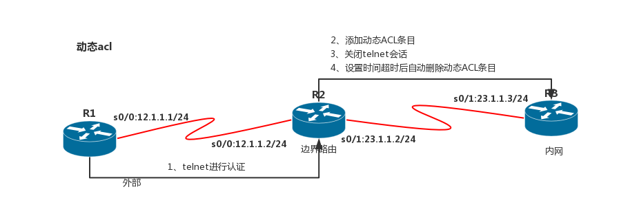

#### 配置动基于时间的acl

```router
R2(config)# clock timezone GMT +8 // 配置时区，东八区
R2(config)# end
R2# clock set 22:33:00 25 november 2017 // 设置成当前时间
R2# conf t
R2(config)# time-range working // 创建时间范围，working是自定义的名称
R2(config-time-range)# ? // 查看帮助
    ··· Time range configuration commands:
    ··· absolute  absolute time and date
    ··· default   Set a command to its defaults
    ··· exit      Exit from time-range configuration mode
    ··· no        Negate a command or set its defaults
    ··· periodic  periodic time and date
// 使用周期性的时间范围，关键字weekdays代表周一到周五；每周周一到周五上午7点到8点，下午1点到2点可以Telnet
R2(config-time-range)# periodic weekdays 7:00 to 8:00
R2(config-time-range)# periodic weekdays 13:00 to 14:00
R2(config-time-range)# exit
// 创建基于时间的ACL，time-range后面跟上面创建的时间范围名称
R2(config)# access-list 100 permit tcp host 12.1.1.1 host 12.1.1.2 eq 23 time-range working
R2(config)# int s 0/1
R2(config-if)# ip access-group 100 in // 在接口上调用

R2# show access-lists // 查看，因为现在时间不符合，这个条目没有生效(inactive)
    ··· Extended IP access list 100
    ···     10 permit tcp host 12.1.1.1 host 12.1.1.2 eq telnet time-range working (inactive)
```

### acl的注意点

- 访问控制列表只对穿越流量起作用
- 标准列表应该尽可能应用在靠近目标端
- 扩展访问列表应该尽可能应用在靠近源端
- ACL条目的放置顺序很重要，如果两条语句放置的前后都不影响结果，一般将较多使用的那条放在前面，这样可以减少路由器的查找时间
- IP访问控制列表中最后隐含为拒绝所有，没有匹配任何语句的流量将被拒绝
- 同一个访问控制列表可以应用在同一个路由的不同接口上
- 对于每个协议的每个接口的每个方向，只能提供一个访问控制列表
- 没有携带条目号对ACL的编辑，比如添加操作，条目默认是被添加在ACL的最后面

## VLAN相关

### vlan信息

- 虚拟局域网/Virtual Local Area Network/VLAN
- 同一个交换机相同vlan可以通信，不同vlan不能通信
- 不同的交换机相同vlan可以通信，不同vlan不能通信（trunk）
- 默认所有端口都属于vlan1（公有）
- 每个端口都可以属于不同的vlan
- 每个逻辑vlan都相当于一个独立的物理桥
- vlan可以跨越多台交换机
- trunk可承载多个vlan数据
- trunk使用特殊封装区分不同vlan
- 现在只有100Mb/s以上（包括100Mb/s）的线路才支持Trunk
- VLAN的创建信息是被单独保存在vlan.dat文件中
- 创建的VLAN信息是默认保存在Flash的vlan.dat里面的，但是端口的分配信息是保存在配置文件中的
- vlan作用是为了隔离广播域，安全，便于管理，而不是为了不能通信

本征vlan：

- Native Vlan，主干端口的特征
- 使用802.1Q封装的主干端口，将数据帧从主干发出时，如果数据帧中的VLAN标识与主干端口的本地VLAN号一致，那么交换机清除数据帧中的VLAN标识，再从主干端口发出
- 使用802.1Q封装的主干端口，从主干端口接收到数据帧时，如果数据帧中没有VLAN标识，交换机将给这个数据帧添加接收这个帧的主干端口的本地VLAN号

### VLAN编号

- vlan1：所有接口默认都属于vlan1
- 支持4096个vlan，编号0~4095共4096个vlan
- vlan1、1002、1003、1004、1005初始vlan，不能删除
- 编号0、4095不能使用
- vlan1002、1003、1004、1005保留，不能使用
- 编号1~1001标准vlan
- 编号1006~4094扩展vlan，cisco 3560以上型号才有，vtp协议的transparent模式可用

### vlan标记协议

- 帧标记（又称显式标记）：根据数据进入交换机的端口属于哪个VLAN来标记一个帧。当一个帧进入交换机的时候，根据那个端口所属VLAN，为帧添加一个包含VLAN标识的域（VLAN着色），缺点是不支持VLAN的设备会将这种更改后的帧当成无效帧丢弃。但现在这种技术已经形成了一个IEEE802.1Q的标准，解决了不同厂商进行帧标记时候的兼容性问题
- 帧过滤（又称隐式标记）：这种方法为每个VLAN保持一张MAC地址表，确定目标后就做出转发决定。好处是不更改原来的帧格式，帧通过不同的网络设备都不会出现问题。缺点是每个VLAN交换机都要保存一张MAC地址表，这张表还要包含每个MAC所属VLAN的信息，并且能根据源地址的VLAN以及MAC进行过滤转发
- 现阶段最常使用的干线协议是802.1Q和ISL（不同厂商设备混用的情况下一定要使用802.1Q）
- 802.1Q是IEEE提出的一个通用标准，也是现在大部分厂商的默认干线传输协议，通过在原来的以太网帧头部添加一个4字节的802.1Q头部，然后重新计算FCS（帧效验序列）来实现

vlan区分方式：


802dot1q包格式：


### DTP协议

- DTP（Dynamic Trunking Protocol，动态主干协议），是思科私有的协议
- 当交换机上某些端口被配置成主干模式时，DTP自动运行，用来协商链路能否成为主干链路
- DTP支持802.1Q和ISL封装的主干链路协商
- 状态
    - OFF(关闭)：使用"switchport mode access"命令，静态配置交换机端口为接入端口（非主干端口）
    - ON（打开）：使用"switchport mode trunk"命令，静态配置交换机端口为主干端口
    - Dynamic auto（动态自动）：使用"switchport mode dynamic auto"命令，静态配置交换机端口为动态自动模式
    - Dynamic desirable（动态期望）：使用"switchport mode dynamic desirable"命令，静态配置交换机端口为动态期望模式
    - Nonegotiate（关闭DTP协议）：使用"switchport nonegotiate"命令，将关闭DTP协议

Access是链路通过DTP协议协商后成为了非主干链路；Trunking是指链路协商后成为了主干线路；错误是指有故障的链路，协商失败：

| 协商结果                 | OFF      | ON         | ON and Nonegotiate   | Dynamic auto   | Dynamic desirable   |
| :----------------------: | :------: | :--------: | :------------------: | :------------: | :-----------------: |
| **OFF**                  | Access   | Err        | Err                  | Access         | Access              |
| **ON**                   | Err      | Trunking   | Trunking             | Trunking       | Trunking            |
| **ON and Nonegotiate**   | Err      | Trunking   | Trunking             | Err            | Err                 |
| **Dynamic auto**         | Access   | Trunking   | Err                  | Access         | Trunking            |
| **Dynamic desirable**    | Access   | Trunking   | Err                  | Trunking       | Trunking            |

### 语音虚拟局域网

IP语音电话需要带宽保证、优先传输、拥塞避免并且要求穿过整个网络的延时小于150毫秒，思科IP电话机一般有两个接口，一个接口可以接交换机，一个接口可以接PC，IP电话可以单独连接在交换机上，有时为了节约端口，可以连接IP电话后再连接计算机

```switch
// 在没有配置语音VLAN前，IP电话和PC处于同一个VLAN中
// Cisco交换机支持通过下面这条命令将IP电话和PC工作站划分到不同的VLAN
SW(config)# int f0/1
SW(config-if)# switchport voice vlan 50

Switch# show int f0/1 switchport // 查看交换接口参数，可以看到Vioce VLAN变成了50
```

### 交换机端口类型

- 交换端口（Switchport）
- 路由端口（No Switchport）
- SVI端口（Switch Virtual Interface，交换虚拟端口）
- 二层交换机端口类型：
    - 交换端口：二层交换机上的物理接口就是一个二层的交换端口
    - SVI端口：二层交换机也可以被配置一个IP地址，实现对交换机的远程管理
- 三层交换机的端口类型：
    - 除了支持二层交换机的"交换端口"、"SVI端口"之外，还支持"路由端口"

```switch
// 给Switch配置一个用来网管的IP地址；1：这个VLAN必须在间路由上有子接口（或物理接口）作为网关；2：只有最小的激活SVI端口（no shut）是有效的
// 可以将SVI配置在VLAN3上，但是必须关闭刚才配置的VLAN2的SVI，如果不关闭VLAN2的SVI，那么只有VLAN2的SVI会被使用
SW(config)# int vlan 2
SW(config-if)# ip add 192.168.1.200 255.255.255.0
SW(config-if)# no shut  // 打开此SVI接口

SW(config)# ip default-gateway 192.168.1.254 // 配置网关
SW(config)# line vty 0 4 // 配置vty密码
SW(config-line)# pass 123
SW(config-line)# login

SW(config)# enab sec 123 //特权密码

```

```switch
SW(config-if)# no switchport // 将接口变成路由接口；之后就能配置IP地址，类似路由接口
SW(config-if)# ip add 192.168.22.22 255.255.255.0
SW(config-if)# no shut // 启用接口
SW(config-if)# switchport // 再转换成2层接口
// 路由端口虽然可以配置IP地址，具有三层接口的特性，但同时也失去了二层接口的特性，比如端口安全等
```

### 路由器和三层交换机在实现虚拟局域网间路由上的区别

- 不同VLAN间的通信都要经过路由器，而经过路由器的延时比经过交换机的延时大，因为路由器比交换机处理过程复杂（对每个数据帧都得解封装-查询路由表-再封装）
- 路由和交换机之间的线路会成为瓶颈
- 基于三层交换机的VLAN间路由上，不存在线路瓶颈，因为在交换机内部，交换机的背板带宽可以上几十GB甚至TB
- 其次假设VLAN2中的PC1要和VLAN3中的PC2进行通信，PC1将数据包发给三层交换机上的SVI端口，三层交换机知道这是一个VLAN间的通信，三层交换机将数据包通过背板电路发给路由模块，路由模块解封装查询路由表，然后再次封装发给交换模块，交换模块查询MAC表最后封装成帧，从对应接口发出去。后面相同目的地的数据包直接查询缓存进行转发，而不发往路由模块（**一次路由，多次交换**），这就大大提高了转发速度

### vlan常用操作

#### 配置虚拟局域网

VLAN配置：（数据从一个接口进，路由还是从此接口出，则称为单臂路由）


```switch/router
R1:
R1(config)# interface f0/0
R1(config-if)# no shutdown
R1(config)# interface f0/0.1 // 建立子接口，编号1，可以建立很多子接口
R1(config-if)# encapsulation dot1Q 10 // 封装 封装格式 vlan号；封装并划分vlan
R1(config-if)# ip address 192.168.1.1 255.255.255.0

R1(config)# interface f0/0.2 // 建立子接口，编号2
R1(config-if)# encapsulation dot1Q 20 // 封装 封装格式 vlan号；封装并划分vlan
R1(config-if)# ip address 192.168.2.1 255.255.255.0
// 网关分配好后即可通信，因需要vlan标记区分，故而需要trunk，将Switch1的f0/4模式设置为trunk
---------
SW# show vlan brief // 查看vlan以及接口表
SW# show interface trunk // 查看trunk接口
// 当成为trunk或vlan消失，vlan表中接口会消失
// 两种配置vlan方式
// 1.
SW# vlan database
SW(vlan)# vlan <vlan号> name <vlan名字> // 创建并命名vlan
SW(vlan)# exit // 退出并保存
// 2.
SW(config)# vlan <vlan号> // 创建vlan
SW(config-vlan)# name <vlan名字> // 命名vlan
SW(config-vlan)# exit // 退出并保存

SW(config)# interface f0/1
SW(config-if)# switchport mode access // 表示接口所连接的是一个终端，划分为接入接口，防止所连设备对交换机的攻击
SW(config-if)# switchport access vlan 10 // 将接口划分入vlan10

SW(config)# interface f0/3
SW(config-if)# switchport mode trunk // 将接口划分为trunk，trunk也可以实现不同vlan间通过路由进行通信
SW(config-if)# switchport trunk encapsulation {isl|dot1Q|negotiate} // 修改封装模式

SW(config-if)# switchport trunk allow vlan 10 // 允许vlan10通过
SW(config-if)# switchport trunk native vlan 2 // 修改本征vlan
// native vlan：此vlan不打标记，其余vlan打标记，即识别不到标记的数据会放入己方的native vlan下；故而trunk需要确定双方的native vlan相同，否则会造成vlan错位

SW(config-if)# switchport trunk allow vlan 1,3,1002-1005 // 可一次写多个vlan
SW(config-if)# switchport trunk allow vlan add 2 // 追加vlan
SW(config-if)# switchport trunk allow vlan all // 允许所有vlan
```

## VTP协议

### vtp信息

- vlan trunk protocol/VLAN中继协议
- 思科私有协议，但大多数交换机都支持该协议
- 一台上配置的vlan可以多台获得
- 能宣告vlan配置信息的信息系统
- 通过一个共有管理域，维持vlan配置信息的一致性
- VTP只能在主干接口发送宣告信息（trunk）
- 支持混合介质主干连接（快速以太网、FDDI、ATM）
- 只同步vlan信息（vlan名，vlan编号等），不同步接口所属
- VTP是一种消息协议，使用第二层帧，通过VLAN1传输
- 可以用VTP管理网络的VLAN范围从1到1005，VTP不能管理扩展的VLAN（大于1005）
- VTP协议使用VTP通告（VTP advertisements）在交换机间交互VLAN信息，VTP通告只能在Trunk（主干）链路上交互信息
- 基本信息：
    - VTP域名：
        - VTP的域名是区分大小写的，VTP版本1和版本2是不兼容的
        - VTP协议允许在一台交换机上集中配置，所做的配置会被自动传播到网络上**同一个VTP域**中所有的交换机
        - 同一个域中的交换机拥有相同的VTP域名
        - 默认的域名为空，此时交换机不会向外传播VTP通告
        - 一个交换机只能加入一个VTP域
        - 当VTP域名被改变或删除闪存中的VLAN配置文件"vlan.dat"，重启后配置修正号会自动归零
        - 当交换机处于Transparent模式时，因为不需要和其他交换机同步VTP信息，配置修正号始终为0
        - 当网络中的交换机配置修正号都为0的时候，他们之间不会同步VLAN配置信息
    - VTP通告：
        - VTP帧结构：
            - VTP被封装在802.1Q或ISL帧中（交换机间主干链路的封装协议）
            - VTP帧以组播的方式发送，目的MAC是保留的MAC地址"01-00-0C-CC-CC-CC"
            - VTP帧包括帧头和信息内容：
                - VTP帧头中包含了VTP域名、域名长度、VTP版本、VTP配置修正号、VTP信息类型（包含了三种信息类型，总汇、子集、查询）等
                - VTP信息内容包括MD5散列值、帧的格式（ISL或802.1Q）、每个VLAN的配置信息（配置信息中包括:VLAN ID、VLAN名称、类型、状态等）
        - VTP通告类型：
            - 汇总通告(Summary Advertisements)：汇总通告包含VTP域名、配置修正号以及配置的一些细节
                - 周期性发送，每隔5分钟被VTP Server或VTP Client发送
                - 触发发送，如果VTP配置发生变化VTP通告立即发送
            - 子集通告(Subset Advertisements)：在创建或删除VLAN、挂起或激活VLAN、更改VLAN名称、改变VLAN UTM时会发送子集通告
            - 查询通告(Request Advertisements)：当VTP Server收到一个查询通告时，VTP Server会发送一个VTP汇总通告和一个VTP子集通告：
                - VTP域名发生变化时
                - 交换机收到一个汇总通告，通告中的配置修正号高于本交换机的配置修正号
                - 因为某些原因子集通告丢失
                - 交换机重启
    - VTP模式：
        - VTP Server模式：
            - Server模式是思科交换机默认的VTP模式
            - vlan创建、删除、命名、修改、并通告自己的VLAN信息给同一个域中的其他交换机
            - 与收到的VTP通告同步VLAN信息
            - VLAN的配置信息保存在闪存的vlan.dat文件中，端口的VLAN从属信息存放在RAM的running-config文件中
        - VTP Client模式：
            - 发通告（服务器同步完后）、只在工作时保存，关机失效
            - 不可以创建、修改、删除VLAN
            - 交换机重启时，它发送一个查询通告给VTP Server，请求更新的VLAN信息
            - VLAN配置信息也保存在闪存的vlan.dat文件中，端口的VLAN从属信息存放在RAM的running-config文件中
        - VTP Transparent模式：
            - vlan增删改，但不发通告，只对本机有效，透传、不接受同步
            - 可以转发收到的VTP通告给网络中的其他交换机，但只是转发
            - Transparent模式下的交换机并不发送自己的VTP信息给其他交换机，也不与网络中的其他交换机同步信息
            - VLAN配置信息保存在running-config中，并非保存在vlan.dat中，端口的VLAN从属信息存放在RAM的running-config文件中
            - transparent模式下的交换机并不需要和其他交换机拥有相同的域名，也不需要配置密码，它只负责转发收到的VTP报文
- 版本差别：
    - VTP版本1和版本2之间不能相互操作
    - VTP版本2支持令牌环LAN交换和令牌环VLAN
    - VTP版本1的透明模式的交换机在转发VTP消息之前要检查VTP消息中的域名和版本，只有两者合本机相同才转发；在VTP版本2下转发VTP消息的时候不进行检查
    - VTP版本2的情况下，仅当用户从CLI或者SNMP输入新信息时才执行VLAN一致性检查（如VLAN的名称和值），在从VTP消息中获取新信息或者从NVRAM中读取信息时，不执行任何检查
    - 在VTP版本3的情况下，如果使用服务器模式，默认的是辅助服务器；在辅助服务器模式下不能创建、删除和修改VLAN，和VTP版本2中的客户端模式类似，但是辅助服务器模式会把配置保存在NVRAM中
    - VTP版本3新增的功能：
        - 支持扩展VLAN（1024-4094号）
        - 支持创建和通告pVLAN
        - 改进的服务器认证
        - 增强了保护机制，能够防止"错误的"数据库被意外地接到VTP域中
        - 能够与版本1和版本2相互作用
        - 能够以端口为基础配置VTP
- **注意问题：**
    - VTP版本1不兼容版本2
    - 确保同一个域中VTP密码要一致
    - 确保同一个域中VTP域名要一致
    - VTP模式要配置正确，VTP域中至少要有一台VTP Server
    - 在一台交换机加入VTP域中时，最好先将它的配置修正号归零，方法就是随便给它配置一个域名，然后再将它的域名改成正确的域名，再将它接入VTP域中
    - configuration revision 配置修订版本号，修改一次增加1，同步时修订号大的优先（server间同步/server换新等，版本号大的优先）
    - vtp中需要配置相同域名才可以同步
    - 配置域名时配置版本号清零
    - 配置时发通告，trunk上开启vtp的会直接同步此域名，故而希望同步的开trunk，不想同步的不开trunk（若已有域名的不会影响）
    - 触发更新
    - 默认5分钟更新一次
    - 尽量一个域一个server

### vtp裁剪

- VTP Pruning（VTP裁剪），是VTP的一个重要功能，能够减少中继端口上不必要的信息量，默认关闭
- 只需要在VTP Server上开启VTP裁剪即可
- SW1和SW2之间的链路被配置成了主干，SW1被配置成VTP Server，SW2被配置成VTP Client，PC1-4是用VPCS模拟出来的4台计算机，PC1被划分到VLAN2中，PC2被划分到VLAN3中，PC3被划分到VLAN3中，PC4被划分到VLAN4中；PC1，PC2链接SW1；PC3，PC4链接SW2；SW1和SW2在没有开启VTP裁剪以前，在主干端口"e3/3"上会发送全部VLAN信息的VTP通告，如果开启了VTP裁剪，那么SW1发给SW2的VTP通告中将不会包含VLAN2的信息，因为SW2上面没有属于VLAN2的接口，同理SW2发给SW1的通告中不会包含VLAN4的信息

```switch
SW(config)# vtp pruning
    ··· "Port   Vlans in spanning tree forwarding state and not pruned"
    ··· "Et3/3  1,3-4"
    ··· "VTP Pruning Mode:Enabled" // 表明VTP裁剪已经开启
// SW1的主干端口上面裁剪掉了VLAN2的信息，因为SW2上没有端口在VLAN2下，同理，在SW2上运行上面的命令，会看到1-3，即裁剪掉了Vlan4的信息
```

### vtp常用操作

#### vtp配置

```switch
SW(config)# hostname server // 修改主机名，标识服务器
SW(config)# interface range f0/1 - 2 // 同时进入f0/1,f0/2
SW(config-if)# switchport mode trunk // 主干修改为trunk

SW(config)# vtp domain <域名> // 配置vtp域名
SW(config)# vtp mode client // 修改vtp模式为客户端
SW(config)# vtp mode transparent // 修改模式为透传
SW(config)# vtp version {1|2} // 修改VTP使用的版本

Switch(config)# vtp password <pwd> // 可以加认证，客户端也需要认证；同一个域中，若没有VTP密码，只要域名相同，配置修正号大的交换机的VLAN配置将覆盖配置修正号小的，不安全

SW# show vtp status // 查询vtp状态
    ··· "VTP Version:2" 表示这台交换支持两种VTP版本(1和2)，默认运行的是版本1
    // 这里显示的2，不代表默认运行的版本是 Version 2，只代表支持几种版本
    ··· "Configuration Revision:0" 配置修正号是0
    // 交换机上VLAN配置信息发生改变时，配置修正号自动加1，配置修正号暗示了交换机VLAN配置信息的新旧
    ··· "Maximum VLANs supported locally:255"
    // 表示交换机最大可配置的VLAN数量是255个，这个值和交换机的型号有关
    ··· "Number of existing VLANs:5" 当前已经有5个VLAN，
    // 交换机默认VLAN就是5个（VLAN1、VLAN1002-1005）
    ··· "VTP Operating Mode:Server" 交换机当前的VTP模式是VTP Server
    ··· "VTP Domain Name" VTP域名，没有配置的时候为空
    ··· "VTP Pruning Mode:Disabled" 是否开启了VTP裁剪功能，默认没有开启
    ··· "VTP V2 Mode:Disabled" VTP版本2没有开启，所以默认是使用版本1
// 可以使用下面这条命令修改VTP使用的版本:
SW(config)# vtp version {1|2}
    ··· "VTP Traps Generation" Trap主要用来为SNMP服务器发送消息，默认没有开启
    ··· "MD5 digest" 从VTP计算得出的散列值，如果VLAN信息发生改变该值也会改变
    ··· "Configuration last modified" 最后配置改变的时间
    ··· "Local updater ID" 发送VTP信息的端口IP地址，可以手动指定发送VTP信息的端口
```

## STP协议

### stp信息

- STP协议/Spanning Tree Protocol（生成树协议）：逻辑上断开环路，防止二层网络的广播风暴的产生
- STP通过拥塞冗余路径上的一些端口，确保到达任何目标地址只有一条逻辑路径
- STP借用交换BPDU（Bridge Protocol Data Unit，桥协议数据单元）来阻止环路
- STP运行的情况下，虽然逻辑上没有了环路，但是物理线上还是存在环路的，只是物理线路的一些端口被禁用以阻止环路的发生
- 如果正在使用的链路出现故障，STP重新计算，部分被禁用的端口重新启用来提供冗余
- STP使用STA（Spanning Tree Algorithm，生成树算法）来决定交换机上的哪些端口被堵塞用来阻止环路的发生
- STA选择一台交换机作为根交换机，称作根桥（Root Bridge），以该交换机作为参考点计算所有路径
- spanning-tree protocol 生成树协议：
    - 解决冗余
    - 解决环路
- BPDU：Bridge protocol data unit 桥协议数据单元
    - Bridge ID
    - 优先级：32768（0~655355）越小越优先
    - mac地址（主板的mac，不是接口的mac）越小越优先
- 利用bridge id，mac地址确定根后，其余不发BPDU，只有根发BPDU，2秒一次
- BPDU：
    - bridge ID
        - 优先级
        - mac
    - root ID
        - 优先级
        - mac
    - 一开始选举时bridge id等于root id，因为一开始都认为自己是root
    - 选举后只有根发BPDU，每2s泛洪一次
- 对比root id后，其余会转发BPDU，其中root id不变，bridge id会改为自身的bridge id
- 非根设备选择一个到根桥最优端口作为根端口
    - 到根桥最低路径成本（接口带宽）
        - 接口带宽开销
            - 10Gbit/s 2
            - 1Gbit/s 4
            - 100Mbit/s 19
            - 10Mbit/s 100
    - 最低发送者网桥id：bridge id
    - 最低发送者端口id
    - 发送者的PID也相同，那么比较接收者的PID（发送者的一端口接集线器，下台交换机两端口接集线器上，会造成发送者pid相同）
        - 端口默认优先级：128（最大255，越小越优先）128.1=>128优先级1号端口，128.2=>128优先级2号端口
- 选完根端口后选指定端口
    - 根端口对端必然是指定端口（每条链路都要选指定端口）
    - 无根端口的链路比较到根桥花费，少的成为DP
    - 花费相同则对比双方bridge id，优先（小的）的成为指定端口
    - 接收者的BID也相同则比较接收者的PID（交换机自身多端口链接集线器且多端口通过集线器链接另台交换机一口，自身BID优先，则产生此情况）
    - 另端无身份，被阻塞
- 阻塞非指定端口AP，以防环
- 端口角色：
    - 根端口RP(Root Port,RP)：收BPDU，转发流量
    - 指定端口DP(Designated Port,DP)：发BPDU，转发流量
    - 非指定端口AP：收BPDU，不能转发流量
    - 禁用端口：禁用端口不参与生成树算法
- 端口状态
    - block：第一个状态，不转发（非指定端口回到block，20s）
    - listen：监听BPDU，不能学习mac，不转发（15s），确认端口角色
    - learn：监听BPDU，学mac，不转发（15s）
    - forward：转发数据（根、指定端口停于此状态）
    - disable：这个二层端口不会参与生成树，也不会转发数据帧。不建议禁用

### 交换机冗余链路中存在的问题

- 广播风暴
    - 第二层数据帧不像路由器传送的第三层数据包有TTL（Time To Live），如果有环路存在第二层帧不能被适当的终止，他们将在交换机之间永无止境的传递下去
- MAC地址表不稳定
    - 广播风暴除了会产生大量的流量外，还会造成MAC地址表的不稳定，广播包源mac地址会在多个环路端口之间被学习，MAC地址缓存表也不断的被刷新，影响交换机的性能
- 重复帧拷贝
    - 假设PC1发送一个单播帧给PC3，这个单播帧到达SW，假设SW上还没有PC3的MAC地址，根据交换机的原理，对未知单播帧进行泛洪转发，即发往除接收端口外的所有其他端口
    - SW2从自己的多个环路接口收到这个单播帧，SW2知道PC3连接在自己的接口上，所以SW2将这两个单播帧都转发给PC3
    - PC1只发送了一个单播帧，PC3却收到了两个单播帧，这会给某些网络环境比如流量统计带来不精确计算等问题

### 根交换机选举

- 根交换机的选举是基于BID（Bridge ID，桥ID）的，BID由三部分组成：优先级、发送交换机的MAC地址、Extended System ID（扩展系统ID，可选项）
- BID一共8个字节，其中优先级2个字节，MAC地址6个字节。在不使用Extended System ID的情况下，BID由优先级域和交换机的MAC地址组成，针对每个VLAN，交换机的MAC地址都不一样，交换机的优先级可以是0-65535
- 使用Extended System ID的情况下每个VLAN的MAC地址可以相同，现在交换机普遍使用Extended System ID
- 拥有最小BID的交换机被选举成为根交换机
- 在同一个广播域中的所有交换机都参与选举根交换机
    - 当一台交换机启动时，它假设自己是根交换机，并默认每隔2秒发送一次"次优BPDU"帧，BPDU帧中的Root ID（根交换机的BID）和本机的BID相同
    - 在一个广播域中的交换机互相转发BPDU帧，并且从接收到的BPDU中读取Root ID，如果读取到的Root ID比本交换机的BID小，交换机更新Root ID为这个较小的Root ID，然后继续转发修改后的BPDU
    - 如果接收的BPDU中的Root ID比本交换机的BID大，那么继续将自己的BID作为Root ID向外发送BPDU
    - 到最后在同一个生成树实例中拥有一致的Root ID，这个Root ID对应了这个广播域中某台交换机的BID（并且这个BID一定是这个广播域最小的），这台交换机就被选作根交换机

bridge_id格式：


### BPDU格式

- BPDU包含12个字段
    - Flags：标记域,包含TC（Topology Change，拓扑改变）位，TCA(Topology Change Acknowledgment,拓扑改变确认)位
    - Root ID：包含了根交换机的BID
    - Cost of Path：到根交换机的路径花费
    - Bridge ID：转发BPDU的交换机的BID
    - Port ID：转发BPDU的交换机的PID，PID等于端口优先级(默认128)加端口号
    - Message Age：BPDU已经存在的时间
    - Max Age：BPDU最大存在时间
        - 非根交换机接收到根交换机发送来的BPDU，再转发出去，如果在2-20秒里面由于网络故障没有新的BPDU从根交换机发送过来，非根交换机将停止向外发送从根交换机接收到的BPDU。如果这种情况持续20秒，也就是最大存活期，非根交换机就使原储存的BPDU无效，并开始寻找新的根端口
        - 所谓最大存活期就是非根交换机丢弃BPDU前用来备份储存它的时间
    - Hello Time：根交换机发送配置信息的间隔时间，默认2秒
    - Forward Delay：转发延时，默认15秒

bpdu格式：


### stp链路断线问题

- 若直连断线，即2断线，sw3能感知到，开启阻塞端口block->listen->learn->forward（30s）
- 若非直连断线，即1断线，阻塞口的2s/次的BPDU消失，BPDU超时20s，后block->listen->learn->forward（20+30=50s）
- BPDU种类
    - TCN(Topology Change Notification)BPDU/拓扑改变通知BPDU
        - topology change notification：拓扑变更通告
        - 检测到down链路的交换机会向根端口转发TCN BPDU（若根端口还在），上一个交换机回复TCA后继续向上的根端口转发TCN BPDU，根桥获得后会转发一个新的BPDU，此BPDU里的TC位会置位，通知所有设备将mac地址老化时间置为15s，后重新泛洪学习新道路以实现冗余
    - TCA（Topology Change Acknowledgement）BPDU/拓扑改变确认BPDU
    - TC（Topology Change）BPDU/拓扑改变BPDU位
- 思科生成树体系pvst（per vlan spanning-tree）
    - 标准生成树协议下，以设备来阻塞，所有vlan运行一颗生成树，阻塞所有流量
    - pvst可以使得不同的vlan在不同的交换机上为根。
    - 不同的vlan，每个vlan一个生成树，阻塞vlan流量
    - 可以使得网络链路全用上，不会造成浪费（vlan间负载均衡）
    - 几组vlan发几组BPDU，相对标准stp来说开销较大
    - 思科的pvst，区别每个vlan的BPDU，在32768的优先级上加上当前的vlan号值

stp断线：

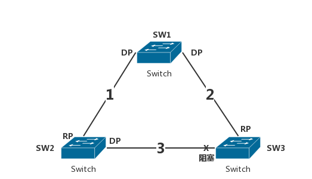

```switch
SW# show spanning-tree // 查看生成树信息（所有的valn）
SW# show spanning-tree vlan 1 // 查看生成树信息（vlan 1）
```

### stp常用操作

#### stp配置

- STP根桥不能出现于接入层，会导致数据发上去又返回下层再返回上层，不符合设计理念
- 交换机接口为access则表示连接的是一台主机，必须是一台主机
- 预防主机模拟交换机发包，使主机成为根桥以切取数据
- 划为access接口时表示只接受数据，不承认其交换机包

stp结构：


```switch
SW(config)# spanning-tree mode <生成树类型> // 即相当于启用
SW(config)# spanning-tree vlan 1 root {primary|secondary} // 主根down时，备根成为主根
SW(config)# spanning-tree vlan 1 priority <优先级> // 优先级需为4096倍数，越小越优先
// 设置优先级，注意设置针对的是VLAN1，不同的VLAN优先级可以不同，不同VLAN的STP选举出来的根交换机也可以不同；利用此特性可以做到vlan的负载均衡

SW(config-if)# spanning-tree portfast // 设置成快速端口
// 交换机接口连接的是终端设备，如计算机，那么端口加电启动后计算机就要等上50秒才能发送数据，不合理
// 设置成快速端口，这样端口从UP到Forwarding也能一瞬间完成；仅在连接计算机的端口上使用，不要在和其他交换机，集线器网桥相连的端口上使用，否则易造成环路

SW(config-if)# spanning-tree vlan <vlan_num> port-priority <value> // 端口优先级调整
SW(config-if)# spanning-tree vlan <vlan_num> cost <value> // 端口开销调整

SW(config)# spanning-tree vlan <vlan_num> {priority|forward-time|max-age|hello-time} <value> // 修改vlan各项stp参数，全局模式，priority为网桥优先级
```

为什么是4096倍数：

整个Root IDentifier 字段一共16个十六进制，64个二进制，8个字节；BPDU对应的Root ID为8000 001a a977 f608；设备读取优先级的时候读的是前四位十六进制，但是8000中的后面三个0是一般不可更改的。只有8对应的位置才能更改；故而只有16种组合，必须为4096的倍数：后面带了三个16进制的0，16的三次方为4096

## DHCP协议

### dhcp信息

- DHCP（Dynamic Host Configuration Protocol，动态主机配置协议）

### dhcp工作过程

- PC通过网卡向外广播DHCP Discover信息
    - 该数据包的目的MAC是广播MAC地址（FFFFFFFFFFFF），源MAC地址是PC的网卡MAC地址
    - 该数据包的目的IP是255.255.255.255，源IP是0.0.0.0
    - DHCP使用UDP协议，该数据包的目的UDP端口是67（DHCP服务端使用的UDP端口），源UDP端口是68（客户端使用的UDP端口）
- R1收到PC的DHCP Discover广播包，比如图中R1接口配置的IP地址是192.168.1.1/24
    - R1从接口接收到PC的DHCP Discover广播包后，它在本地的DHCP配置中寻找可以和自己F0/0匹配的地址池(192.168.1.0/24这个子网的地址池)
    - 如果配置了这个地址池，R1查找这个地址池中还可以使用的IP地址
    - 这里假设192.168.1.100是可用的，R1在提供租用地址之前首先会发送一个ARP查询包，查询192.168.1.100在网络上有没有被使用，如果收到应答，表明这个IP已经被使用，R1在地址池中换一个地址再发送ARP查询，直到找到没有ARP回复的那个IP地址
- R1向PC发送DHCP Offer信息,内容包括这个没被使用的IP地址
    - DHCP Offer包仍然是一个广播包，目的MAC是广播MAC地址，源MAC是R1的F0/0的MAC地址
    - 目的IP是255.255.255.255，源IP是192.168.1.1
    - 目的端口是UDP68，源端口是UDP67
- 如果PC发送的DHCP Discover广播没有DHCP服务端回复，PC将无法获得IP地址，PC会每隔一段时间发送一次DHCP Discover,在没有请求到IP地址的这段时间里，**Windows主机**会被临时分配一个属于169.254.0.0/16的本地地址
- PC收到R1发回的DHCP Offer信息，PC马上发送DHCP Request包，表示自己将使用R1所提供的IP地址
    - 该数据包还是一个广播包，目的MAC是广播MAC，源MAC是PC的网卡MAC
    - 目的IP是255.255.255.255，源IP是0.0.0.0
    - 传输层的目的UDP端口是67，源UDP端口是68
    - DHCP Request中包含了要选择的DHCP服务器（R1的F0/0接口）的IP地址以及客户端(PC)将要使用的IP地址
- R1收到PC发来的DHCP Request信息后，马上发送DHCP Ack确认信息，该确认信息也是以广播发送的（和第三步中的包头差不多）。DHCP Ack中包含了一些其他选项，比如子网掩码、默认网关、DNS地址、租约期限、域名等
- PC收到DHCP Ack后，利用其中的信息配置自己的TCP/IP属性，然后广播一个ARP Reply包，这个包的目的是通知其他设备，该IP地址已经被使用

dhcp工作流程：


### dhcp常用操作

#### dhcp配置

```router
R(config)# interface f0/0
R(config-if)# ip address 192.168.1.1 255.255.255.0
R(config-if)# no shutdown

R(config)# ip dhcp pool <地址池名称>
R(dhcp-config)# network 192.168.1.0 255.255.255.0 // 下发地址网段/掩码
R(dhcp-config)# default-router 192.168.1.1 // 默认网关
R(dhcp-config)# dns-server 8.8.8.8 // 默认dns服务器地址
R(dhcp-config)# domain-name www.dncp.com // 域名（可选）
R(dhcp-config)# lease 3 // 租约期限，3天
R(dhcp-config)# exit
R(config)# ip dhcp excluded-address 192.168.1.2 // 不下发192.168.1.2
R(config)# ip dhcp excluded-address 192.168.1.2 192.168.1.9 // 不下发192.168.1.2~192.168.1.9
```

#### dhcp配置中继

dhcp中继：R1的f1/0连接到一台vpcs，R1是DHCP中继服务器，R2是DHCP服务器，R1负责将vpcs发来的DHCP广播请求以单播的形式发给DHCP服务器R2


```router
// R1配置
R1(config)# int f1/0
R1(config-if)# ip add 192.168.1.254 255.255.255.0
// 在与PC客户端相连的那个接口上配置DHCP中继服务，"ip helper-address 12.1.1.2"
// 将这个接口收到的DHCP广播请求以单播形式发给DHCP服务器12.1.1.2，DHCP中继与DHCP服务器间必须路由可达
R1(config-if)# ip helper-address 12.1.1.2
R1(config-if)# no shut
R1(config-if)# int s 0/0
R1(config-if)# ip add 12.1.1.1 255.255.255.0
R1(config-if)# no shut

//R2配置
R2(config)# int s0/1
R2(config-if)# ip add 12.1.1.2 255.255.255.0
R2(config-if)# no shut
R2(config)# ip dhcp excluded-address 192.168.1.254 // DHCP地址池排除R1以太网接口的IP
R2(config)# ip dhcp pool 192pool // 配置地址池与参数
R2(dhcp-config)# network 192.168.1.0 255.255.255.0
R2(dhcp-config)# default-router 192.168.1.254 // 中继的IP
R2(dhcp-config)# dns-server 192.168.1.254 // 中继的IP
R2(dhcp-config)# domain-name www.r2.com
R2(dhcp-config)# lease 3
R2(dhcp-config)# exit
// 如果PC1要和R2通信还要在R2添加一条静态路由（这一句并不是DHCP中继必须的）
R2(config)# ip route 192.168.1.0 255.255.255.0 12.1.1.1
```

## PPP协议

### ppp信息

- 点对点协议/PPP(Point to Point Protocol)

HDLC封装协议：

- HDLC：High-Level Data-Link Control/高级数据链路控制
- HDLC是思科路由器串行接口默认的封装协议，由于串行线路在远距离通信中的优势，远距离传输数据一般都使用串行线路，而一些计算机的内部通信一般采用并行通信
- 标准的HDLC封装只能支持单协议，即IP协议，思科对标准的DHLC进行了改进，增加了协议域字段来支持多种网络层协议
- 虽然改进后的DHLC是思科私有的，但是现在大多网络设备都能够使用它
- 思科路由之所以默认使用HDLC封装是因为路由器之间用同步串行接口连接时，Cisco HDLC封装要比PPP封装效率高很多
- 但是其他网络设备不一定支持思科HDLC，所以在不同厂商设备混用的时候，最好采用PPP作为串口封装协议

```router
R# show interfaces s0/0
    ··· "Encapsulation HDLC, crc 16, loopback not set" // 可以看到输出"Encapsulation HDLC"，说明思科路由串口默认使用HDLC封装
R(config)# int s0/0
R(config-if)# encapsulation ppp
R# show int s0/0
    ··· "Encapsulation PPP, LCP Closed, crc 16, loopback not set" // 再次查看接口信息，"Encapsulation PPP"表明，接口封装类型变成了ppp
```

同步和异步串行通信：

- 串行通信分为同步传输和异步传输
- 异步传输
    - 通常异步传输是以字符为传输单位的
    - 每个字符添加一位起始位和一位停止位，用来标记一个字符的开始和结束
    - 这种传输方式每传输一个字符都要附加2-3位，通信效率较低
    - 这种传输方式发送方发出数据后，不等对方发回响应，接着发送下一个数据包
- 同步传输
    - 通常同步传输是以数据块为传输单位
    - 每个数据块的头部和尾部附加一个特殊的字符或比特序列，标记一个数据块的开始和结束，一般还附加效验序列，以便对数据块进行差错控制
    - 这种传输方式发送方发出数据后要等待接收方发回响应，然后再发下一个数据包
    - 路由器的串行接口属于快速的同步接口，所以需要在DCE端配置"时钟"来进行信号同步

```router
R(config)# int s 0/0
R(config-if)# clock rate ? // 查看比特率允许的值
R(config-if)# clock rate 64000 // 修改比特率
```

PPP特点：

- PPP是IETF（因特网工程任务组）推出的点到点类型线路的数据链路层封装协议，支持的接口：
    - 同步串行接口
    - 异步串行接口
    - 高速串行接口（HSSI）
    - 综合业务数字网（ISDN）
- PPP还被广泛的应用在ATM上（PPP over ATM，简称PPPoA）以及以太网上（PPP over Ethernet，简称PPPoE）

### 分层体系结构

- 只要是点到点类型的线路都可以运行PPP
- 在数据链路层PPP通过LCP协议进行链路管理，相当于以太网数据链路层的MAC子层
    - IEEE802系列标准把数据链路层分成LLC（Logical Link Control，逻辑链路控制）和MAC（Media Access Control，介质访问控制）两个子层
    - 上面的LLC子层实现数据链路层与硬件无关的功能，比如流量控制、差错恢复等
    - 较低的MAC子层提供LLC和物理层之间的接口
    - MAC子层负责把物理层的“0”、“1”比特流组建成帧，并通过帧尾部的错误校验信息进行错误校验
    - 提供对共享介质的访问方法，包括以太网的带冲突检测的载波侦听多路访问（CSMA/CD）、令牌环（Token Ring）、光纤分布式数据接口（FDDI）等
    - MAC子层分配单独的局域网地址，就是通常所说的MAC地址（物理地址）
    - MAC子层将目标计算机的物理地址添加到数据帧上，当此数据帧传递到对端的MAC子层后，它检查该地址是否与自己的地址相匹配，如果帧中的地址与自己的地址不匹配，就将这一帧抛弃；如果相匹配，就将它发送到上一层中
    - MAC子层的主要功能包括数据帧的封装/卸装，帧的寻址和识别，帧的接收与发送，链路的管理，帧的差错控制等
    - MAC子层的存在屏蔽了不同物理链路种类的差异性
- 在网络层NCP为不同协议提供服务，相当于以太网数据链路层的LLC子层
    - LLC子层的主要功能包括：传输可靠性保障和控制、数据包的分段与重组、数据包的顺序传输
    - LLC子层提供三种服务：
        - 无确认无连接的服务，这是数据包类型的服务
        - 连接方式的服务，这种服务类似于HDLC提供的服务
        - 有确认无连接的服务，提供有确认的数据包，但不建立连接
    - LLC子层维护一张以DSAP为索引的函数列表，每接收到一个数据包，以DSAP为索引调用相应的函数，该函数把数据包挂到相应接收队列
- LCP（Link Control Protocol）子层
    - LCP子层位于物理层之上，除了用来建立、配置和测试数据链路连接外，还提供下面这些功能：
        - 身份验证：提供了PAP和CHAP验证
        - 压缩：将需要传输的数据先压缩再传输。支持Stac、Predictor、MPPC以及TCP头部压缩
        - 错误检测：保证链路的质量
        - 多链路：实现链路的负载均衡
        - PPP回拨：可以提高安全性和节约用户拨号费用
- NCP（Network Control Protocol）子层
    - 当LCP将链路建立好后，PPP开始根据不同用户的需要配置上层协议所需环境，NCP被用来为上层服务提供服务接口，针对不同的上层协议NCP提供不同的服务组件

ppp体系架构：


### 会话建立过程

- 链路的建立和配置协商，主要由LCP完成，通信的发起方发送LCP帧来配置和检测数据链路
- 链路质量检测(可选)，属于LCP的可选功能，主要是测试链路的质量能否满足要求
- 网络层协议的配置阶段,主要是NCP的功能，通信双方交换一系列NCP分组来配置网络层，NCP配置好后双方的逻辑通信链路建立完成
- 链路终止，当数据传送完成，或者一些外部事件发生的时候，一方会发起断开连接的请求，这时，首先使用NCP来释放网络层的链接，然后使用LCP来关闭数据链路层的链接，最后双方的通信设备关闭物理链路

### 身份验证协议

- PAP（Password Authentication Protocol，密码验证协议）
    - 两次握手协议，采用明文传输方式传输用户口令
    - 首先被验证方主动发起验证请求，将本地配置的用户名和密码用明文的方式发送给验证方，验证方接收到验证请求后检查此用户名和密码是否正确（在验证方的数据库中也配置有此用户名和密码），正确就发回接受报文，错误就发送拒绝报文
    - 这种验证方式是采用明文传输，很容易被破解
    - 
- CHAP（Challenge Handshake Authentication Protocol，挑战握手验证协议）
    - 三次握手协议，它只在网络上传输用户名，密码并不在网络上传输
    -在PPP链路建立阶段完成后（R1作为被验证方拨入），验证方R2主动发起验证挑战"Challenge"，挑战报文中"01"是序列号；R2上可能有多个拨入请求，"ID"用来识别是哪个拨入者发起的挑战；"Random"是一个随机数；"R2"是发起挑战路由器的名字
    - 被验证方收到验证方发来的请求后，根据这个报文中的路由器名称（R2），在本地数据库中寻找到这个名称（R2）对应的密码，如果找到对应的密码，则用验证方发送过来的报文的ID和随机数加上本地数据库中找到的密码，以MD5算法生成一个"hash"值
    - 生成hash之后，再将这个hash值、验证方R2发送过来的ID号以及本路由的名称R1，发回给验证方R2。其中报文的序列号是"02"，"ID"是R2发送过来的ID不变，"hash"是R1计算后得到的哈希值
    - R2接收到这个报文后，利用报文中的ID值找到储存在本地数据库中的随机数，并且根据发送过来的报文中路由器的名称(R1)找到本地数据库对应这个名称的密码，然后利用ID、随机数、R1对应的密码使用MD5算法生成一个hash值，最后用这个hash值与R1发送过来的hash比较，相同则验证通过，发回序号是"03"的确认报文，如果不相同则验证失败，发回序号是"04"的验证失败报文
    - 只要双方配置相同的验证密码，即可完成验证，并且这个密码是不会在链路上传输的，传输的只是一个随机数、一个ID值、路由器的名称和发回的hash值
    - 

### ppp常用操作

#### CHAP认证

```router
// 接口内认证用户名密码
// 客户端
R(config)# interface s0/1
R(config-if)# ip address 100.1.1.5 255.255.255.0
R(config-if)# no shutdown
R(config-if)# encapsulation ppp // 启用ppp封装
// 发送认证
R(config-if)# ppp chap hostname <用户名>
R(config-if)# ppp chap password <密码>
// 客户端没必要开认证
------------------------------
//服务端
R(config-if)# interface s0/1
R(config-if)# ip address 100.1.1.6 255.255.255.0
R(config-if)# no shutdown
R(config-if)# encapsulation ppp //启用ppp封装
R(config-if)# ppp authentication chap // 开chap认证
R(config)# username <用户名> password <密码> //客户端认证账号
```

```router
// 全局内验证用户名密码
// 用户名是对端路由器（R2）的名称，密码验证双方要相同
R1(config)# username R2 password 111
R1(config)# int s 0/0
R1(config-if)# ip add 12.1.1.1 255.255.255.0
R1(config-if)# no shut
R1(config-if)# encapsulation ppp
R1(config-if)# ppp authentication chap  // 使用CHAP验证

// 用户名是R1的名称，密码和R1相同
R2(config)# username R1 password 111
R2(config)# int s 0/1
R2(config-if)# ip add 12.1.1.2 255.255.255.0
R2(config-if)# no shut
R2(config-if)# encapsulation ppp
R2(config-if)# ppp authentication chap
```

#### PAP协议

```router
// 接口内验证用户名密码
// 配置用户名和密码
R1(config)# username R1 password R1_pass
R1(config)# int s 0/0
R1(config-if)# ip add 12.1.1.1 255.255.255.0
R1(config-if)# no shut
R1(config-if)# encapsulation ppp // 使用PPP封装
R1(config-if)# ppp authentication pap // 使用PAP验证
// 发给R2的用户名和密码
R1(config-if)# ppp pap sent-username R2 password R2_pass
---
// 在R2上配置用户名和密码
R2(config)# username R2 password R2_pass
R2(config)# int s 0/1
R2(config-if)# ip add 12.1.1.2 255.255.255.0
R2(config-if)# no shut
R2(config-if)# encapsulation ppp
R2(config-if)# ppp authentication pap
// 向R1发送用户名和密码
R2(config-if)# ppp pap sent-username R1 password R1_pass
```

#### ppp配置压缩

配置压缩会影响路由性能增加CPU负荷，如果需要传送的文件已经压缩过，比如ZIP，RAR等，则不建议在路由上开启压缩

```router
R(config)# int s 0/0
R(config-if)# compress ? // 查看可用的压缩类型
    ··· lzs        lzs compression type
    ··· mppc       MPPC compression type
    ··· predictor  predictor compression type
    ··· stac       stac compression algorithm
    ··· <cr>
R(config-if)# compress lzs // 启用lzs压缩
```

#### 配置链路质量监控

"PPP会话建立过程"的第二步中提到了一个可选的阶段"链路质量检测"，在这个阶段LCP测试链路并决定链路的质量能否满足第三层协议的需要，如果不能满足，链路将会关闭

```router
// 计算数据包发送的成功率，链路有效要大于80%，否则认为链路无效
R(config)# int s 0/0
R(config-if)# ppp quality 80 // ppp quality <percentage_value>
```

#### 配置链路负载均衡

PPP链路负载均衡（多链路PPP，也叫MP、MPPP、MLP或Multilink）允许包被分段，在到对方的多条点对点线路上被同时发送

```router
R(config)# int s 0/0
R(config-if)# ppp multilink
```

## NAT协议

### nat信息

- network address translation
- 将私有IP地址通过边界路由转换成外网IP地址，在边界路由的NAT地址转换表中记录下这个转换，当外部数据返回时，路由使用NAT技术查询NAT转换表，再将目标地址替换成内网用户IP地址
- 私网地址不允许链接运营商：
    - A类：10.0.0.0—10.255.255.255
    - B类：172.16.0.0—172.31.255.255
    - C类：192.168.0.0—192.168.255.255
    - 这三块私有地址本身是可路由的，只是公网上的路由器不会转发这三块私有地址的流量
- NAT配置区分内外部，连接运营商的为外，内网为内
- 常用的NAT技术：
    - 静态NAT：静态NAT就是一对一的NAT，内部有多少私有地址需要和外部通信，就要配置多少外网IP地址与其对应
    - 动态NAT：动态NAT是在路由器上配置一个外网IP地址池，当内部有计算机需要和外部通信时，就从地址池里动态的取出一个外网IP，并将他们的对应关系绑定到NAT表中，通信结束后，这个外网IP被释放，可供其他内部IP转换使用，这和DHCP租约IP有相似之处
    - PAT(Port address Translation，端口地址转换，也叫端口地址复用)：这是最常用的NAT技术，也是IPv4能维持到今天的最重要原因之一，它提供了一种多对一的方式，对多个内网IP地址，边界路由可以给他们分配一个外网IP，利用这个外网IP的不同端口（不同的端口对应不同的内网IP）和外部进行通信

### nat常用操作

#### nat配置

```router
R# show ip nat translations // 查看NAT地址转换表

R(config-if)# interface s0/0
R(config-if)# ip nat outside // 定义nat外部
R(config-if)# interface f0/0
R(config-if)# ip nat inside // 定义nat内部
R(config-if)# ip nat inside source static 192.168.1.10 100.1.1.7 // 静态NAT，将192.168.1.10源ip转换为100.1.1.7
// inside表示收到的数据作为源修改其ip；隐含的是从outside来的数据修改其目的ip为内网ip 192.168.1.10

R(config)# ip nat pool <地址池名称> 100.1.1.1 100.1.1.4 netmask 255.255.255.0 // 定义nat地址池，从100.1.1.1~100.1.1.4，掩码/24
R(config)# access-list 1 permit 192.168.1.0 0.0.0.255 // 设置ACL， 编号 允许 网段 反掩码 ,网段也可以设置为any
R(config)# ip nat inside source list 1 pool <pool-name> // 使配置的pool以及ACL生效

R(config)# ip nat inside source list 1 interface s1/0 overload // nat的端口复用，使用s1/0接口的ip进行nat，一定要加overload
```

#### 配置静态端口映射

假设PC上面架设了TFTP服务，外网要访问PC的TFTP服务就需要将PC（192.168.1.2）的69端口映射到外网s0/0（12.1.1.1）的某个端口

```router
R(config)# ip nat inside source static udp 192.168.1.2 69 12.1.1.1 69 // 添加静态端口映射，TFTP使用的是UDP的69号端口

R# show ip nat translations // 查看NAT转换表
```

## HSRP协议

### hsrp信息

- 热备份路由协议：Hot Standby Router Protocol（思科私有）
- 公有VRRP

### hsrp常用操作

#### hsrp配置

hsrp结构：


```router
// R1&R2:
R1(config)# interface f1/0 // R2为f0/0
R1(config-if)# no shutdown
R1(config-if)# interface f1/0.1 // 进入子接口
R1(config-if)# encapsulation dot1Q 10 // 封装格式，vlan号
R1(config-if)# ip address 192.168.1.10 255.255.255.0 // R2为f0/0.1  192.168.1.20/24
R1(config-if)# no shutdown
R1(config-if)# interface f1/0.2
R1(config-if)# encapsulation dot1Q 20 // 封装格式，vlan号
R1(config-if)# ip address 192.168.2.10 255.255.255.0 // R2为f0/0.2  192.168.2.20/24
R1(config-if)# no shutdown
R1(config-if)# interface f0/0
R1(config-if)# ip address 100.1.1.1 255.255.255.0 // R2为200.1.1.1/24
R1(config-if)# no shutdown
----------上述配置ip以及网关，下述HSRP配置
R1(config)# interface f1/0.1
R1(config-if)# standby <组id> ip 192.168.1.1 // 组id相同才能热备，ip为协商ip，同网段、虚拟ip，双方都要
R1(config-if)# standby <组id> preempt // 开启抢占模式，双方都要
// 上两行配置双方都需要

R1(config-if)# standby <组id> priority 101 // 优先级0~255，默认100，越大越优先；相同则看ip，ip小优先
R1(config-if)# standby <组id> track f0/0 2 // 监控外出接口，若外出接口down则减少优先级数值
// 上两行配置主路由才需要

R1# show standby brief // 查看热备信息
----------
// SW配置：
SW(config)# interface range f0/1 -3 // 同时修改多接口配置
SW(config)# interface f1/0 // f1/0、f0/0需要trunk
SW(config-if)# switchport mode trunk
SW(config-if)# switchport trunk encapsulation dot1Q
SW(config-if)# switchport trunk allow vlan {all|<vlan_num>} // 1,2,5|1-5|1-3,5
---------
// R1&R2的nat配置：
R1(config)# interface f0/0 // R2为f1/0
R1(config-if)# ip nat outside
R1(config)# interface f1/0.1 // R2为f0/0.1
R1(config-if)# ip nat inside

R1(config)# access-list 1 permit any
R1(config)# ip nat inside source list 1 interface f0/0 overload // R2同理
----------
// R1&R2添加默认路由
R1(config)# ip route 0.0.0.0 0.0.0.0 100.1.1.2 // R2为200.1.1.2
```

## IPV6相关

### ipv6信息

- IPv4
    - 点分十进制，/32位
    - IPv4的/32是255.255.255.255的缩写
- IPv6
    - 冒分十六进制
    - `1234:5678:90ab:cdef:____:____:____:____/64`
    - 128位，只有/128的形式
    - 共用冒号分为8组，每组4个十六进制数，每组是16位
- 1234:5678:90ab::/64用户使用，掩码掩一半
- 简写形式
    - 前缀的零可以不写，中间后面的不行：0123->123可行，1203->123不行
    - IPv6地址中每个16位分组中前导零位可以去除做简化表示，但每个分组必须保留一位数字，2001:3CA1:010F:001A:121B:0000:0000:0010->2001:3CA1:10F:1A:121B:0:0:10,简写去除前导0简写形式，可以看到第三个和第四个分组去除了前导0,第七个和第八个分组因为全部是0，但必须保留一位数字，所以保留一个0
    - 连续的零可以缩写成双冒号"::"，但只能缩写一次：1234:0000:0000··· :1234->1234::1234可行，1234:0000:2345:0000···->1234::2345::不行，因为不知道缩写了几个零，无法确定缩写位置
    - ```ip
        // 完整版的IPv6地址
        2001:3CA1:010F:001A:121B:0000:0000:0010
        // 去除前导零并将连续的零位合并
        2001:3CA1:10F:1A:121B::10

        // 另一个完整的IPv6地址
        2001:0000:0000:001A:0000:0000:0000:0010
        // 可以看到虽然第二组和第三组也是连续的零位；但双冒号只能在IPv6的简写中出现一次，运用到了后面更长的连续零位上
        2001:0:0:1A::10 // 这个地址还可以简写成这样2001::1A:0:0:0:10

        // 需要将上面这个地址还原也很简单，只要看存在数字的分组有几个，然后就能推测出双冒号代表了多少个连续的零位分组；一共有5个保留了数字的分组，那么连续冒号就代表了3个连续的零位分组
        // 只有前导零位可以去除，如果这个地址写成下面这样就是错误的；注意最后一组，不能去除1后面的那个0
        2001:0:0:1A::1 // 错误的写法
      ```
- IPv6默认路由"::"
- 一个接口能配置多个IPv6
- IPv4与IPv6不能共通
- 协议支持
    - RIP NG版
    - OSPF V3版
    - EIGRP可用
    - `ipv6 address`等命令配置
    - `ipv6 route`等（需要开`ipv6 unicast-routing`）

### IPV6地址类型

- 地址有单播地址（Unicast）、组播地址（Multicast）、任意播地址（Anycast）除此之外还包含一些特殊的地址
- 全局单播地址
    - 全局单播地址是全球可路由的，可以分配给任何个人和机构
    - IANA组织当前规定全局单播地址是2000::/3，然后IANA再将这个地址空间逐级分下去，/23是注册机构前缀，/32是ISP运营商前缀，/48是站点前缀，/64是子网前缀
    - **IPv6中没有广播地址**
- 组播地址
    - IPv6组播地址的格式是FF00::/8，其作用与IPv4中的组播地址相同
- 私有地址
    - IPv6中的私有地址和IPv4的私有地址意义相同，都是用作本地使用，只具有本地意义
    - 链路本地地址（Link-local addresses）：当两个支持IPv6特性的路由器直连时，直连的接口会自动给自己分配一个链路本地地址，其主要作用是在没有管理员配置时设备就能互相通信。链路本地地址中的前10bit是FE80（转换成二进制就是1111 1110 10，一共十位），后54bit全0，最后64bit是EUI-64地址，也就是说链路本地地址的前缀是FE80::/64
    - 站点本地地址（Site-local addresses）：站点本地地址现在已经被废除。站点本地地址的前10bit是FEC0,后54位是0，最后64位是EUI-64地址，因为IPv6地址空间很大，所以这种类型的私有地址没有了存在的必要
- 回环地址
    - IPv6中只有一个回环地址"0:0:0:0:0:0:0:1"，简写成"::1"，IPv6的回环地址功能和IPv4的127.0.0.0/8网段的回环地址功能是一样的
- 不确定地址
    - IPv4中的不确定地址是用"0.0.0.0"表示，在IPv6中不确定地址使用"0:0:0:0:0:0:0:0"表示，简写成"::"
- **EUI-64地址：**
    - 假设接口的IPv6地址是：2008:12:12:12:CE01:6FF:FE04:10/64
    - 这个地址的前64位是我们手动指定的（2008:12:12:12），后面64位（CE01:6FF:FE04:10）是按照下面的方法得到的：
    - 假设给路由器的f1/0配置静态EUI-64地址，f1/0接口的MAC地址是（CE0106040010），前64位我们指定了（2008:12:12:12），后面的64位会使用这个接口的MAC地址最中间插入FFFE得出（CE0106 FFFE 040010），用冒号按4位十六进制一组分隔就是（CE01:06FF:FE04:0010），写成简写形式就是（CE01:6FF:FE04:10）,这就是上面的IPv6地址的由来
    - 配置的R1和R2之间的连线是串行线路s0/0-s0/1时，串行接口是没有MAC地址的，实际上，串行接口上配置IPv6地址时，串行接口会使用路由器上**接口号最小的以太网接口MAC地址**来计算EUI-64地址（这就是为什么要在GNS3中给R1和R2分别添加一个f1/0接口的原因，经过测试，GNS3中如果不添加这个以太网接口，两边的路由会出现"链路本地地址"冲突的情况。也就是说，在GNS3中路由器没有添加以太网接口时，默认情况下会两边使用相同的MAC地址计算EUI-64地址，这种情况在真实环境是不会发生的）

### ipv6常用操作

#### IPV6地址配置

```router
R# show ipv6 route // 查看IPv6路由表

R(config)# int s 0/0
R(config-if)# ipv6 address 2008:12:12:12::1/64 // 后面的/64代表子网掩码位，这是简写形式，这个地址的完整形式应该是: "2008:0012:0012:0012:0000:0000:0000:0001/64"
R(config-if)# no shut

// 静态EUI-64配置；因为真实路由器默认都是存在以太网接口的,而EUI-64地址需要使用以太网接口的MAC地址，在GNS3中配置EUI-64的时候，必须给两个路由添加上至少一个快速以太网接口
R(config)# int s 0/0
R(config-if)# ipv6 add 2008:12:12:12::/64 eui-64 // 静态EUI-64的配置方法，前64位手工指定，后64位地址使用eui-64地址来代替
R(config-if)# no shut

R# show ipv6 interface s 0/1 // 查看一下接口被分配了什么样的地址
    ··· Serial0/1 is up, line protocol is up // 这个接口的链路本地地址
    ··· IPv6 is enabled, link-local address is FE80::CE01:6FF:FE04:10 // 这个地方显示的就是配置的静态EUI-64地址
    ··· Global unicast address(es):
    ··· 2008:12:12:12:CE01:6FF:FE04:10, subnet is 2008:12:12:12::/64 [EUI]
```

#### RIPNG协议配置

RIP NG（Routing Information Protocol Next Generation，RIP下一代版本），是针对IPv6的RIP版本，和RIPv2非常相似，是一个距离矢量的路由协议，最大跳数是15，使用水平分隔和毒性反转来阻止路由环路。RIP NG使用多播地址"FF02::9"作为目的更新地址，发送更新使用UDP协议的521端口

```router
R1(config)# ipv6 router rip test1 // 启用RIPng协议，后面的test1是自定义的名称，只具有本地意义
R1(config-rtr)# exit
R1(config)# int lo 0
R1(config-if)# ipv6 rip test1 enable // 和IPv4的RIP不同，RIP NG是直接在接口下开启RIP NG
R1(config-if)# int s 0/0
R1(config-if)# ipv6 rip test1 enable

R1# show ipv6 route // 查看IPv6路由表
    ··· IPv6 Routing Table - 12 entries
    ··· Codes: C - Connected, L - Local, S - Static, R - RIP, B - BGP
    ···     U - Per-user Static route
    ··· // 这四条R开头的是R1的回环接口路由条目
    ··· R   2008:1:1:8::/64 [120/3]
    ···     via FE80::CE01:DFF:FE4C:10, Serial0/1
    ··· R   2008:1:1:9::/64 [120/3]
    ···     via FE80::CE01:DFF:FE4C:10, Serial0/1
    ··· R   2008:1:1:A::/64 [120/3]
    ···     via FE80::CE01:DFF:FE4C:10, Serial0/1
    ··· R   2008:1:1:B::/64 [120/3]
    ···     via FE80::CE01:DFF:FE4C:10, Serial0/1
    ··· C   2008:3:3:3::/64 [0/0]
    ···     via ::, Loopback0
    ··· L   2008:3:3:3::1/128 [0/0]
    ···     via ::, Loopback0
    ··· // 这里是R1和R2相连的那个网段的路由条目
    ··· R   2008:12:12:12::/64 [120/2]
    ···     via FE80::CE01:DFF:FE4C:10, Serial0/1
    ··· C   2008:23:23:23::/64 [0/0]
    ···     via ::, Serial0/1
    ··· L   2008:23:23:23::3/128 [0/0]
    ···     via ::, Serial0/1
    ··· L   FE80::/10 [0/0]
    ···     via ::, Null0
    ··· L   FF00::/8 [0/0]
    ···     via ::, Null0
// RIP NG的条目和RIP有很大不同，跳数比IPv4下多1，默认情况下，进入路由表前RIP NG度量值就已经加了1
// via地址不是邻居的接口IPv6地址，而是邻居接口的本地链路地址，本地链路地址是使用FE80::/64前缀加上EUI-64地址得到的
```

#### IPV6OVERIPV4通信配置

- 两端运行的是IPv6网络，中间是IPv4网络，可以使用一种叫做Tunneling（隧道）的技术，来实现两端的IPv6网络能够跨越IPv4网络进行通信
- IPv6-Over-IPv4隧道，两端的IPv6网络可以穿越IPv4网络进行通信，在IPv6-Over-IPv4隧道中，首先必须保证IPv4的路由可达，在此基础上，在IPv6边界路由上配置Tunnel，源为本地边界路由的出口IPv4地址，目的为目标IPv6边界路由的接收口IPv4地址，这两个IPv4地址必须IPv4路由可达，在此基础上再配置隧道IPv6地址，只要两端配置的IPv6地址在同一个网段中，就好像两个IPv6边界路由之间是使用一条专线直连一样，再使用IPv6的静态路由或开启路由协议即可

ipv6overipv4：


```router
R1(config)# ipv6 unicast-routing // 开启IPv6路由支持
R1(config)# int lo 0
R1(config-if)# ipv6 add 2008:1:1:1::1/64
R1(config-if)# no shut
R1(config-if)# int s 0/0
R1(config-if)# ip add 12.1.1.1 255.255.255.0
R1(config-if)# no shut
R1(config)# ip route 0.0.0.0 0.0.0.0 12.1.1.2 // 配置去往R2的IPv4默认路由
R1(config)# int tunnel 0 // 创建一个隧道接口，0是隧道号
R1(config-if)# tunnel source 12.1.1.1 // 隧道的源IP地址是R1的s0/0
R1(config-if)# tunnel destination 23.1.1.3 // 隧道的目的IP地址是R3的s0/1,为保证正常通信,隧道的源和目的必须是路由可达（IPv4路由可达）
R1(config-if)# tunnel mode ipv6ip // 配置隧道模式,ipv6ip就是IPv6-Over-IPv4模式，也就是将IPv6的包封装在IPv4的包中
R1(config-if)# ipv6 add 2008:13:13:13::1/64 // 给隧道接口配置一个IPv6地址
R1(config)# ipv6 route ::/0 2008:13:13:13::3 // 配置IPv6默认路由，指向R3上的隧道接口地址

R2(config)# int s 0/0
R2(config-if)# ip add 12.1.1.2 255.255.255.0
R2(config-if)# no shut
R2(config-if)# int s 0/1
R2(config-if)# ip add 23.1.1.2 255.255.255.0
R2(config-if)# no shut

R3(config)# ipv6 unicast-routing
R3(config)# int s 0/1
R3(config-if)# ip add 23.1.1.3 255.255.255.0
R3(config-if)# no shut
R3(config-if)# int lo 0
R3(config-if)# ipv6 add 2008:3:3:3::3/64
R3(config-if)# no shut
R3(config)# ip route 0.0.0.0 0.0.0.0 23.1.1.2
R3(config)# int tunnel 0
R3(config-if)# tunnel source 23.1.1.3
R3(config-if)# tunnel destination 12.1.1.1
R3(config-if)# tunnel mode ipv6ip
R3(config-if)# ipv6 add 2008:13:13:13::3/64
R3(config)# ipv6 route ::/0 2008:13:13:13::1 // 配置IPv6默认路由，指向R1上的隧道接口地址
```

tunnel：

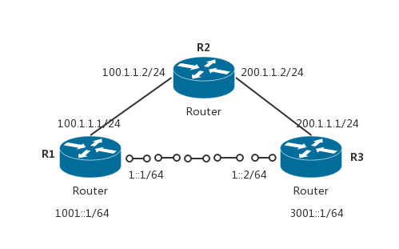

```router
// R1:
R1(config)# ip route 0.0.0.0 0.0.0.0 100.1.1.2
R1(config)# ipv6 unicast-routing // IPv6路由需要开启此项
// R3:
R3(config)# ip route 0.0.0.0 0.0.0.0 200.1.1.2
R3(config)# ipv6 unicast-routing // IPv6路由需要开启此项
----------物理链路先通
// R1:
R1(config)# interface tunnel <编号> // 管道接口，默认关闭
R1(config-if)# tunnel source f0/0 // 源可以跟接口、地址等
R1(config-if)# tunnel destination 200.1.1.1 // 指定目的；能通则链路协议开启，则可以配置IP，否则down
R1(config-if)# ipv6 address 1::1/64 // 配置地址
R1(config)# ipv6 route 3001::1/64 tunnel 0 // R2则为ipv6 route 1001::1/64 tunnel 0
// ipv6 route 1001::1/64 1::1/64 此形式路由也可以
```

## 帧中继

### 帧中继信息

- Frame Relay，简称FR，可以将它看做X.25协议的简化版本
- 帧中继网络中不考虑传输差错问题，其中的结点只做帧的转发操作，不需要执行接收确认和请求重发等操作
- 帧中继是一种严格意义上的二层协议
- 在帧中继网络中使用VC（Virtual Circuit，虚电路）来互连各个分支，并不需要两个分支之间有单独的物理链路
- 使用虚电路的最主要好处就是配置方便，建立和拆除虚电路只需要使用命令配置即可，所以虚电路并非真正的物理链路，只是在现有网络的基础上添加的一系列转发规则，就好像在源和目的间存在一条专线一样；相比之下专线则需要综合布线施工，建立和拆除难度较大
- 帧中继的工作范围在DTE设备和帧中继交换机之间
- VC（Virtual Circuit，虚电路）
    - 帧中继网络中两台DTE设备之间的连接称为虚电路
    - 现在常用的虚电路为PVC（Permanent Virtual Circuit，永久虚电路），PVC由运营商预先配置
- DLCI（Data Link Connection Identifier，数据链路连接标识符）
    - DLCI是源设备和目的设备之间标识逻辑电路的一个数据值，该数据值只具有本地意义
    - 不同DTE设备上的DLCI号可以相同，但在同一台DTE设备上不能用相同的DLCI号来标识到不同的连接
    - DLCI号的范围是0-1023，其中0-15以及1008-1023被保留用作特殊用途，所以用户可以配置的DLCI号为16-1007
    - 
- LMI（Local Management Interface，本地管理接口）
    - LMI是用户端和帧中继交换机之间的信令标准，负责管理设备之间的连接，维护设备的状态
    - LMI被用来获知路由器被分配了哪些DLCI，确定PVC的操作状态，有哪些可用的PVC，另外还用来发送维持分组，确保PVC处于激活状态
    - LMI的类型有三种：ANSI、Cisco、Q933A，DTE端的LMI配置要和帧中继上的一致，否则LMI不能正常工作，进而导致PVC失败
    - 思科路由上默认的LMI类型为Cisco
- 承诺信息速率（CIR）
- 承诺突发（BC）
- 超量突发（BE）
- 前向显示拥塞通知（FECN）
- 后向显示拥塞通知（BECN）
- 允许丢弃（DE）

物理专线和帧中继虚电路：

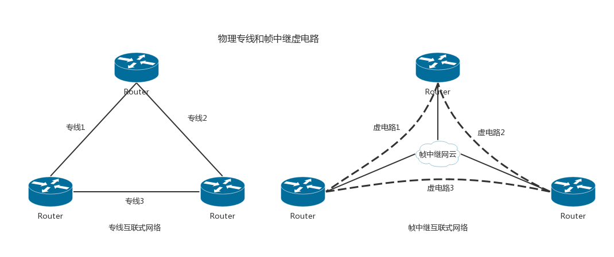

### 帧中继运行方式

- 帧中继帧格式
    - 帧中继的帧和以太网帧一样，也工作在数据链路层
    - 字段解释：
        - Flag标志：标志帧的开始和结束
        - 地址：地址字段2个字节中包含了DLCI号（帧中继的帧中只有一个DLCI号，即去往的目的地的DLCI号，2个字节中的10个比特用来储存这个DLCI号）,拥塞控制（Congestion Control）占3比特，其中包括1比特的FECN位，1比特的BECN位和1比特的DE位,除此之外地址域中还包含3个比特的其他值
        - 数据：是一个可变长的字段，包含了封装的上层协议数据
        - 帧效验序列：用来保证传输数据的完整性
        - 
- 帧中继中的帧转发方式
    - 假设R1要将数据发往R3，R1封装DLCI号103，将封装好的帧发往帧中继交换机FR1。根据FR1上管理员的配置，FR1知道如果从接口1接收到DLCI号为103的帧，应该将DLCI号修改成112并从接口3发出。此时帧到达FR3，FR3也根据配置得知，从自己的1接口接收到的DLCI号为112的帧，应该将DLCI号修改成301，并从3号接口发出。此时R3接收到FR3发过来的帧中继帧，解封装后交给上层处理
    - 只要R1封装DLCI号103的帧，就能将数据发往R3，帧中继网云使用DLCI号103和DLCI号301在R1和R3之间建立了一条永久虚电路（PVC），同理R1到R4可以封装104，R4到R1可以封装401
    - 
- 帧中继交换表
    - 在图中的帧中继网络中，FR1-3三台帧中继交换机上都维护着一个帧中继交换表
    - 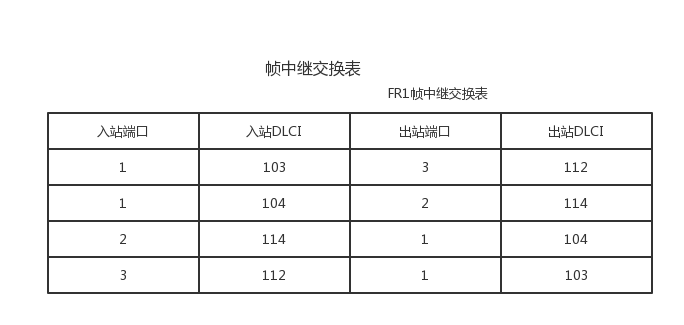

### 帧中继寻址方式

- 帧中继中的反向ARP是根据DLCI号解析IP的一个过程，和以太网中通过ARP解析MAC地址很相似
- 在R1和R3的物理接口上配置帧中继封装，接口开启后，R1和R3会自动向帧中继交换机发送查询信息，该消息可以向帧中继交换机通知本路由状态，还可以查询有哪些可用的DLCI号
- 帧中继交换机通知R1，DLCI号103和104是激活的，对于每个激活的DLCI号，R1发送一个反向ARP请求分组，宣告自己的IP，并且封装对应的DLCI号
- **帧中继是不支持广播的，帧中继网络默认是NBMA（Non-Broadcast Multiple Access，非广播多路访问），但可以通过发送多个帧拷贝来解决广播问题**
- 帧中继网云将R1发来的DLCI号103替换成301发往R3（实际帧中继网络中可能存在很多帧中继交换机，这里假设中间只有一台）
- R3收到帧中继交换机发来的帧，DLCI号是301，R3处理该数据帧并进行应答，R3封装DLCI号为301，并且告知自己的IP是123.1.1.3，然后从自己的物理接口发回
- 帧中继交换机收到这个DLCI号是301的帧，根据自己的交换表，将DLCI号改成103发往R1，R1收到这个应答后在本地的映射中添加R3的IP123.1.1.3和对应的DLCI号103，以后发往123.1.1.3的数据帧就用DLCI号103封装
- 最后R1继续发送维持消息，默认10秒一次，此维持消息可以验证帧中继交换机是否处于激活状态
- 反向ARP默认的发送时间是60秒
- 同理R3和R4也可以使用相同的方法获得对方的IP地址和对应的DLCI号
- 

### 帧中继水平分隔潜在问题

- 在这种星型拓扑结构中R1和R2以及R3通过虚电路相连，R2和R3之间没有建立虚电路，R1就像以太网中的一个Hub，R2或R3将路由信息发给R1，因为水平分隔的原因，R1不会将从一个接口接收到的路由信息再从这个接口发回，导致R1上面有所有分支的路由信息，而分支路由间无法学习到路由信息
- 解决这一问题的方法是关闭水平分隔，或者使用多个点到点子接口
- 

### 帧中继常用操作

#### 帧中继配置

帧中继配置：将R2配置成帧中继交换机，用来模拟帧中继网云，R1、R3、R4是DTE端的路由器，配置帧中继封装


```router
// R2
R(config)# host Frame-relay-SW
Frame-relay-SW(config)# frame-relay switching // 配置成帧中继交换机
Frame-relay-SW(config)# int s 0/0 // 进入和R1相连的接口
Frame-relay-SW(config-if)# encapsulation frame-relay // 使用帧中继封装
Frame-relay-SW(config-if)# frame-relay lmi-type ansi // 配置帧中继LMI类型为ANSI，可选配置，如不配置，思科使用Cisco作为默认的LMI类型
Frame-relay-SW(config-if)# frame-relay intf-type dce // 为了帧中继交换需要将接口改变成DCE，这和具体链接的是DCE还是DTE接口无关
Frame-relay-SW(config-if)# frame-relay route 103 interface s 0/1 301 // 将s0/0接口接收到的DLCI号103的帧，替换成301从s0/1接口发出
Frame-relay-SW(config-if)# frame-relay route 104 interface s 0/2 401 // 将s0/0接收到的DLCI号104的帧，替换成401从s0/2接口发出
Frame-relay-SW(config-if)# no shut

Frame-relay-SW(config-if)# int s 0/1 // 配置和R3相连的s0/1接口
Frame-relay-SW(config-if)# encapsulation frame-relay
Frame-relay-SW(config-if)# frame-relay lmi-type ansi
Frame-relay-SW(config-if)# frame-relay intf-type dce
Frame-relay-SW(config-if)# frame-relay route 301 interface s 0/0 103
Frame-relay-SW(config-if)# frame-relay route 304 interface s 0/2 403
Frame-relay-SW(config-if)# no shut

Frame-relay-SW(config-if)# int s 0/2 // 配置和R4相连的s0/2接口
Frame-relay-SW(config-if)# encapsulation frame-relay
Frame-relay-SW(config-if)# frame-relay lmi-type ansi
Frame-relay-SW(config-if)# frame-relay intf-type dce
Frame-relay-SW(config-if)# frame-relay route 403 interface s 0/1 304
Frame-relay-SW(config-if)# frame-relay route 401 interface s 0/0 104
Frame-relay-SW(config-if)# no shut
-----------
// R1
R1(config)# int s 0/0
R1(config-if)# encapsulation frame-relay // 配置与帧中继相连的接口使用帧中继封装，再配置IP地址
R1(config-if)# ip add 123.1.1.1 255.255.255.0
R1(config-if)# no shut

// R3
R3(config)# int s 0/1
R3(config-if)# enc f
R3(config-if)# ip add 123.1.1.3 255.255.255.0
R3(config-if)# no shut

// R4
R4(config)# int s 0/2
R4(config-if)# enc f
R4(config-if)# ip add 123.1.1.4 255.255.255.0
R4(config-if)# no shut

R# show frame-relay map // 查看帧中继DLCI号的映射情况
    ··· "ip 123.1.1.3 dlci 103" // 去往123.1.1.3的帧，封装的DLCI号是103
    ··· "dynamic"表示这种映射关系是动态学习到的
    ··· "static"静态映射
    ··· "broadcast"表示帧中继上支持广播
    ··· "active"表示链路是正常的
    ··· Serial0/0 (up): ip 123.1.1.3 dlci 103(0x67,0x1870), dynamic,
    ··· broadcast,, status defined, active
    ··· // 同理，发往123.1.1.4的帧用DLCI号104封装
    ··· Serial0/0 (up): ip 123.1.1.4 dlci 104(0x68,0x1880), dynamic,
    ··· broadcast,, status defined, active

R# show frame-relay pvc //查看PVC建立和DLCI号的分配情况
    ··· PVC Statistics for interface Serial0/0 (Frame Relay DTE)
    ··· // R1使用LMI从帧中继交换机（R2）那学到了两条本地可用的DLCI号，103和104
    ··· "STATUS=ACTIVE"表示PVC链路工作正常
    ··· "STATUS=INACTIVE"表示不可用，一般是远端配置有问题
    ··· "STATUS=DELETED"则表示本地配置可能有问题
    ··· DLCI=103,DLCI USAGE=LOCAL, PVC STATUS=ACTIVE, INTERFACE=Serial0/0
    ··· DLCI=104,DLCI USAGE=LOCAL, PVC STATUS=ACTIVE, INTERFACE=Serial0/0


R# show frame-relay lmi //查看接口的LMI类型；会自动调整默认的LMI类型和帧中继交换机上配置的一致
```

#### PING通自己的帧中继配置

```router
"IP地址"是要去往的目的地址
"DLCI号"是这个IP对应的DLCI
"[broadcast]"可选参数使链路支持广播,配置动态路由协议时必须携带此参数
"[cisco|ietf]"中有两个可选参数,如果网络中不全是思科设备，存在不同设备互连，建议使用"ietf"参数

R(config-if)# frame-relay map ip ip地址 DLCI号 [broadcast] [cisco|ietf]
R1(config-if)# frame-relay map ip 123.1.1.1 103 broadcast ietf
R3(config-if)# frame-relay map ip 123.1.1.3 301 broadcast ietf
R4(config-if)# frame-relay map ip 123.1.1.4 401 broadcast ietf
```

#### 配置帧中继使用静态映射

手动配置DLCI的静态映射，首先关闭反向ARP，然后清除通过反向ARP学习到的动态映射缓存，然后使用手动配置

```router
// R1
R1(config)# int s 0/0
R1(config-if)# no frame-relay inverse-arp // 关闭反向ARP
R1# clear frame-relay inarp // 清除反向ARP学到的映射缓存
R1(config)# int s 0/0 // 在接口下添加静态映射
R1(config-if)# frame-relay map ip 123.1.1.3 103 broadcast ietf
R1(config-if)# frame-relay map ip 123.1.1.4 104 broadcast ietf
// R3步骤与R1类似，R4同理
R3(config-if)#frame-relay map ip 123.1.1.1 301 broadcast ietf
R3(config-if)#frame-relay map ip 123.1.1.4 304 broadcast ietf
```

#### RIPOVER帧中继配置

rip_over帧中继配置：R2被配置成帧中继交换机，其中只有两条虚电路R1-R3和R1-R4，R1 s0/0的IP为123.1.1.1，R3 s0/1的IP为123.1.1.3，R4 s0/2的IP为123.1.1.4，它们上面各有一个回环接口，这些接口都被发布到RIP协议中

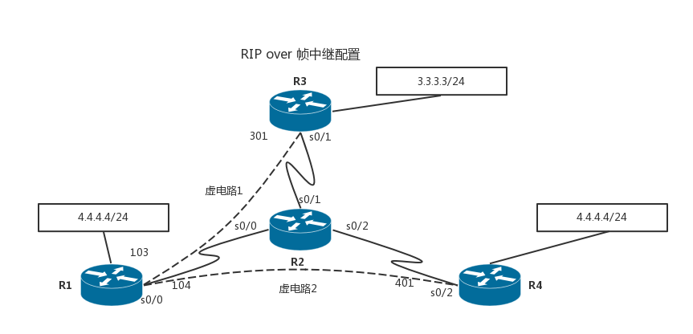

```router
// R2配置成帧中继交换机
Router(config)# host FR-SW
FR-SW(config)# frame-relay switching
FR-SW(config)# int s 0/0
FR-SW(config-if)# encapsulation frame-relay
FR-SW(config-if)# frame-relay lmi-type ansi
FR-SW(config-if)# frame-relay intf-type dce
// 仅配置R1-R3以及R1-R4的虚电路
FR-SW(config-if)# frame-relay route 103 interface s 0/1 301
FR-SW(config-if)# frame-relay route 104 interface s 0/2 401
FR-SW(config-if)# no shut
FR-SW(config-if)# int s 0/1
FR-SW(config-if)# encapsulation frame-relay
FR-SW(config-if)# frame-relay lmi-type ansi
FR-SW(config-if)# frame-relay intf-type dce
FR-SW(config-if)# frame-relay route 301 interface s 0/0 103
FR-SW(config-if)# no shut
FR-SW(config-if)# int s 0/2
FR-SW(config-if)# encapsulation frame-relay
FR-SW(config-if)# frame-relay lmi-type ansi
FR-SW(config-if)# frame-relay intf-type dce
FR-SW(config-if)# frame-relay route 401 interface s 0/0 104
FR-SW(config-if)# no shut
// R1
R1(config)# int s 0/0
R1(config-if)# encapsulation frame-relay // 使用帧中继封装
R1(config-if)#no frame-relay inverse-arp // 关闭反向ARP，使用手动静态映射配置
// 配置静态映射
R1(config-if)# frame-relay map ip 123.1.1.3 103 broadcast ietf
R1(config-if)# frame-relay map ip 123.1.1.1 103 broadcast ietf
R1(config-if)# frame-relay map ip 123.1.1.4 104 broadcast ietf
R1(config-if)# ip add 123.1.1.1 255.255.255.0
R1(config-if)# no shut
R1(config-if)# int lo 0
R1(config-if)# ip add 1.1.1.1 255.255.255.0
R1(config-if)# no shut
R1(config)# router rip // 配置RIP，宣告所有接口
R1(config-router)# net 1.0.0.0
R1(config-router)# net 123.0.0.0
// R3
R3(config)# int s 0/1
R3(config-if)# encapsulation frame-relay
R3(config-if)# no frame-relay inverse-arp
R3(config-if)# frame-relay map ip 123.1.1.1 301 broadcast ietf // 让R3能ping通自己
R3(config-if)# frame-relay map ip 123.1.1.3 301 broadcast ietf
// 因为R3和R4之间并没有虚电路，所以发往R4的数据要先封装成301发往R1
R3(config-if)# frame-relay map ip 123.1.1.4 301 broadcast ietf
R3(config-if)# ip add 123.1.1.3 255.255.255.0
R3(config-if)# no shut
R3(config-if)# int lo0
R3(config-if)# ip add 3.3.3.3 255.255.255.0
R3(config-if)# no shut
R3(config)# router rip
R3(config-router)# net 3.0.0.0
R3(config-router)# net 123.0.0.0
// R4
R4(config)# int s 0/2
R4(config-if)# encapsulation frame-relay
R4(config-if)# no frame-relay inverse-arp
R4(config-if)# frame-relay map ip 123.1.1.1 401 broadcast
R4(config-if)# frame-relay map ip 123.1.1.4 401 broadcast // 让R4能ping通自己
// 因为R4和R3之间没有配置虚电路，发往R3的数据先发往R1
R4(config-if)# frame-relay map ip 123.1.1.3 401 broadcast
R4(config-if)# ip add 123.1.1.4 255.255.255.0
R4(config-if)# no shut
R4(config-if)# int lo 0
R4(config-if)# ip add 4.4.4.4 255.255.255.0
R4(config-if)# no shut
R4(config)# router rip
R4(config-router)# net 4.0.0.0
R4(config-router)# net 123.0.0.0
//这个时候假设R4去ping 3.3.3.3：首先R4查询路由表，发现"3.0.0.0/8 [120/2] via 123.1.1.1"；发往3.0.0.0/8网段的数据要发给123.1.1.1即R1；R4再查询帧中继映射表，发现"ip 123.1.1.1 dlci 401"；所以R4用DLCI号401封装这个帧发往R1

// 从上面的输出中并没有出现上面"帧中继水平分隔潜在问题"中提到的水平分隔问题，这是因为帧中继物理接口默认关闭了水平分隔
R1(config)# int s 0/0
R1(config-if)# ip split-horizon // 打开水平分隔
// 打开水平分隔后稍等一段时间，RIP收敛后，R3上面就看不到R4回环接口的路由了，同样R4上面也看不到R3的回环接口路由了。**除了关闭水平分隔外，还可以使用点到点子接口来解决水平分隔在帧中继网络中导致的问题。点到点子接口可以有效的避免水平分割带来的问题，但点到点子接口会占用更多的IP地址**
```

#### 配置帧中继子接口

- 点到点子接口(Point-to-Point)
- 多点子接口(Multipoint)
- R5被配置成帧中继交换机，其中有三条虚电路R1-R2，R1-R3，R1-R4，在R1的s0/0接口上启用子接口，其中s0/0.1用来连接R2，是一个点到点子接口，s0/0.2被用来连接R3和R4，是一个多点子接口。R1 s0/0.1的IP为12.1.1.1、s0/0.2的IP地址为134.1.1.1，R2的s0/1的IP地址为12.1.1.2，R3的s0/2的IP地址为134.1.1.3，R4的s0/3的IP地址为134.1.1.4。每个路由上都有一个回环接口，IP如图所示。在这个帧中继网络上运行RIP协议，测试多点子接口存在的水平分隔问题
- 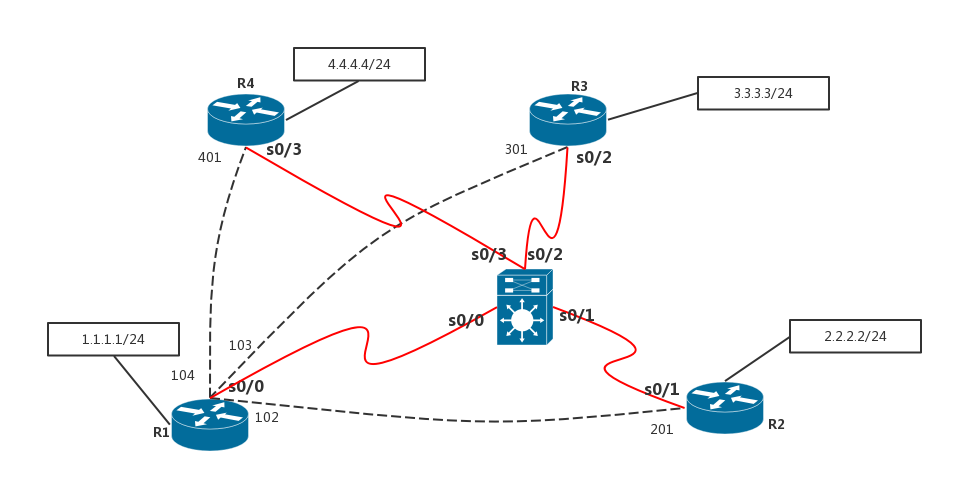

```router
// R5配置成为帧中继交换机
R(config)# host RF-SW
RF-SW(config)# frame-relay switch
RF-SW(config)# int s 0/0
RF-SW(config-if)# encap frame
RF-SW(config-if)# frame lmi-type ansi
RF-SW(config-if)# frame intf-type dce
RF-SW(config-if)# frame route 102 int s 0/1 201
RF-SW(config-if)# frame route 103 int s 0/2 301
RF-SW(config-if)# frame route 104 int s 0/3 401
RF-SW(config-if)# no shut
RF-SW(config-if)# int s 0/1
RF-SW(config-if)# encap frame
RF-SW(config-if)# frame lmi-type ansi
RF-SW(config-if)# frame intf-type dce
RF-SW(config-if)# frame route 201 int s 0/0 102
RF-SW(config-if)# no shut
RF-SW(config-if)# int s 0/2
RF-SW(config-if)# encap frame
RF-SW(config-if)# frame lmi-type ansi
RF-SW(config-if)# frame intf-type dce
RF-SW(config-if)# frame route 301 int s 0/0 103
RF-SW(config-if)# no shut
RF-SW(config-if)# int s 0/3
RF-SW(config-if)# encap frame
RF-SW(config-if)# frame lmi-type ansi
RF-SW(config-if)# frame intf-type dce
RF-SW(config-if)# frame route 401 int s 0/0 104
RF-SW(config-if)# no shut
// R1上配置点到点和多点子接口
R1(config)# int s 0/0
R1(config-if)# encap frame
R1(config-if)# no frame inverse-arp
R1(config-if)#no shut // 物理接口只需要打开即可
R1(config-if)# int s 0/0.1 point-to-point // 配置点到点子接口
R1(config-subif)# ip add 12.1.1.1 255.255.255.0
// 点到点子接口不需要和物理接口一样配置静态映射，只要指明该接口使用的DLCI号即可；点到点子接口上去往该子接口的IP地址（12.1.1.1）或远端（R2的12.1.1.2）的数据都使用这个DLCI号封装
R1(config-subif)# frame-relay interface-dlci 102
R1(config-if)# int s 0/0.2 multipoint // 配置多点子接口
R1(config-subif)# ip add 134.1.1.1 255.255.255.0
// 多点子接口的静态映射和物理接口相同
R1(config-subif)# frame-relay map ip 134.1.1.1 103 broadcast ietf
R1(config-subif)# frame-relay map ip 134.1.1.4 104 broadcast ietf
R1(config-subif)# frame-relay map ip 134.1.1.3 103 broadcast ietf
R1(config-subif)# int lo 0
R1(config-if)# ip add 1.1.1.1 255.255.255.0
R1(config-if)# no shut
R1(config)# router rip // 启用RIP协议
R1(config-router)# net 1.0.0.0
R1(config-router)# net 12.0.0.0
R1(config-router)# net 134.1.0.0
// R2配置
R2(config)# int s 0/1
R2(config-if)# encapsulation frame-relay
R2(config-if)# no frame-relay inverse-arp
R2(config-if)# frame-relay map ip 12.1.1.1 201 broadcast ietf
R2(config-if)# frame-relay map ip 12.1.1.2 201 broadcast ietf
R2(config-if)# ip add 12.1.1.2 255.255.255.0
R2(config-if)# no shut
R2(config-if)# int lo 0
R2(config-if)# ip add 2.2.2.2 255.255.255.0
R2(config-if)# no shut
R2(config)# router rip
R2(config-router)# net 2.0.0.0
R2(config-router)# net 12.0.0.0
// R3配置
R3(config)# int s 0/2
R3(config-if)# encapsulation frame-relay
R3(config-if)# no frame-relay inverse-arp
R3(config-if)# frame-relay map ip 134.1.1.1 301 broadcast ietf // 配置静态映射，去往R1
R3(config-if)# frame-relay map ip 134.1.1.4 301 broadcast ietf // 因为R3和R4之间没有配置虚电路，所以去往R4要先发往R1
R3(config-if)# frame-relay map ip 134.1.1.3 301 broadcast ietf // 配置R3能够ping通自己
R3(config-if)# ip add 134.1.1.3 255.255.255.0
R3(config-if)# no shut
R3(config-if)# int lo 0
R3(config-if)# ip add 3.3.3.3 255.255.255.0
R3(config-if)# no shut
R3(config)# router rip
R3(config-router)# net 3.0.0.0
R3(config-router)# net 134.1.0.0
// R4配置
R4(config)# int s 0/3
R4(config-if)# encapsulation frame-relay
R4(config-if)# no frame-relay inverse-arp
R4(config-if)# frame-relay map ip 134.1.1.1 401 broadcast ietf
R4(config-if)# frame-relay map ip 134.1.1.3 401 broadcast ietf
R4(config-if)# frame-relay map ip 134.1.1.4 401 broadcast ietf
R4(config-if)# ip add 134.1.1.4 255.255.255.0
R4(config-if)# no shut
R4(config-if)# int lo 0
R4(config-if)# ip add 4.4.4.4 255.255.255.0
R4(config-if)# no shut
R4(config)# router rip
R4(config-router)# net 4.0.0.0
R4(config-router)# net 134.1.0.0

R1# show ip interface s 0/0.1 // R1上查看子接口信息来验证默认情况下，点到点子接口和多点子接口的水平分隔都是打开的
R3# show ip route // 在R2的多点子接口上连接了两台路由器R3和R4，查看R3的路由表；从路由表中看不到R4的回环接口的信息；在R4上面也看不到R3回环接口的信息，这就是因为R1上s0/0.2接口上默认的水平分隔设置导致的
R1(config)# int s 0/0.2
R1(config-subif)# no ip split-horizon // 关闭R1的s0/0.2子接口的水平分隔
```

#### EIGRPOVER帧中继

eigrp_over帧中继：R4是帧中继交换机，图中配置了两条虚电路R1-R2，R1-R3，R1-3各有一个回环接口IP

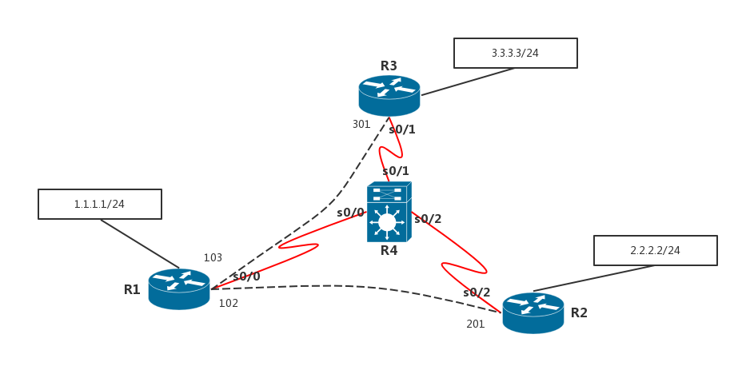

```router
// 配置R4成为帧中继交换机
R(config)# host RF-SW
RF-SW(config)# frame-relay switching
RF-SW(config)# int s 0/0
RF-SW(config-if)# encapsulation frame-relay
RF-SW(config-if)# frame-relay lmi-type ansi
RF-SW(config-if)# frame-relay intf-type dce
RF-SW(config-if)# frame-relay route 103 int s 0/1 301
RF-SW(config-if)# frame-relay route 102 int s 0/2 201
RF-SW(config-if)# no shut
RF-SW(config-if)# int s 0/1
RF-SW(config-if)# encapsulation frame-relay
RF-SW(config-if)# frame-relay lmi-type ansi
RF-SW(config-if)# frame-relay intf-type dce
RF-SW(config-if)# frame-relay route 301 int s 0/0 103
RF-SW(config-if)# no shut
RF-SW(config-if)# int s 0/2
RF-SW(config-if)# encapsulation frame-relay
RF-SW(config-if)# frame-relay lmi-type ansi
RF-SW(config-if)# frame-relay intf-type dce
RF-SW(config-if)# frame-relay route 201 int s 0/0 102
RF-SW(config-if)# no shut
// 配置R1、R2、R3的物理接口使用帧中继封装，并且在上面运行EIGRP协议
R1(config)# int s 0/0
R1(config-if)# encapsulation frame-relay
R1(config-if)# no frame-relay inverse-arp
R1(config-if)# frame-relay map ip 123.1.1.1 102 broadcast ietf
R1(config-if)# frame-relay map ip 123.1.1.2 102 broadcast ietf
R1(config-if)# frame-relay map ip 123.1.1.3 103 broadcast ietf
R1(config-if)# ip add 123.1.1.1 255.255.255.0
R1(config-if)# no shut
R1(config-if)# int lo 0
R1(config-if)# ip add 1.1.1.1 255.255.255.0
R1(config-if)# no shut
R1(config)# router eigrp 100
R1(config-router)# net 1.1.1.0 0.0.0.255
R1(config-router)# net 123.1.1.0 0.0.0.255

R2(config)# int s 0/2
R2(config-if)# encapsulation frame-relay
R2(config-if)# no frame-relay inverse-arp
R2(config-if)# frame-relay map ip 123.1.1.1 201 broadcast ietf
R2(config-if)# frame-relay map ip 123.1.1.2 201 broadcast ietf
R2(config-if)# frame-relay map ip 123.1.1.3 201 broadcast ietf
R2(config-if)# ip add 123.1.1.2 255.255.255.0
R2(config-if)# no shut
R2(config-if)# int lo 0
R2(config-if)# ip add 2.2.2.2 255.255.255.0
R2(config-if)# no shut
R2(config)# router eigrp 100
R2(config-router)# net 2.2.2.0 0.0.0.255
R2(config-router)# net 123.1.1.0 0.0.0.255

R3(config)# int s 0/1
R3(config-if)# encapsulation frame-relay
R3(config-if)# no frame-relay inverse-arp
R3(config-if)# frame-relay map ip 123.1.1.1 301 broadcast ietf
R3(config-if)# frame-relay map ip 123.1.1.2 301 broadcast ietf
R3(config-if)# frame-relay map ip 123.1.1.3 301 broadcast ietf
R3(config-if)# ip add 123.1.1.3 255.255.255.0
R3(config-if)# no shut
R3(config-if)# int lo 0
R3(config-if)# ip add 3.3.3.3 255.255.255.0
R3(config-if)# no shut
R3(config)# router eigrp 100
R3(config-router)# net 3.3.3.0 0.0.0.255
R3(config-router)# net 123.1.1.0 0.0.0.255

R2# show ip route // 配置完成后在R2上面查看路由表；R2上面并没有学到去往R3的回环接口3.3.3.3的路由条目；同样R3上面也没有学习到R2的回环接口的条目，这是因为在R1的物理接口s0/0上开启了对EIGEP的水平分隔
R1(config)# int s 0/0
R1(config-if)# no ip split-horizon eigrp 100
```

#### EIGRP帧中继多点子接口

```router
//R2、R3、R4配置保持不变；在R1的物理接口s0/0上配置多点子接口
R1(config)# int s 0/0
R1(config-if)# encapsulation frame-relay
R1(config-if)# no frame-relay inverse-arp
R1(config-if)# no shut // 物理接口只需要打开即可
R1(config)# int s 0/0.1 multipoint // 配置多点子接口
R1(config-subif)# ip add 123.1.1.1 255.255.255.0
R1(config-subif)# frame-relay map ip 123.1.1.1 102 broadcast ietf
R1(config-subif)# frame-relay map ip 123.1.1.2 102 broadcast ietf
R1(config-subif)# frame-relay map ip 123.1.1.3 103 broadcast ietf
R1(config-subif)# no ip split-horizon eigrp 100 // 多点子接口默认对EIGRP的水平分隔也是开启的，现在关闭它
R1(config-subif)# int lo 0
R1(config-if)# ip add 1.1.1.1 255.255.255.0
R1(config)# no shut
R1(config-if)# router eigrp 100
R1(config-router)# net 1.1.1.0 0.0.0.255
R1(config-router)# net 123.1.1.0 0.0.0.255
```

#### EIGRP帧中继点到点接口

```router
//R4帧中继交换机的配置保持不变 在R1的物理接口s0/0上配置点到点子接口
//多点子接口下所有对应的路由属于同一网段 点到点子接口，每个子接口对应了一个单独网段
//每个子接口就像一个单独的物理接口一样工作，所以不会出现水平分隔的问题
// R1配置
R1(config)# int s 0/0
R1(config-if)# encapsulation frame-relay
R1(config-if)# no frame-relay inverse-arp
R1(config-if)# no shut // 物理接口只需要开启
R1(config-if)# int s 0/0.1 point-to-point // 使用点到点子接口
R1(config-subif)# ip add 12.1.1.1 255.255.255.0
R1(config-subif)# frame-relay interface-dlci 102 // 点到点子接口只需要封装DLCI号,从封装DLCI号可知，这个点到点子接口是用来连接R2的
R1(config-fr-dlci)# int s 0/0.2 point-to-point // 连接R3的点到点子接口
R1(config-subif)# ip add 13.1.1.1 255.255.255.0
R1(config-subif)# frame-relay interface-dlci 103
R1(config-fr-dlci)# int lo 0
R1(config-if)# ip add 1.1.1.1 255.255.255.0
R1(config-if)# no shut
R1(config)# router eigrp 100
R1(config-router)# net 1.1.1.0 0.0.0.255
R1(config-router)# net 12.1.1.0 0.0.0.255
R1(config-router)# net 13.1.1.0 0.0.0.255
// R2配置
R2(config)# int s 0/2
R2(config-if)# ip add 12.1.1.2 255.255.255.0
R2(config-if)# no shut
R2(config-if)# encapsulation frame-relay
R2(config-if)# no frame-relay inverse-arp
R2(config-if)# frame-relay map ip 12.1.1.1 201 broadcast ietf
R2(config-if)# frame-relay map ip 12.1.1.2 201 broadcast ietf
R2(config-if)# int lo 0
R2(config-if)# ip add 2.2.2.2 255.255.255.0
R2(config)# router eigrp 100
R2(config-router)# net 2.2.2.0 0.0.0.255
R2(config-router)# net 12.1.1.0 0.0.0.255
// R3配置
R3(config)# int s 0/1
R3(config-if)# encapsulation frame-relay
R3(config-if)# no frame-relay inverse-arp
R3(config-if)# frame-relay map ip 13.1.1.3 301 broadcast ietf
R3(config-if)# frame-relay map ip 13.1.1.1 301 broadcast ietf
R3(config-if)# ip add 13.1.1.3 255.255.255.0
R3(config-if)# no shut
R3(config-if)# int lo 0
R3(config-if)# ip add 3.3.3.3 255.255.255.0
R3(config-if)# no shut
R3(config)# router eigrp 100
R3(config-router)# net 3.3.3.0 0.0.0.255
R3(config-router)# net 13.1.1.0 0.0.0.255
```

## 模拟

### 模拟一

- 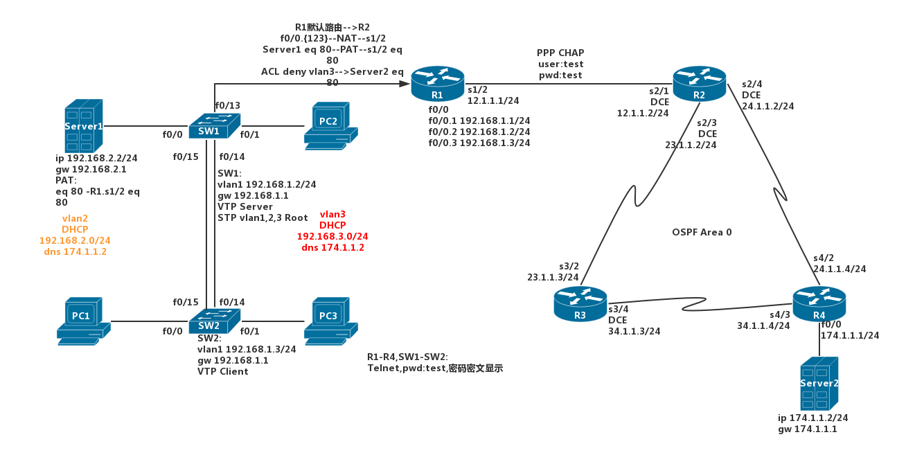
- 设备配置
    - R1配置
        - f0/0 打开
        - f0/0.1 192.168.1.1/24
        - f0/0.2 192.168.2.1/24
        - f0/0.3 192.168.3.1/24
        - s1/2 12.1.1.1/24
    - R2配置
        - s2/1 12.1.1.2/24 DCE端,需要配置时钟
        - s2/3 23.1.1.2/24 DCE端
        - s2/4 24.1.1.2/24 DCE端
    - R3配置
        - s3/2 23.1.1.3/24
        - s3/4 34.1.1.3/24 DCE端
    - R4配置
        - s4/2 24.1.1.4/24
        - s4/3 34.1.1.4/24
        - f0/0 174.1.1.1/24
    - Server1配置
        - IP地址 192.168.2.2
        - 子网掩码 255.255.255.0
        - 默认网关 192.168.2.1
    - Server2配置
        - IP地址 174.1.1.2
        - 子网掩码 255.255.255.0
        - 默认网关 174.1.1.1
    - SW1配置
        - VLAN1 192.168.1.2/24
        - 默认网关 192.168.1.1
    - SW2配置
        - VLAN1 192.168.1.3/24
        - 默认网关 192.168.1.1
    - PC1、PC2、PC3使用DHCP自动获取IP
    - Server1和PC1属于VLAN2，VLAN2所在子网是192.168.2.0/24
    - PC2和PC3属于VLAN3，VLAN3所在子网是192.168.3.0/24
- 配置4台路由以及2台交换机，使他们都能支持远程Telnet登录；配置他们的特权密码和Console端口密码，所有的密码统一配置成"test"，要求密码不能在配置文件中明文显示（使用加密）
- 配置VTP协议，让SW1成为VTP Server，SW2为VTP Client，VTP配置中域名配置成"test",密码同样是"test"
- 在SW1上面配置VLAN2和VLAN3，让SW2可以通过VTP协议学习到SW1上的VLAN信息。配置两台交换机上面链接的4台终端设备到各自的VLAN中，配置SW1与R1相连的接口为主干
- 配置STP协议，使SW1成为VLAN1、VLAN2和VLAN3的根交换机
- 在R1上配置DHCP协议，使得PC1、PC2、PC3都能准确获取IP地址、网关，DNS服务器的地址是174.1.1.2
- 配置R1使用默认路由指向R2，配置R2、R3、R4运行OSPF协议，配置完成后4台路由器能够互访
- R1和R2之间配置PPP封装，使用CHAP验证用户名密码是"test"
- 在R1上配置NAT，使得内网Server1、PC1、PC2、PC3能够通过PAT共享R1的s1/2接口IP地址访问Internet（R2、R3、R4和Server2模拟的是Internet）；同时在R1上配置静态PAT，让Internet上的用户可以通过R1的s1/2接口的80端口访问内网Server1的WWW服务
- 在R1上配置ACL，拒绝VLAN3的主机访问Server2的WWW服务，其他服务不受影响

```router/switch
// R1配置
R1(config)# int f0/0
R1(config-if)# no shut
R1(config-if)# int f0/0.1
R1(config-subif)# encapsulation dot1Q 1 // VLAN1的网关
R1(config-subif)# ip add 192.168.1.1 255.255.255.0
R1(config-subif)# no shut
R1(config-subif)# int f0/0.2
R1(config-subif)# encapsulation dot1Q 2 // VLAN2的网关
R1(config-subif)# ip add 192.168.2.1 255.255.255.0
R1(config-subif)# no shut
R1(config-subif)# int f0/0.3
R1(config-subif)# encapsulation dot1Q 3 // VLAN3的网关
R1(config-subif)# ip add 192.168.3.1 255.255.255.0
R1(config-subif)# no shut
R1(config-subif)# int s1/2
R1(config-if)# ip add 12.1.1.1 255.255.255.0
R1(config-if)# no shut

// R2配置
R2(config)# int s2/1
R2(config-if)# ip add 12.1.1.2 255.255.255.0
R2(config-if)# clock rate 64000
R2(config-if)# no shut
R2(config-if)# int s2/3
R2(config-if)# ip add 23.1.1.2 255.255.255.0
R2(config-if)# clock rate 64000
R2(config-if)# no shut
R2(config-if)# int s2/4
R2(config-if)# ip add 24.1.1.2 255.255.255.0
R2(config-if)# clock rate 64000
R2(config-if)# no shut

// R3配置
R3(config)# int s3/2
R3(config-if)# ip add 23.1.1.3 255.255.255.0
R3(config-if)# no shut
R3(config-if)# int s3/4
R3(config-if)# ip add 34.1.1.3 255.255.255.0
R3(config-if)# clock rate 64000
R3(config-if)# no shut

// R4配置
R4(config)# int s4/3
R4(config-if)# ip add 34.1.1.4 255.255.255.0
R4(config-if)# no shut
R4(config-if)# int s4/2
R4(config-if)# ip add 24.1.1.4 255.255.255.0
R4(config-if)# no shut
R4(config-if)# int f0/0
R4(config-if)# ip add 174.1.1.1 255.255.255.0
R4(config-if)# no shut

// SW1配置
// SW1配置一个网关，并配置一个可网管的IP地址 可尝试配置DHCP snooping可信端口与DHCP发送速率
// SW(config)# ip dhcp snooping vlan 1
// SW(config)# int range f0/0 -6
// SW(config-if-range)# ip dhcp snooping trust // 开启vlan1的防DHCP欺骗
// SW(config)# int range f0/7 -12
// SW(config-if-range)# ip dhcp snooping limit rate 2 // 限制端口的DHCP请求包发送速率
SW1(config)# ip default-gateway 192.168.1.1
SW1(config)# int vlan 1
SW1(config-if)# ip add 192.168.1.2 255.255.255.0
SW1(config-if)# no shut

// SW2配置
SW2(config)# ip default-gateway 192.168.1.1
SW2(config)# int vlan 1
SW2(config-if)# ip add 192.168.1.3 255.255.255.0
SW2(config-if)# no shut

//Server1配置
    IP地址 192.168.2.2
    子网掩码 255.255.255.0
    默认网关 192.168.2.1
//Server2配置
    IP地址 174.1.1.2
    子网掩码 255.255.255.0
    默认网关 174.1.1.1
//PC1-3配置
    IP地址 DHCP
    DNS DHCP
    网关 DHCP
```

远程配置&密码配置：

```router/switch
// R1配置
R1(config)# enable secret test
R1(config)# line co 0
R1(config-line)# pass test // 配置Console端口密码
R1(config-line)# login
R1(config-line)# line vty 0 4
R1(config-line)# pass test // 配置R1远程Telnet管理
R1(config-line)# login
R1(config-line)# exit
R1(config)# service password-encryption

// R2配置
R2(config)# enable secret test
R2(config)# line co 0
R2(config-line)# pass test
R2(config-line)# login
R2(config-line)# line vty 0 4
R2(config-line)# pass test
R2(config-line)# login
R2(config-line)# exit
R2(config)# service password-encryption

// R3、R4、SW1、SW2配置和R1、R2相同
```

配置VTP：

```switch
// SW1配置
SW1(config)# int range f0/13 -15
SW1(config-if-range)# swi mod trunk // 配置端口为主干
SW1(config-if-range)# swi trunk enc dot1q // 封装dot1q
SW1(config-if-range)# swi trunk allow vlan all // 允许vlan流量，可具体指定
SW1(config)# vtp domain test // 配置VTP
SW1(config)# vtp pass test
SW1(config)# vtp mode server

// SW2配置
SW2(config)# int range f0/14 -15
SW2(config-if-range)# swi mod trunk
SW2(config-if-range)# swi trunk enc dot1q
SW2(config-if-range)# swi trunk allow vlan all
SW2(config)# vtp domain test
SW2(config)# vtp pass test
SW2(config)# vtp mode client // SW2配置成VTP Client
```

配置vlan：

```switch
// SW1配置
SW1(config)# vlan 2
SW1(config-vlan)# name vlan2
SW1(config-vlan)# vlan 3
SW1(config-vlan)# name vlan3
SW1(config-vlan)# exit
SW1(config)# int f0/1
SW1(config-if)# swi mod acc
SW1(config-if)# swi acc vlan 2
SW1(config-if)# int f0/2
SW1(config-if)# swi mod acc
SW1(config-if)# swi acc vlan 3

// SW2配置
// 从VTP server上学到了VLAN后，将对应接口加入这些VLAN中
SW2(config)# int f0/1
SW2(config-if)# swi mod acc
SW2(config-if)# swi acc vlan 2
SW2(config-if)# int f0/2
SW2(config-if)# swi mod acc
SW2(config-if)# swi acc vlan 3
```

配置STP：

```switch
SW1(config)# spanning-tree vlan 1 root primary // 将SW1配置成VLAN1/2/3的根交换机
SW1(config)# spanning-tree vlan 2 root primary
SW1(config)# spanning-tree vlan 3 root primary
```

配置DHCP：

```router
// R1配置
R1(config)# ip dhcp excluded-address 192.168.2.1 // 没下发1.0网段，故而没配置1.1
R1(config)# ip dhcp excluded-address 192.168.3.1
R1(config)# ip dhcp pool pool-1
R1(dhcp-config)# network 192.168.2.0 255.255.255.0
R1(dhcp-config)# default-router 192.168.2.1
R1(dhcp-config)# dns-server 174.1.1.2
R1(dhcp-config)# domain-name www.test.com // 可选
R1(dhcp-config)# exit
R1(config)# ip dhcp pool pool-2
R1(dhcp-config)# default-router 192.168.3.1
R1(dhcp-config)# network 192.168.3.0 255.255.255.0
R1(dhcp-config)# dns-server 174.1.1.2
R1(dhcp-config)# domain-name www.test.com // 可选
```

配置静态路由和动态路由协议：

```router
// R1配置
R1(config)# ip route 0.0.0.0 0.0.0.0 12.1.1.2 // 指向R2的默认路由

// R2配置
R2(config)# router ospf 2 // 本地进程号，只具有本地意义
R2(config-router)# net 0.0.0.0 255.255.255.255 area 0 // 所有接口都宣告进OSPF进程

// R3配置
R3(config)# router ospf 3
R3(config-router)# net 0.0.0.0 255.255.255.255 area 0

// R4配置
R4(config)# router ospf 4
R4(config-router)# net 0.0.0.0 255.255.255.255 area 0
```

配置PPP：

```router
// R1配置
R1(config)# int s1/2
R1(config-if)# encapsulation ppp // 配置PPP封装和CHAP验证
R1(config-if)# ppp chap hostname test
R1(config-if)# ppp chap password test

// R2配置
R2(config)# username test password test
R2(config)# int s2/1
R2(config-if)# encapsulation ppp
R2(config-if)# ppp authentication chap
```

配置NAT：

```router
// R1配置
R1(config)# int f0/0.1
R1(config-subif)# ip nat inside // 指定对内端口和对外端口
R1(config-subif)# int f0/0.2
R1(config-subif)# ip nat inside
R1(config-subif)# int f0/0.3
R1(config-subif)# ip nat inside
R1(config-subif)# int s1/2
R1(config-if)# ip nat outside
// 配置允许内部那些地址进行NAT转换
R1(config)# access-list 1 permit 192.168.1.0 0.0.0.255
R1(config)# access-list 1 permit 192.168.2.0 0.0.0.255
R1(config)# access-list 1 permit 192.168.3.0 0.0.0.255
// R1(config)# access-list 1 permit 192.168.0.0 0.0.3.255 等效
R1(config)# ip nat inside source list 1 interface s1/2 overload // 开启转换
// 使用静态端口映射，让外网可以通过R1的s1/2接口IP访问内网Server1的WWW服务
R1(config)# ip nat inside source static tcp 192.168.2.2 80 12.1.1.1 80
```

ACL配置：

```router
// 使用扩展ACL，仅阻止VLAN3去往Server2 TCP 80端口的流量，除80端口外，其他服务不受影响
R1(config)# access-list 100 deny tcp 192.168.3.0 0.0.0.255 host 174.1.1.2 eq 80
R1(config)# access-list 100 permit ip any any // 允许其他流量
R1(config)# int f0/0.3
R1(config-subif)# ip access-group 100 in // 在子接口上应用这个扩展ACL
```

## todo