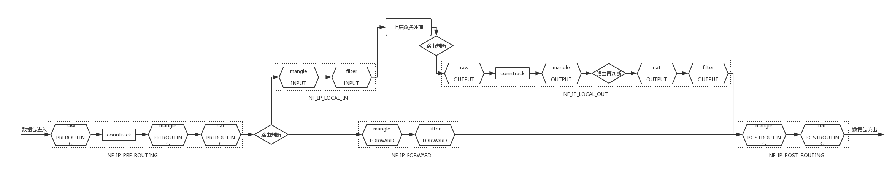

<!--
{
    "title": "iptables相关",
    "create": "2019-01-08 21:30:35",
    "modify": "2019-01-08 21:30:35",
    "tag": [
        "iptables"
    ],
    "info": []
}
-->

## 信息

包过滤机制是netfilter，管理工具iptables/firewall。用户空间的iptables制定防火墙规则，内核空间的netfilter实现防火墙功能

### iptables表和链



netfilter提供5个钩子供程序注册：

NF_IP_PRE_ROUTING: 数据流量进入网络栈时触发，钩子上注册的模块在路由决策前执行

NF_IP_LOCAL_IN: 路由判断发送本机时执行

NF_IP_FORWARD: 路由判断需要转发给其他主机时执行

NF_IP_LOCAL_OUT: 本机产生的数据送到网络栈时执行

NF_IP_POST_ROUTING: 数据包经路由判断后即将发送到网络前执行

iptables有5表/5链：

raw: 为iptables提供了不经过状态追踪的机制

mangle: 用于修改数据信息，如ttl，包标记等

nat: 进行地址转换时使用

filter: 进行过滤等操作

security: 提供在数据包中加入selinux特性的功能

## 连接追踪

```bash
# 设置连接追踪条目数
# /etc/sysctl.conf
net.nf_conntrack_max=655360
net.netfilter.nf_conntrack_max=655360
# /etc/modprobe.d/netfilter.conf
options nf_conntrack hashsize=131072

sysctl -p

# 查看连接追踪表
cat /proc/net/nf_conntrack

> ipv4 2 tcp 6 62 SYN_SENT src=...
```

连接追踪其在内存数据结构中记录了连接的状态，包括源目的ip、源目的port、协议类型、状态、超时时间等。其不进行过滤动作，只是为上层应用提供基于状态的过滤功能。

## state模块状态

利用了nf_conntrack进行状态区分，状态分为ESTABLISHED、NEW、RELATED、INVALID

ESTABLISHED: 数据包成功穿越防火墙，之后的所有封包（包含反向的所有数据包）状态都会是ESTABLISHED

NEW: 发出的第一个包的状态就是NEW

RELATED: 封包与主机发送出去的封包有关， 可能是响应封包或者是联机成功之后的传送封包或由已有连接新起的连接

INVALID: 状态不明的包，不属于前面3中状态的包，例如数据破损的封包状态

```bash
# 允许已建立的连接
iptables -A INPUT -p tcp -m state --state ESTABLISHED,RELATED -j ACCEPT
iptables -A INPUT -p tcp -j DROP
iptables -A OUTPUT -p tcp -j ACCEPT

# 不使用nf_conntrack # 使用nat不能禁用
iptables -t raw -A PREROUTING -p tcp -j NOTRACK
iptables -t raw -A OUTPUT -p tcp -j NOTRACK
```

## 常用操作

### ping设置

```bash
iptables -A INPUT -p icmp --icmp-type echo-reply -j ACCEPT # 回复ping请求
iptables -A INPUT -p icmp --icmp-type echo-request -j ACCEPT # ping请求
iptables -A INPUT -p icmp --icmp-type fragmentation-needed -j ACCEPT # 协商MTU所需包
```

### nat设置

```bash
# 开启内核转发
sysctl -w net.ipv4.ip_forward=1

# iptables规则
iptables -t filter -A FORWARD -j ACCEPT
iptables -t nat -A POSTROUTING -o eth_out -j SNAT --to-source 1.1.1.2-1.1.1.20

# 2.2.2.2 == 1.1.1.1 ==|== 1.1.1.2 # 访问2.2.2.2:1111为访问1.1.1.2:80
iptables -t nat -A PREROUTING -d 2.2.2.2 -p tcp -m tcp --dport 1111 -j DNAT --to-destination 1.1.1.2:80
iptables -t nat -A POSTROUTING -d 1.1.1.2 -p tcp -m tcp --dport 80 -j SNAT --to-source 1.1.1.1

# 类似SNAT，但是使用网卡的地址，在dhcp等环境下有优势
iptables -t nat -I POSTROUTING -s 2.2.2.0/24 -j MASQUERADE
```

### 示例命令

```bash
# 允许ssh
iptables -A INPUT -i eth0 -p tcp -s 192.168.1.0/24 --dport 22 -m state --state NEW,ESTABLISHED,RELATED -j ACCEPT
iptables -A OUTPUT -o eth0 -p tcp --sport 22 -m state --state ESTABLISHED,RELATED -j ACCEPT

# 允许http/httpd
iptables -A INPUT -i eth0 -p tcp --dport 80 -m state --state NEW,ESTABLISHED -j ACCEPT
iptables -A OUTPUT -o eth0 -p tcp --sport 80 -m state --state ESTABLISHED -j ACCEPT
iptables -A INPUT -i eth0 -p tcp --dport 443 -m state --state NEW,ESTABLISHED -j ACCEPT
iptables -A OUTPUT -o eth0 -p tcp --sport 443 -m state --state ESTABLISHED -j ACCEPT

# 多端口设置
iptables -A INPUT -i eth0 -p tcp -m multiport --dports 22,80,443 -m state --state NEW,ESTABLISHED -j ACCEPT
iptables -A OUTPUT -o eth0 -p tcp -m multiport --sports 22,80,443 -m state --state ESTABLISHED -j ACCEPT

# 允许本地的ssh/指定网段
iptables -A OUTPUT -o eth0 -p tcp --dport 22 -m state --state NEW,ESTABLISHED -j ACCEPT
iptables -A INPUT -i eth0 -p tcp --sport 22 -m state --state ESTABLISHED -j ACCEPT
# --
iptables -A OUTPUT -o eth0 -p tcp -d 192.168.1.0/24 --dport 22 -m state --state NEW,ESTABLISHED -j ACCEPT
iptables -A INPUT -i eth0 -p tcp --sport 22 -m state --state ESTABLISHED -j ACCEPT

# 负载均衡
iptables -A PREROUTING -i eth0 -p tcp --dport 443 -m state --state NEW -m nth --counter 0 --every 3 --packet 0 -j DNAT --to-destination 192.168.1.101:443
iptables -A PREROUTING -i eth0 -p tcp --dport 443 -m state --state NEW -m nth --counter 0 --every 3 --packet 1 -j DNAT --to-destination 192.168.1.102:443
iptables -A PREROUTING -i eth0 -p tcp --dport 443 -m state --state NEW -m nth --counter 0 --every 3 --packet 2 -j DNAT --to-destination 192.168.1.103:443

# 连接限制
iptables -A INPUT -p tcp --dport 80 -m limit --limit 25/minute --limit-burst 100 -j ACCEPT # 25次/min 当达到burst 100时启动限制

# 记录丢弃的数据
iptables -N LOGGING
iptables -A INPUT -j LOGGING
iptables -A LOGGING -m limit --limit 2/min -j LOG --log-prefix "IPTables Packet Dropped: " --log-level 7
iptables -A LOGGING -j DROP
```
