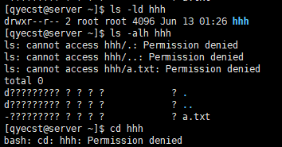
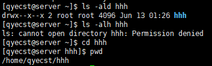

<!--
{
    "title": "linux相关",
    "create": "2018-06-01 07:35:09",
    "modify": "2018-12-16 23:25:13",
    "tag": [
        "linux"
    ],
    "info": []
}
-->

## PC硬件

### 硬件组成

- 中央处理器/CPU
    - 服务器CPU
        - 长期连续工作
        - 支持多CPU
    - 普通CPU
- 内存
- 芯片组
- I/O总线
- I/O设备
- 电源
- 机箱
- 相关软件

### 硬件信息查看

- PCI设备
    - 显卡：`dmesg | grep -i vga`
    - 网卡：`lspci | grep -i eth`
    - 声卡：`lspci | grep -i vga`
- CPU信息：
    - `cat /proc/cpuinfo`查看信息
- 内存信息：
    - `cat /proc/meminfo`查看信息
- 磁盘信息：
    - `fdisk/parted`分区信息
    - `df`大小情况
    - `du`使用情况
- 外设：
    - U盘：scsi，/dev/sda[X]
    - 光盘：ide，/dev/hd[X]
    - 光驱：scsi：/dev/sr[X]
    - 磁带：scsi，/dev/st[X]
- 文件系统：
    - msdos：dos文件系统/windows
    - vfat：长文件名dos系统，U盘
    - iso9660：光盘文件系统格式
    - ext2/3/4：linux常用文件系统
    - xfs：linux高性能日志文件系统，CentOS7默认文件系统
    - `mount`挂载设备，`umount`卸载 `mount <device> <mount point>`，`umount <device>` or `umount <mount point>`

### 硬盘信息

- 硬盘
    - 盘片、磁头、主轴、马达、磁头控制器、数据转换器、接口、缓存等
    - `/dev/sda1`：sd=SCSI接口类型硬盘 hd=IDE类型 abcd=第几块硬盘 1234=主分区 5678=扩展分区/逻辑分区
    - 设备联机->创建分区->创建文件系统->挂载->使用
    - MBR分区表：`fdisk <device>`
    - GPT分区表：`parted <device>`
- 分类
    - 机械硬盘HDD
        - SCSI
        - IDE
        - SAS
        - STAT
    - 固态硬盘SSD
        - 低功耗、无噪音、发热量小、散热快
- 尺寸
    - 0.85英寸：手机等便携设备
    - 1英寸：多用于数码相机
    - 1.8英寸：部分笔记本电脑
    - 2.5英寸：常用于笔记本电脑
    - 3.5英寸：多用于台式机，采用3.5英寸硬盘的外置硬盘盒需要外接电源
    - 5.25英寸：早期台式机使用

## 控制台

### 控制台信息

- 字符控制台
    - tty终端
        - 默认6个字符控制台 `/etc/tty*`
        - 独立运行，互不影响
        - 多用户，多任务
        - `Ctrl` + `Alt` + `F2~F6`，`F1`图形化界面（若有）
    - pty终端
        - 虚拟终端pty(pseudo-tty)
        - 远程到主机使用的终端
    - pts/ptmx终端
        - 实现pty终端的一个方式
        - `who am i`查询当前终端对应的pts
- shell
    - 程序，交互式解析用户输入命令
    - `$`普通用户标识符，`#`root用户标识符
    - `[username@hostname <pwd>]$`，`[root@hostname <pwd>]#`
    - 命令执行
        - 交互式/interactive：解释执行用户命令，输入一条，解释执行一条
        - 批处理/batch：事先写一个shell脚本/script，其中多条命令。shell一次性执行完这些命令，不用一条一条输入
    - 解释器
        - bash/csh/sh
        - `cat /etc/shells` 或 `chsh -l`查看当前系统支持的shell列表

## 命令

### 常用命令

- `date`查看/设置日期
    - 选项：`-s --set <date-string/2018-06-01>`设置时间，`-d --date`显示描述信息
    - 参数：`%H 小时00-23； %M 分钟00-59； %S 秒00-59； %Y 年份2018； %d 日期01-31； %m 月份01-12`
    - `date "+%Y-%m-%d %H:%M:%S"` => `2018-06-01 06:46:23`
- `clear`清屏
- `man`查看帮助信息
- `who`查看当前用户
    - 选项：`-h`不显示标题列，`-u`显示用户的相关信息，`-s`简短格式，`-r`运行级别，`-T`终端状态，`-b`最近启动日期
- `w`查看当前用户，系统1/5/15mins负载
- `uname`查看系统信息
    - 选项：`-a`显示全部信息，`-r`内核版本，`-m`CPU类型，`-s`操作系统类型
- `uptime`查看系统任务队列信息
- `last`输出系统登入信息
- `dmesg`显示开机信息
    - 选项：`-c`显示后清除buffer，`-s`设置缓冲区大小，`-n`设置记录信息层次
- `free`系统内存信息

### 文本编辑

- nano编辑器
- vi/vim编辑器
    - `i`插入模式，`ESC`普通模式，`:`命令模式
    - `x` 或 `wq`保存退出，`w`保存，`q!`退出不保存

### 远程连接

- Xshell/Xftp
- SecureCRT
- Telnet

### net-tools工具集

- 废弃/长期未更新
- `net-tools`软件包
- `ifconfig`
    - `ifconfig <dev> up|down`
    - `ifconfig <dev> <ip> [netmask <mask> broadcast <ip>]`
    - `ifconfig <dev> add|del 33ffe:3240:800:1005::2/64`
    - `ifconfig <dev> hw ether 00:AA:BB:CC:dd:EE`
    - `ifconfig <dev> arp`/`ifconfig eth0 -arp`
    - `ifconfig <dev> mtu 1500`
- `netstat`
    - a：显示所有链接接口 c：持续列出网络状态 h：帮助 i：网络界面信息 l：显示监控中的接口 n：显示ip地址 p：显示程序名 r：路由表 s：显示统计表 t：tcp链接状态 u：udp链接状态
    - 所有监听的tcp端口：`netstat -anlpt`

|用途|net-tool（被淘汰）|iproute2|
|:-:|:-:|:-:|
|地址和链路配置|ifconfig|ip addr, ip link|
|路由表|route|ip route|
|邻居|arp|ip neigh|
|VLAN|vconfig|ip link|
|隧道|iptunnel|ip tunnel|
|组播|ipmaddr|ip maddr|
|统计|netstat|ss|

### iproute工具集

- `iproute`软件包
- `ip`
    - `ip link`
        - 查看网络链接信息（不包括ip）：`ip link [show <interface>]`
        - 设置接口：`ip link set <interface> [up|down] [multicast on|off]`
    - `ip addr`
        - 显示ip地址：`ip addr [show <interface>]`
        - 设置ip：`ip addr add dev <interface> <ip/mask> [label 别名]`/`ip addr add dev <interface> <ip> [ladel 别名]`
        - 清除ip：`ip addr flush <interface> [to 网络地址]`
    - `ip route`
        - 添加路由：`ip route add <ip/mask> via 下一跳 src 源地址 [dev <device>]`
        - 删除路由：`ip route del <ip>`
        - 显示：`ip route list`
- `ss`
    - h：帮助 n：不解析ip r：解析ip a：显示所有链接 l：显示监听链接 p：显示程序名 s：显示概要 4：-f inet别名，只显示ipv4链接 6：-f inet6别名，只显示ipv6链接 t：tcp链接 u：udp链接 A：列出需要的套接字（all/inet/tcp/udp）.etc
    - 列出time-wait状态ipv4套接字：`ss -t4 state time-wait`
        - 状态：
            - established
            - syn-sent
            - syn-recv
            - fin-wait-1
            - fin-wait-2
            - time-wait
            - closed
            - close-wait
            - llast-ack
            - closing
            - all – All of the above states
            - connected – All the states except for listen and closed
            - synchronized – All the connected states except for syn-sent
            - bucket – Show states, which are maintained as minisockets, i.e. time-wait and syn-recv
            - big – Opposite to bucket state
    - 过滤：
        - 源端口：`ss -nt 'src :2333'` 目的端口：`ss -nt 'dst :ssh'`
        - 源端口：`ss -nt 'sport = :2333'` 目的端口：`ss -nt 'dport = :ssh'`
        - 地址和端口：`ss -nt 'dst 101.68.62.5:6777'`
        - 显示目的端口号小于1000的套接字：`ss -nt 'dport \< :1000'`
        - 显示源端口号大于1024的套接字：`ss -nt 'sport gt :1024'`

### 文件恢复

extundelete：

- 下载，解压
- 依赖：`e2fsprogs .etc`
- 安装：`./configure && make clean && make && make install`
- 恢复：
    - `extundelete /dev/<device> --inode < / 的 inode>`
    - `extundelete /dev/<device> --restore-file <file-name>`
    - `extundelete /dev/<device> --restore-inode <inode-num>`
    - `extundelete /dev/<device> --restore-directory <directory-name>`
    - `extundelete /dev/<device> --restore-all`
    - `ls RECOVERED_FILES/`

## PC启动过程

### 启动过程信息

- 开机自检
    - BIOS，硬件自检
    - 查找MBR
- MBR引导
    - 0磁道，第一个扇区
    - 512字节，引导区446字节，分区表66字节
    - 引导区：找到标记活动分区，将活动分区引导读入内存
    - BootLoader信息，加载GRUB等
- GRUB菜单
    - 查找加载kernel
- 加载内核
    - 装载驱动
    - 挂载rootfs
    - 执行/sbin/init
- init初始化
    - 系统初始化
    - 执行runlevel相关程序
    - 依赖shell脚本，串行，执行慢
    - 改进：upstart/systemd
    - inittab->rc.d/rc.sysinit->rc.runlevel->rc.local
- runlevel
    - init根据定义的级别去执行相应目录下的脚本
    - 0关机 1单用户 2无网络多用户 3网络多用户 4保留 5图形多用户 6重启

### root密码恢复

CentOS6

grub菜单->`e`进入编辑->`kernel`项条目->`e`编辑->最后添加`1`->进入单用户模式->`passwd root`修改密码

CentOS7

grub菜单->`e`进入编辑->找到`ro`项条目->修改为`rw init=/sysroot/bin/sh`->`Ctrl + X`启动->`chroot /sysroot`更换环境->`passwd root`修改密码[->`touch /.autorelabel`创建文件->`/bin/sh shutdown -r now`重启]

## 用户

### 用户信息

- 多用户多任务分时操作系统
- 用户
    - 账号文件`/etc/passwd`，密码文件`/etc/shadow`
    - `root:x:0:0:root:/root:/bin/bash` 用户名:密码占位:uid:gid:注释:主目录:使用的shell
    - `root:$...:16274:0:99999:7:::` 用户名:加密密码:最近修改密码日期19700101开始计算:密码不能更改天数0为随时可修改:密码过期天数:更改期限前几天发出警告:宽限天数:账号过期时间:保留
    - uid用户id，gid组id
    - root用户
        - uid：0
        - 普通用户uid为0则有root权限
    - 普通用户
        - 系统用户，uid：1-999 或 1-499
        - 本地用户，uid：1000+ 或 500+
    - 伪用户
        - nobody等，一般与系统和程序服务相关
        - 不能登入系统，shell为`/sbin/nologin`
- 用户模板文件
    - 位置：`/etc/skel/*`下的隐藏文件
- 操作
    - `useradd` `userdel` `usermod` `adduser` `passwd`

### 批量添加用户

1.编辑文本用户文件，每行按照`/etc/passwd`格式，用户名、uid、家目录不能相同，密码栏留空或x

```txt
user1:x:601:601:user1:/home/user1:/bin/bash
user2:x:602:602:user2:/home/user2:/bin/bash
```

2.使用命令新增用户`newusers < new_user_file.txt`

3.使用`pwunconv`将`/etc/passwd`文件解码，以便新增的用户密码修改

4.用户密码文件

```txt
user1:123456
user2:123456
```

5.使用`chpasswd < new_passwd_file.txt`导入密码

6.使用`pwconv`加密`/etc/passwd`文件

若缺失用户模板文件，拷贝`/etc/skel/`下的文件至新增用户家目录，使用脚本

## 文件系统

### 文件系统信息

- 文件系统
    - `stat <file>` `df -i` `ls -i` `xfs_repair [-n]`
    - 组成：文件名，inode，block（数据）
    - 常见
        - ext2/3/4：早期/带日志/大幅改动升级版
        - nfs：网络文件系统
        - iso9660：光盘文件系统
        - xfs：日志文件系统
        - ntfs：windows文件系统
        - ramfs：内存文件系统
        - xfs/ext4对比：
            - 数据完整性
            - 传输性能
            - 可扩展性
            - 传输带宽
    - 一个文件一个inode，一个inode多个文件名，一个文件可以有多个访问路径
        - 硬链接
            - 源文件名和链接文件名指向同一个物理地址，同一个文件
            - 不能跨分区
            - 不能对目录操作
            - 文件只有一个副本
        - 软链接
            - 符号链接

### 磁盘加密

- 加密：`cryptsetup luksFormat <device>`
- 打开：`cryptsetup luksOpen <device> <volume_name>`
- 查看：`cryptsetup status /dev/mapper/<volume_name>`
- 格式化：`mkfs -t ext4 /dev/mapper/<volume_name>`
- 挂载：`mount /dev/mapper/<volume_name> <mount_point>`
- 开机挂载
    - `<passwd_file>`
    - `/etc/crypttab`=>`<volume_name> <device> <passwd_file>`
    - `/etc/fstab`=>`/dev/mapper/<volume_name> <mount_point> ext4 defaults 0 0`
    - 加key：`cryptsetup luksAddKey <device> <password_file>`
- 关闭：`cryptsetup luksClose <volume_name>`

### LVM

- 将底层磁盘组合，以逻辑卷的方式呈现给上层应用
- 动态管理磁盘，不改变上层现有的逻辑卷
- PV：物理卷
- VG：卷组，多个物理卷组成
- LV：逻辑卷，基于卷组创建
- PE：LVM管理中的块
- 磁盘->PV->VG->LV->格式化，挂载
- 过程：
    - 添加硬盘，分区
    - 创建PV：`pvcreate <device>`/`pvcreate /dev/sda[1-2]`
    - 创建VG：`vgcreate <group_name> <device>`/`vgcreate group_name /dev/sda[1-2]`
        - 指定PE大小：`vgcreate -s 16M`
        - 扩展：`vgextend <group_name> </dev/sda3>`
        - 缩减：`vgreduce <group_name> </dev/sda2>`
    - 创建LV：`lvcreate -n <name> -L <1.5G> <group_name>`
        - 扩展：`lvextend -L <+200M> /dev/<group_name>/<name>`
            - 更新：`xfs_growfs /dev/<group_name>/<name>`
        - 缩减：`lvreduce -L <1G> /dev/<group_name>/<name>`
            - 更新：`xfs_growfs /dev/<group_name>/<name>`
    - 格式化，挂载：`mkfs -t xfs /dev/<group_name>/<name>` `mount /dev/<group_name>/<name> <mount_point>`
- 删除：`lvremove`->`vgremove`->`pvremove`
- 快照：
    - 信息：
        - 冷备份：卸载文件系统，不能读写
        - 温备份：不卸载文件系统，不能写
        - 热备份：不卸载文件系统，能读写
    - 创建：`lvcreate -s -n <lvname> -L <300M> <volume_name>`

### SSM

- 借助ssm（system-storage-manager）管理LVM卷
- 显示信息：`ssm list`
- 卷组扩展：`ssm add -p <vg_name> <device>`
- 逻辑扩展：`ssm resize -s <+10G> <lv_name>`
- 创建：`ssm create -s <1G> -n <name> --fstype xfs -p <vg_name> <device> <mount_point>`
- 快照：`ssm snapshot -s <500M> -n <name> <vg_name>`
- 删除：`ssm remove`

### 磁盘配额

- 只在指定的文件系统有效，当用户使用未启用配额的文件系统时不受影响
- 用户账号/组账号，磁盘容量，文件数量
- 软限制
    - 固定的宽限内允许暂时超过，系统给出警告
- 硬限制
    - 禁止用户超过，系统给出警告，禁止继续写入数据。需大于软限制，否则软限制失效
- 过程：
    - 分区，格式化，挂载
    - 挂载，支持配额：`mount -o uquota,gquota <device> <mount_point>`
        - `/etc/fstab`=>`<device> <mount_point> xfs defaults,usrquota,grpquota 0 0`
    - 添加访问权限
    - 查看信息：`xfs_quota -x -c 'report' <mount_point>`
    - 给test用户设置配额：`xfs_quota -x -c 'limit bsoft=100M bhard=120M -u test' <mount_point>`

### RAID磁盘阵列

#### raid信息

- RAID（Redundant Array of Independent Disks）独立磁盘冗余阵列
- 分类
    - 硬RAID
        - RAID卡
            - 专门的处理器，有专门的存贮器
            - 不需要大量的CPU及系统内存资源
    - 软RAID
        - `mdadm`
- 常用
    - RAID1
    - RAID5
    - RAID10

#### RAID0

- 条带，磁盘2块/以上，大小最好相同
- 成本低，提高性能、吞吐量
- 提升读写性能
- 不提供冗余
- 数据平均存储于各个磁盘中
- 检查：`mdadm -E /dev/sd[b-c]`
- 标记：`fdisk`->`t`变更磁盘类型`fd`
- 创建：`mdadm -C -v /dev/md0 -l 0 -n 2 /dev/sdb /dev/sdc`
- 保存信息：`mdadm -Ds > /etc/mdadm.conf`
- 查看信息：`mdadm -D <md_device>`
- 格式化，挂载
- 停止：`mdadm -S <md_device>`
- 启动：`mdadm -As`

#### RAID1

- 镜像卷，磁盘2块/以上，大小最好相同/大小为最小分区容量
- 将一块盘的数据镜像到另一块磁盘/数据写入一块磁盘时，镜像到另一块磁盘
- 提升读性能，写入慢
- 提供冗余
- 创建：`mdadm -C -v /dev/md1 -l 1 -n 2 /dev/sd[b-c]1`
- 保存信息：`mdadm -Dsv > /etc/mdadm.conf`
- 查看信息：`mdadm -D <md_device>`
- 查看状态：`cat /proc/mdstat`
- 格式化，挂载
- 模拟损坏：`mdadm /dev/md1 -f /dev/sdc1`

#### RAID5

- 磁盘3块/以上
- 提供热备及故障恢复，只能坏一块
- 提升读性能，写入慢
- 校验分布于不同磁盘上
- 创建：`mdadm -C -v /dev/md5 -l 5 -n 3 /dev/sd[b-d]1`
- 保存信息：`mdadm -Dsv > /etc/mdadm.conf`
- 查看信息：`mdadm -D <md_device>`
- 查看状态：`cat /proc/mdstat`
- 格式化，挂载

## 目录结构

- `cat` `tac` `tail` `head` `ls` `tree` `nl` `more` `less` `chattr` `lsattr`
- 多数情况将额外软件安装于`/usr/local`，并链接执行程序于`/usr/local/bin`
- 系统设置一般于`/etc`
- 多数工具和应用程序于`/bin` `/sbin` `/usr/sbin`
- /bin
    - 命令文件，所有用户可用
- /boot
    - bootloader的静态文件
- /dev
    - 设备文件
- /etc
    - 系统配置文件
- /home
    - 用户家目录（可选）
- /lib
    - 内核模块以及共享库
- /media
    - 可移动设备挂载点
- /mnt
    - 临时文件系统挂载点
- /opt
    - 附加的应用软件包
- /root
    - root家目录（可选）
- /run
    - 运行时变化的数据
- /sbin
    - 系统二进制程序
- /srv
    - 此系统提供的服务所需的数据
- /tmp
    - 临时文件
- /usr
    - 可共享的数据
- /var
    - 变化的数据，日志、邮件等
- /proc
    - 虚拟文件系统，内核/程序信息
- /sys
    - 虚拟文件系统，内核/程序信息

## 文件

### 文件查看

`cat` `tac` `tail` `head` `ls` `tree` `nl` `more` `less` `chattr` `lsattr` `file`

### 文件属性

- `chattr` `lsattr`
- `chattr`
    - +：增加一个参数，其余不变
    - -：移除一个参数，其余不变
    - =：设置一个参数，且只有这个参数
    - a：只能追加
    - d：当dump程序执行时，设置d属性使得文件/目录不会被dump备份
    - i：设置i后，该文件不能被删除、修改、设置链接也无法写入/新增信息
- `lsattr`
    - -a：显示隐藏属性
    - -d：显示目录自身
    - -R：连同子目录的文件一起显示

### 归档压缩

- `tar` `zip`
- `tar`
    - c：创建
    - f：文件名
    - x：解压
    - v：显示信息
    - t：列出文件
    - z：gzip压缩
    - j：bzip2压缩
    - C：指定文件路径
- `zip`
    - d：指定目录
    - `zip filename.zip -r <path>` `zip filename.zip <file>`
    - `unzip file.zip -d <path>`

### 文件权限

普通rwx权限

```bash
drwxr-xr-x      2        root root  6    Mar 27 17:08   Filename
类型权限   链接数/子目录数  用户/组  大小  最后修改日期   文件/目录名称

rwx/r-x/r-x：u/g/o 用户/组/其他

d：目录 l：软连接 -：文件 c：字符设备文件 b：块设备 p：管道
r：Read读取-4
w：Write写入-2
x：eXecute执行-1
```

对于目录来说`rx`是必要的，若只有`r`权限，可以看到内部文件（存疑），但是无法读取信息，无法进入目录  


若只有`x`权限，无法查看内部文件，可以进入目录  


特殊权限

s：SUID/set UID，占u-x位置，仅对可执行文件生效，本权限仅在执行该程序的过程中有效，执行者对于该程序需要具有x的可执行权限。用户执行该文件时，执行者将具有该程序拥有者(owner)的权限。例：`passwd`

s：SGID/set GID，占g-x位置，一般用于目录文件，SGID对二进制程序有用，程序执行者对于该程序来说，需具备x的权限。用户在此目录下具有w权限，若使用者在此目录下建立新文件，则新文件的群组与此目录的群组相同。例：`多用户共享目录` `/usr/bin/wall`

t：SBIT/sticky Bit，占o-x位置，只针对目录有效。当用户在该目录下建立文件或目录时，仅有自己与root才能删除。例：`/tmp`

## 软件包管理

- cpio
    - o：将文件打包成文件/将文件输出到设备 i：将打包的文件解压/还原到设备 t：查看打包文件内容 v：显示信息 d：自动建立相应目录 c：一种存储方式 B：默认Blocks至5120bytes，加快存取速度
    - 备份：`find /etc/ -type f | cpio -ocvB > /var/etc.cpio`
- rpm
    - `zsh-5.0.2-14.el7.x86_64.rpm` 软件名.主版本号.次版本号.修订版本号.企业版7操作系统.cpu架构_支持系统位数
    - i：安装 --nodeps：不验证依赖 v：详细信息 h：hash进度条 U：升级包 e：卸载包
    - q：查询
        - qa：查询所有已安装软件包
        - qf：查询文件所属软件包
        - qp：查询软件包（通常未安装）
        - qi：显示软件包信息
        - ql：显示软件包文件列表
        - qd：显示被标注为文档的文件列表
        - qc：显示被标注为配置文件的文件列表
    - 提取文件：`rpm2cpio <package.rpm> | cpio -idv <path>`
- yum
    - C/S架构
    - 仓库文件：`/etc/yum.repos.d/`，以`.repo`结尾
    - 镜像站：
        - 阿里：`https://opsx.alibaba.com/mirror`
        - 网易：`http://mirrors.163.com/`
    - ```yum
      [rhel7-yum repo名 唯一]
      name=<repo_注释>
      baseurl=file:///mnt # 地址 http://www.www.www:www...
      enabled=1 # 启用
      gpgcheck=0 # 不启用gpg校验
      ```
    - 安装：`yum install / yum groupinstall` 升级：`yum update/upgrade` 查询：`yum list / yum grouplist` 信息：`yum info`
- 编译安装
    - 解压软件包
    - 配置：`./configure [--prefix=/usr/local/<path>]`
    - 清理：`make clean`
    - 编译：`make -j 4 # 指定同时编译进程数`
    - 安装：`make install`

## 输入输出

- 输入输出
    - 0/stdin：标准输入
    - 1/stdout：标准输出
    - 2/stderr：标准错误
    - 重定向：`command 1>file 2>file2` `command 1>file 2>&1` 混合输出：`command &>file`
- 管道
    - 匿名管道：`|`
    - 有名管道：`mkfifo <pipe_name>`
- `tee`
    - 读取输入并输出到文件
    - a：追加

## 查找修改编辑

- `which <command>`
    - 查找命令
- `whereis <file>`
    - 可查找文件
- `locate <file>`
    - 依赖数据库，需更新数据库`updatedb`
- `grep`
    - i：忽略大小写 v：取反
- `find`
    - `find <path> -options [-print]`
    - print：匹配的输出到stdout
    - name：按文件名查找
    - perm：按权限查找
    - prune：不在指定目录查找
    - depth：查找深度
    - user：按属主查找
    - nouser：查找无有效属主，即不在/etc/passwd中的用户
    - group：按属组查找
    - nogroup：类似nouser
    - mtime：按文件修改时间查找（-n：n天内 +m：m天外）
    - type：按类型查找（b/d/c/p/l/f） size
    - size：按大小查找
    - mount：查找时不跨越文件系统挂载点
    - follow：遇到符号链接文件，跟踪至所指向文件
    - cpio：对匹配文件使用cpio命令，备份
    - exec：对匹配文件执行指定命令
- `awk`
- `sed`
- `vim`

## 进程

- 程序
    - 一组指令的集合
- 进程
    - 程序的执行
    - 有独立的代码空间、数据空间
    - 资源分配、调度运行的基本单位
    - 查看
        - `ps`
            - a：显示所有用户进程 u：显示用户名和启动时间 x：显示没有控制终端的进程 e：显示所有进程，包括没有控制终端的进程 l：长格式显示 w：宽行显示，可多个w加宽
            - 常用：`ps aux`
        -`top`
            - d：刷新间隔
            - 空格立即刷新、M内存排序、P按cpu排序
        - `pgrep`
            - `pgrep <process_name>`
            - e.g.：`pgrep httpd`
        - `pstree`
            - 显示进程树
            - p：显示pid
- 线程
    - 可认为轻量级的进程
    - 一个进程至少一个线程，称为主线程
    - 一个进程的多个线程共享代码、数据

## 网络

### 配置文件

CentOS7：`/etc/sysconfig/network-scripts/ifcfg-<device-name>`

```network
cat /etc/sysconfig/network-scripts/ifcfg-eth0

DEVICE=eth0 # 网卡，与ifcfg-eth0对应
HWADDR=00:0c:29:58:5f:4b # MAC地址
TYPE=Ethernet # 网络接口格式，这里是以太网格式
UUID=371ea85bb7-4e99127fd7e787ae # UUID
ONBOOT=yes # 开机启动
NM_CONTROLLED=yes # 是否由Network Manager服务托管
BOOTPROTO=static # static和none功能相同，表示手动配置，dhcp表示动态获取IP
IPADDR=192.168.1.211 # IP 地址
NETMASK=255.255.255.0 # 子网掩码
GATEWAY=192.168.1.1 # 默认网关，如果有多个网卡配置文件，配置一个即可
USERCTL=no # 是否允许非root用户控制该设备
PEERDNS=yes # yes表示由DHCP来获取DNS，no表示/etc/resolv.conf来控制
IPV6INIT=no # 是否允许IPV6
DNS1=8.8.8.8 # dns1配置  
DNS2=1.3.5.7 # dns2配置
DEFROUTE=yes/no # 是否将此设备设为默认路由中的设备,多个网卡只能有一个为yes

---

DEVICE=eth0
ONBOOT=yes
BOOTPROTO=static
IPADDR=172.19.158.183
NETMASK=255.255.240.0
GATEWAY=1.1.1.1
DNS1=8.8.8.8
DNS2=223.5.5.5
```

其余配置项以及注释参见：`/usr/share/doc/initscripts-9.49.41/sysconfig.txt`

重启网络服务：`service network restart` or `systemctl restart network`

## 内核

### 内核信息

组成：

- 内存管理
    - 主要管理系统的物理内存
    - 响应内核各个子系统对内存分配的请求
    - Linux内存管理支持虚拟内存，而多出的内存是通过磁盘申请得到的
    - 平时系统只把当前运行的程序块保留在内存中，其他程序块则保留在磁盘中。在内存紧缺时，内存管理负责在磁盘和内存间交换程序块
- 进程管理
    - 主要控制系统进程对CPU的访问，当需要进程运行时，由进程调度器根据基于优先级的调度算法启动新的进程
    - Linux支持多任务运行，在系统运行时，每个进程都会分得一定的时间片，然后进程调度器根据时间片的不同，选择每个进程依次运行
    - 当某个进程的时间片用完后，调度器会选择一个新的进程继续运行
    - 由于切换的时间和频率都非常的快，由此用户感觉是多个程序在同时运行，而实际上，CPU在同一时间内只有一个进程在运行
- 进程间通信
    - 主要用于控制不同进程之间在用户空间的同步、数据共享和交换
    - 不同的用户进程拥有不同的进程空间，因此进程间的通信要借助于内核的中转来实现
    - 一般情况下，当一个进程等待硬件操作完成时，会被挂起。当硬件操作完成，进程被恢复执行，而协调这个过程的就是进程间的通信机制
- 虚拟文件系统
    - 用一个通用的文件模型表示了各种不同的文件系统，这个文件模型屏蔽了很多具体文件系统的差异，使Linux内核支持很多不同的文件系统
    - 这个文件系统可以分为逻辑文件系统和设备驱动程序
        - 逻辑文件系统指Linux所支持的文件系统，例如ext2、ext3和fat等
        - 设备驱动程序指为每一种硬件控制器所编写的设备驱动程序模块
- 网络接口
    - 提供了对各种网络标准的实现和各种网络硬件的支持
    - 网络接口一般分为网络协议和网络驱动程序
        - 网络协议部分负责实现每一种可能的网络传输协议
        - 网络设备驱动程序则主要负责与硬件设备进行通信，每一种可能的网络硬件设备都有相应的设备驱动程序

### 升级内核

yum：`yum install -y kernel`

elrepo：`http://elrepo.org`

- `http://elrepo.org`
- `rpm --import https://www.elrepo.org/RPM-GPG-KEY-elrepo.org`
- `rpm -Uvh http://www.elrepo.org/elrepo-release<version.ver.ver>.elrepo.noarch.rpm`
- `yum --enablerepo=elrepo-kernel install kernel-ml-devel kernel-ml -y` or `yum --enablerepo=elrepo-kernel install kernel-lt-devel kernel-lt -y`
- `kernel-lt` is based on a "long term support" branch while `kernel-ml` is based on the "mainline stable" branch

编译：

- 下载新内核：`https://www.kernel.org/`
- 更新，依赖：`yum groups install Development Tools`，`elfutils-libelf-devel bc openssl-devel .etc`
- 解压，进入
- `make mrproper && make clean`
    - `make mrproper`删除所有的编译生成文件、内核配置文件(.config文件)和各种备份文件，一般只在第一次执行内核编译前才用
    - `make clean`删除前一次编译过程的残留数据，常用
- `make oldconfig`
    - `make oldconfig`使用当前内核一样的配置，新功能还是要选择
    - `make config`是每项都选择，一般不建议使用
    - `make default`是直接使用提供的默认配置，一般不建议使用
- `make && make modules && make modules_install && make install`

设置启动项：

- `vim /etc/grub2.conf`
- `grub2-mkconfig -o /boot/grub2/grub.cfg`

- 查看新版本内核：`cat /etc/grub2[-efi].cfg |grep menuentry`
- 设置新版本启动：`grub2-set-default 'CentOS Linux <OS kernel version>'`
- 查看启动项：`grub2-editenv list`
- 重启：`reboot && uname -r`

## shell

### shell脚本

查看可用shell：`cat /etc/shells` or `chsh -l`

```bash
# 变量格式
var_name = var_value # 区分大小写，变量名不以数字，特殊字符开头；值可以是数字、字符串、文件位置、命令、命令结果、 .etc
# 变量分 自定义变量、环境变量、位置变量、预定义变量
echo $var_name # 变量输出
export var_name # 转为环境变量
# 环境变量
echo $PWD $HOME $HOSTNAME $BASH_VERSION $BASH_VERSINFO $GROUPS $SHELL $UID # .etc
env # 查看环境变量
$# 传递到脚本的参数个数 $* 以一个字符串显示所有参数 $$ 脚本当前进程id号 $! 后台运行的最后一个进程id $@ 返回所有参数，以""包裹每个参数 $- 显示shell使用的选项，与set命令相同 $? 最后命令的退出状态，0表示无错误 # 预定义变量
expr $1 + $2 ; expr $1 - $2 ; expr $1 \* $2 ; expr $1 / $2 ; expr $1 % $2 # varname=$(expr $1 + $2) 整数运算，注意运算符左右空格
varname="some value .etc" # ""保留值中的空格或特殊字符，''将值内的全部作为普通字符，``反撇号，同$()，建议$()，先执行命令，再赋值
read varname # 读取输入 read -p '提示信息' varname
# 条件测试 test [] [[]]
test -r file
[ -e file ]
[[ 3 -eq 3 && 4 -eq 4 ]]
# 其内变量、字符串使用双引号包围,能做字符串比较的时候，不要用数值比较 [ "$name" = "str string" ]
# 将对数值的等值比较改为字符串的比较，避免变量为空时报错 [ "$a" = "7" ]
# 变量可能为空的时候，在变量的基础上加上其他辅助字符串 [ "a$a" = "a7" ]#判断a是否为7 [ "a$a" = "a" ]#判断a是否为空
# 在[]和[[]]中每个地方都有空格，强制要求格式
# if语句格式
if [ ! -d /not/exists/dir ]; then
    <do something>
fi
---
if [ "$UNAME" == "Linux" ]; then
    <do something>
else # if [ "$UNAME" == "Darwin" ]; then
    <do something>
    if [ ! -x ${STEAMEXE} ]; then
        <do something>
    fi
    <do something>
fi
# while语句格式，可用break continue
while [ $count -le 6 ]; do
    <do something>
done
# for语句格式，可用break continue
for ((i=1;i<=10;i++)); do
    <do something>
done
---
for i in $(seq 1 10); do
    <do something>
done
---
for i in {1..10}; do
    <do something>
done
---
for i in `ls`; do
    <do something>
done
---
for i in $*; do
    <do something>
done
---
for i in f1 f2 f3; do
    <do something>
done
---
list="rootfs usr data data2"
for i in $list; do
    <do something>
done
---
for file in /proc/*; do
    <do something>
done
---
for file in $(ls *.sh); do
    <do something>
done
# case语句格式
case varname in # 起始语句，case <xxx> in
    pattern1) # 匹配模式，以右括号结束
    <do something>
    ;; # 双分号，命令序列结束标记，在bash中不加`;;`报错
    pattern2|pattern3) # |表示'或'，[0-9]表示0~9范围
    <do something>
    ;;
    *) # 默认，前面均未匹配上则执行此后命令序列
    <do something>
    ;;
esac # 结束语句
# 输出提示信息
cat <<EOF
----------------------------
请选择：
    1.显示系统信息
    2.显示磁盘使用情况
    3.显示用户空间使用情况
    0.退出
----------------------------
EOF
# 日期
date "+%Y-%m-%d %H:%M:%S" # 2018-06-24 23:48:23
# 退出状态，退出shell，并返回给定值。在shell脚本中可以终止当前脚本执行。执行exit可使shell以指定的状态值退出
exit 0|1|2 .etc
/**
0 正常退出
1 通常的位置错误
2 用法不当
126 命令无法执行
127 没有找到命令
128 无效退出参数
130 使用Ctrl + C终止的命令
*/
# shift 命令，脚本参数左移
sh a.sh 1 2 3 4 5
shift 3
sh a.sh (1 2 3)丢弃 4($1) 5($2)
shift (默认 shift 1)
# 函数 function
function func_name(){
    <do something>
    [return]
}
--- # function 关键字可省略，exit退出脚本，break中断函数执行
func_name(){
    <do something>
    [return]
}
---
# 调用函数
func_name # 不用 func_name()
# declare命令，定义变量
declare -f # 显示定义函数清单
declare -F # 显示定义函数名
unset -f # 从shell中删除函数
export -f # 将函数输出给shell
export -p # 列出当前的环境变量
# 正则表达式
\ # 转义
. # 单个字符（除NUL）
* # 任意0~多个其前面的字符 .* 表匹配任意（多个）字符
^ # 以开头
$ # 以结尾
[] # 括号内任一字符 - 表范围 ^ 在括号头部表示不匹配括号内字符 e.g. [a-g] 匹配a~g [^a-g] 不匹配a~g [ag] 匹配a、g
? # 匹配前0-1次
{n,m} # 匹配前面n~m次，注意符号转义
() # 保留空间，最多将9个独立子模式存储，\<num>使用，(ab).*\1 等价 ab.*ab，注意符号转义
+ # 匹配前1-多次
| # 匹配 | 前或后的表达式
# cut文本处理
cut -b 字节分割 -c 字符分割 -d 自定分隔符 -f 字段分割，常与-d一起使用 -n 取消分割，仅和-b一起使用
# printf 输出
printf 'format_string' output_value
%ns # 输出字符串，n为输出位数，省略则输出全部
%ni # 输出整数
%m.nf # 输出浮点数，m n为数字，m表示输出总位数含小数点，n为小数位数 %0m.nf 表示空白填充0
\a # 警告声
\b # 退格 Backspace
\f # 清屏
\n # 换行
\r # 回车
\t # 水平tab
\v # 垂直tab
# sed文本处理
sed -n 只显示符合的行 -i 直接修改源文件 -e 多操作同时进行
sed [options] Address Command 修饰符 file1 file2
# Address:
linenumber # 特定行，$ 最后一行
start,end # 起始，结束行
/^root/ # 正则，以root开头的行
mode1,mode2 # 第一次mode1匹配的行开始，到第一次mode2匹配的行结束
start,+n # 从开始行往后n行
# Command:
d # 删除行
p # 输出行
a # 行后追加内容
i # 行前追加内容
r file # 将文件内容添加到符合的行
w file # 将文件内容另存为符合的行
s # 查找替换
# 修饰符：
g # 所有
i # 忽略大小写
# awk文本处理
awk [options] 'command' file1, file2, ...etc
```

## 优化linux文件打开数量

```bash
ulimit -n 65535 # 重启失效

# vim /etc/security/limits.conf
* soft nproc 65535 # 软限制 最大进程数
* hard nproc 65535 # 硬限制 最大进程数
* soft nofile 65535 # 软限制 最大文件描述符
* hard nofile 65535 # 硬限制 最大文件描述符

ulimit -Hn # 查看限制数量

# 对linux系统设置打开文件数
echo [max_num] > /proc/sys/fs/file-max # 可以写在rc.local 开机执行
# systemd => /lib/systemd/system/[rc-local.service|rc.local.service] 开机执行脚本
```
